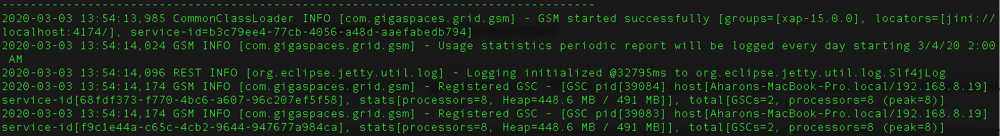

# gs-admin-training - lab02-service_grid

## 	Service Grid

###### Lab Goals
*   Be introduced to and experience the Service Grid.

###### Lab Description
In this lab you will start GigaSpaces service grid. The service grid is the core set of processes that runs GigaSpaces and typically consists of Grid Service Agents, Managers and Grid Service Containers. We will then inspect the service grid in the GS-UI.

## 1	Start the GigaSpaces Service Grid
1. Go to `$GS_HOME/bin`
2. Run: `./gs.sh host run-agent --auto --gsc=2`  
   This command will start a GridServiceAgent (GSA). The GSA is responsible for the components that its starts. In the example above, we are staring a Manager (in development mode) and 2 GSCs.
    
## 2	Examine the running environment
    
1. Examine the 'gigaspaces-manager.log' Check that the Manager and GSCs have started and registered successfully.  

   

2. We will learn about the various UIs in a later session.

## 3	Self-Healing
You will learn more about this in a later session.

