# Deployment using other UIs

## REST API
Using the REST Manager, deployment is a two-step process that requires the artifact to be uploaded first.

1. In a browser window, open `localhost:8090/v2`.
2. Expand the section 'Processing Units' | 'PUT' `/pus/resources` `Create (or replace) a processing unit resource` 
   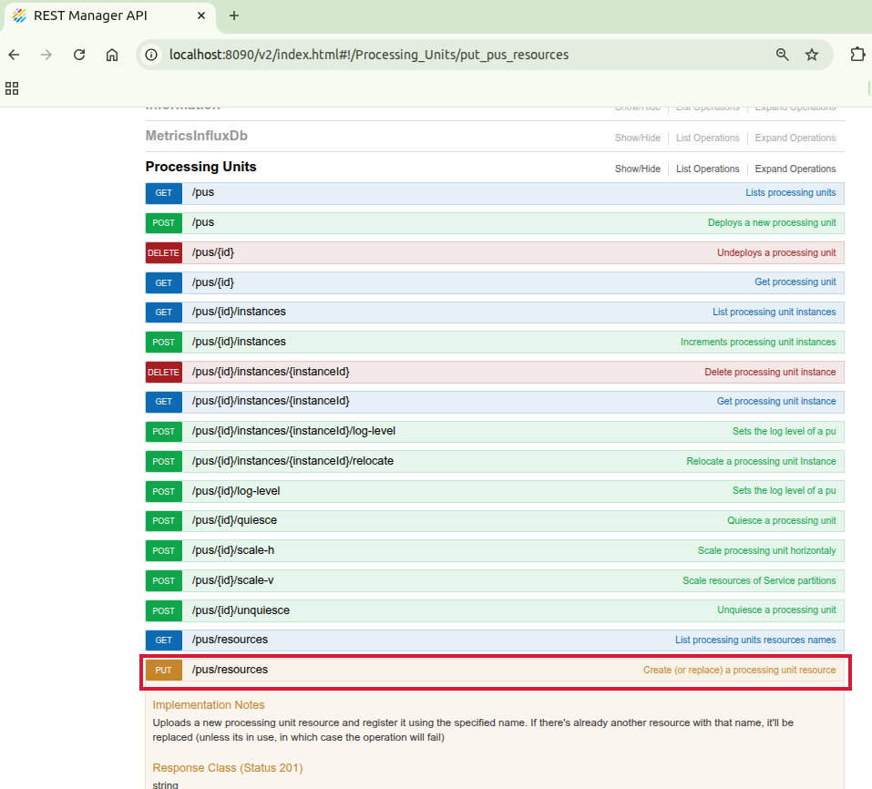
3. Use the file picker to upload your PU.jar. Then click `Try it out!`.
4. To validate it has been successful, you can run 'Processing Units' | 'GET' `/pus/resources` `List processing units resources names`.
5. Expand the section 'Processing Units' | 'POST' `/pus` `Deploys a new processing unit`.
   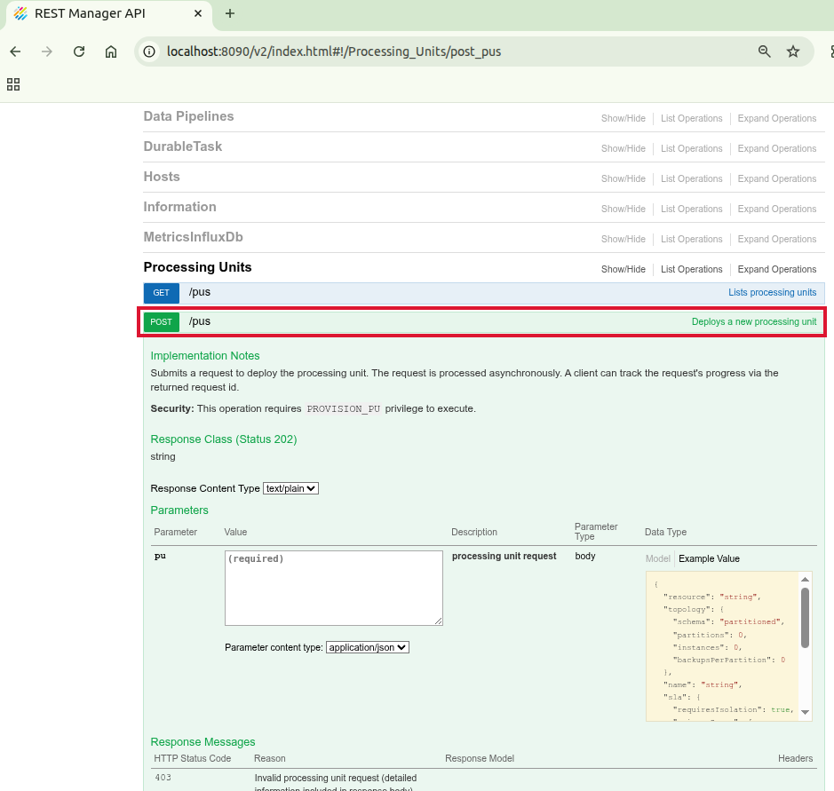
6. Under 'Parameters', click on the text under 'Data Type' | 'Example Value'.  
   This provides a template for the JSON that is needed for the `pu` parameter.
   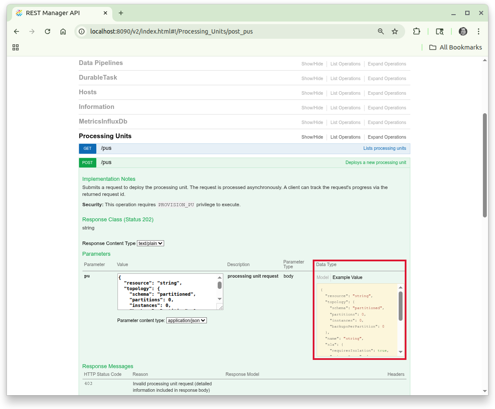
7. Modify the JSON:
   The original JSON:
   ```
   {
     "resource": "string",
     "topology": {
       "schema": "partitioned",
       "partitions": 0,
       "instances": 0,
       "backupsPerPartition": 0
     },
     "name": "string",
     "sla": {
       "requiresIsolation": true,
       "primaryZones": [
         "string"
       ],
       "maxInstancesPerMachine": 0,
       "zones": [
         "string"
       ],
       "maxInstancesPerVM": 0
     },
     "contextProperties": {}
   }
   ```
   becomes:
   ```
   {
     "resource": "BillBuddy_Space.jar",
     "topology": {
       "schema": "partitioned",
       "partitions": 2,
       "backupsPerPartition": 1
     },
     "name": "BillBuddySpacePU"
   } 
   ```
    * `resource` - pu resource name.
    * `schema` - partitioned for processing units that have a space defined in it.
    * `partitions` - number of partitions.
    * Since this is a partitioned space, remove `instances` from the topology.
    * `backupsPerPartition` - 0|1. 0 means no backups, 1 means 1 backup per each partition.
    * `name` - the name of the processing unit.
    * For this example we have removed `sla` and `contextProperties`.  
   
   Lastly, click `Try it out!`.  
   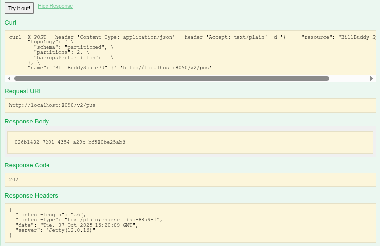
8. The 'Response Body' in the above screenshot contains a request id.  
   It can be used to request a status of the deployment under 'Requests' | 'POST' `/requests/{id}` `Get request`.  
   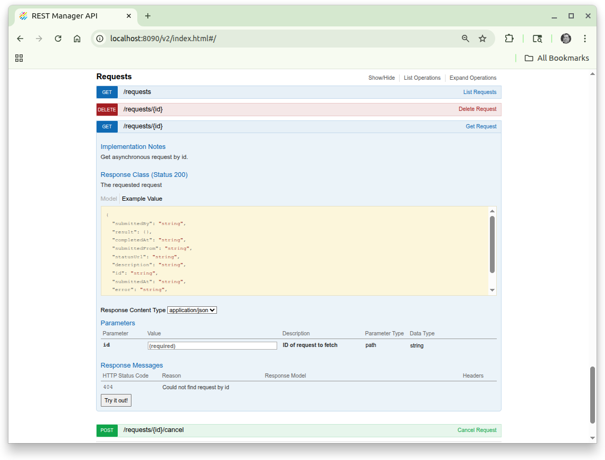
   Or you can get the PUs via 'Processing Units' | 'GET' `/pus` `Lists processing units`.


## gsui
1. Go to `$GS_HOME/bin` and run `gsui.sh`
2. Click on the 'Deploy application' button. Alternatively go to the 'File' menu 'Launch' | `SBA Application - Processing Unit...`.
   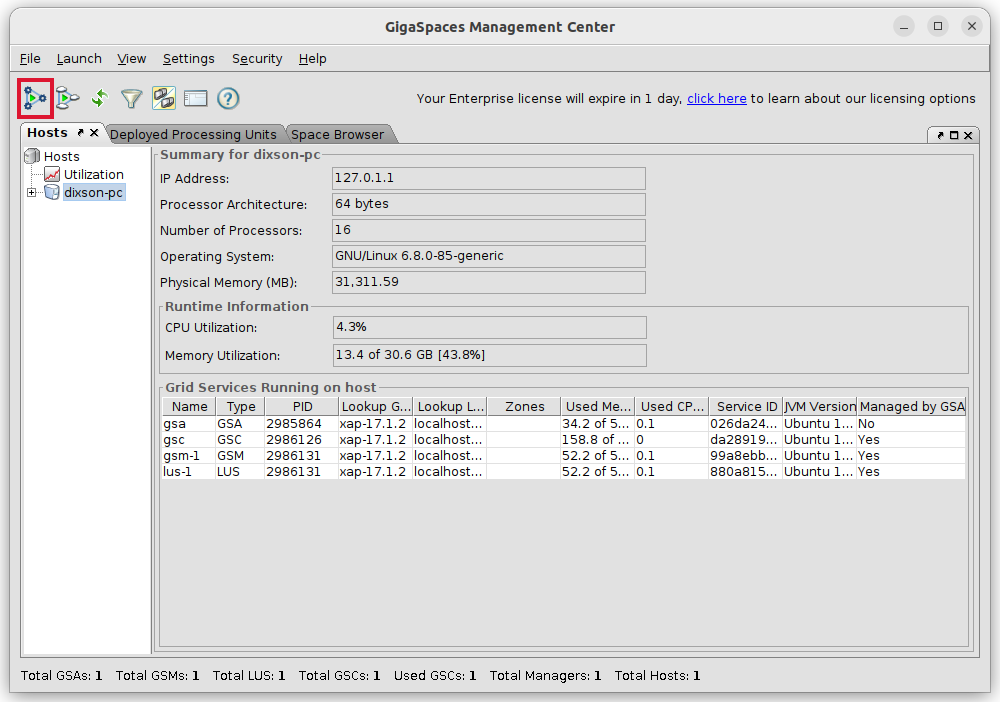
3. You should see the 'Deployment wizard'  
   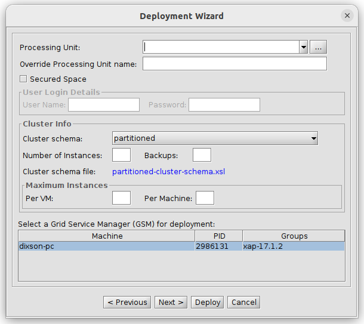
4. Use the file picker to upload the BillBuddy_Space jar file. The other fields should have the following values.

   |Field|Value|
   |---|---|
   |Cluster schema|partitioned|
   |Number of instances|2|
   |Backups|1|
   |Max Instances Per VM|Gets filled in with 1 automatically|

5. Refer to 'lab03-application_components' for further information on checking the processing unit.

## opsui
1. In a browser window open`localhost:8090`
2. Click on 'Monitor my services' or the services icon in the left nav.
   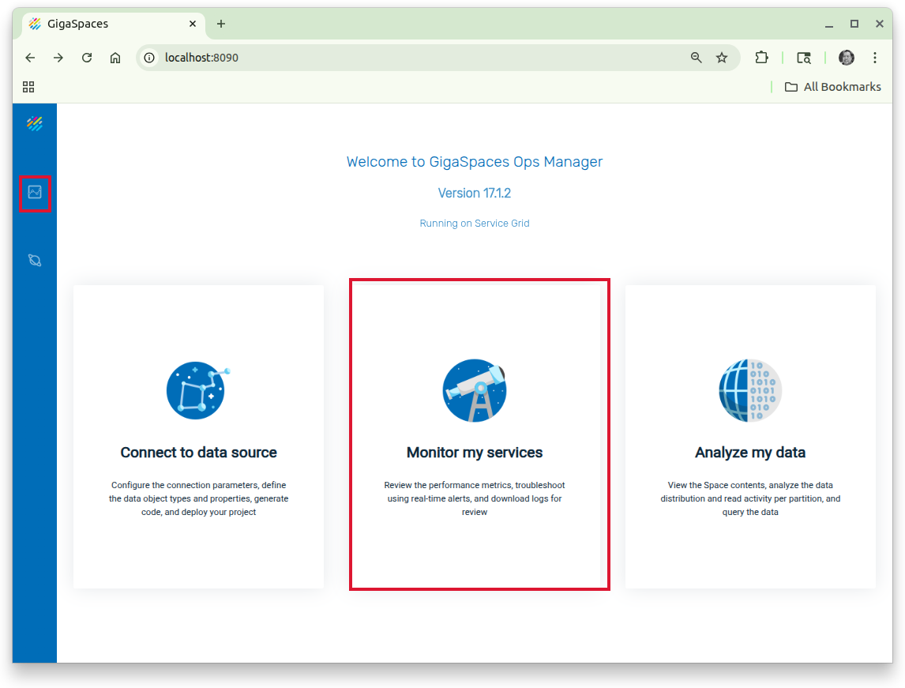
3. In the next screen, in the top right corner, click on '+' (plus).
   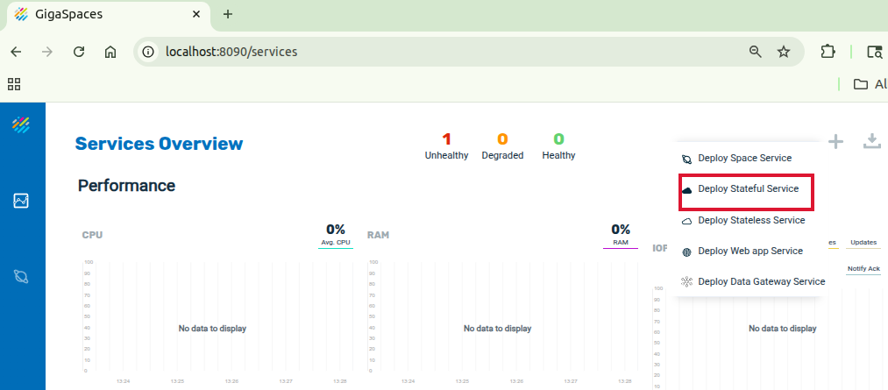
4. Enter the following information:

   |Field|Value|
   |---|---|
   |Service name|BillBuddySpacePU|
   |Deployment type|You can either upload a file or provide a url to the resource.|
   |Cluster schema|partitioned|
   |Number of partitions|2|
   |High availabilty |Use the slider to enable|
   
   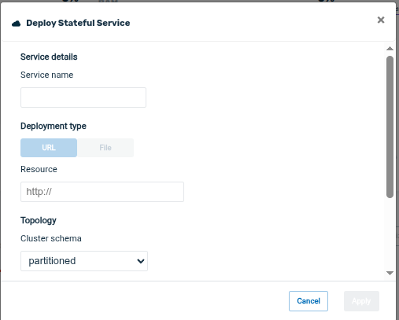   

5. Refer to 'lab03-application_components' for further information on checking the processing unit.

## webui
1. Go to `$GS_HOME/bin` and run `gs-webui.sh`
2. In a browser window open `localhost:8099`
3. Click on 'Deploy' and select 'Processing Unit'.
   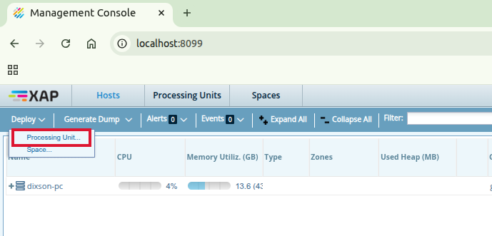
4. Enter the following information:

   |Field|Value|
   |---|---|
   |Cluster schema|partitioned|
   |Number of instances|2|
   |Number of Backups|1|
   |Max Inst. per VM|Gets filled in with 1 automatically|

   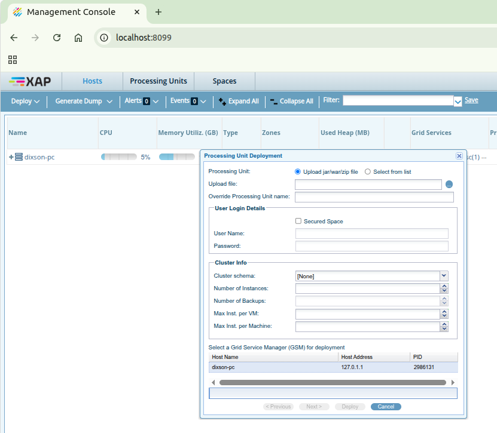
   Then click `Deploy`

5. Refer to 'lab03-application_components' for further information on checking the processing unit.
