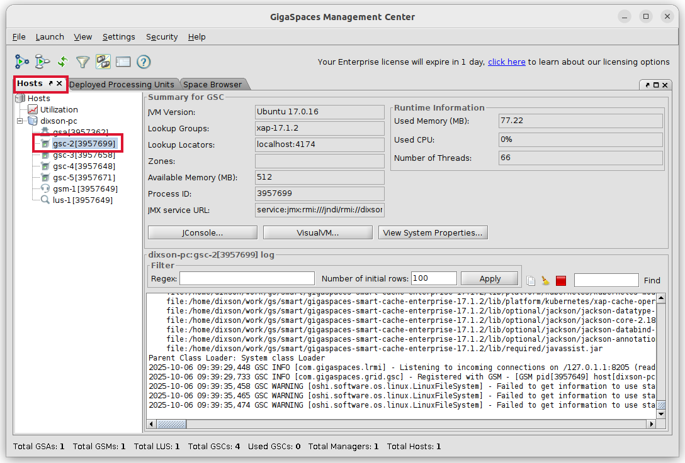
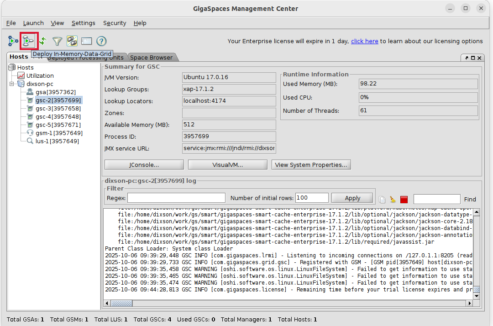
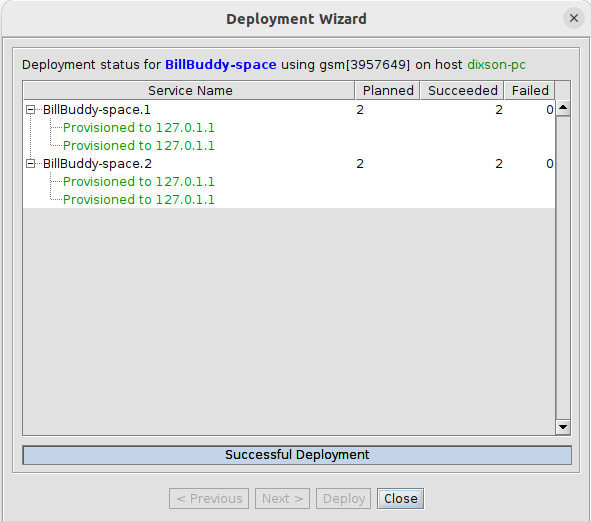
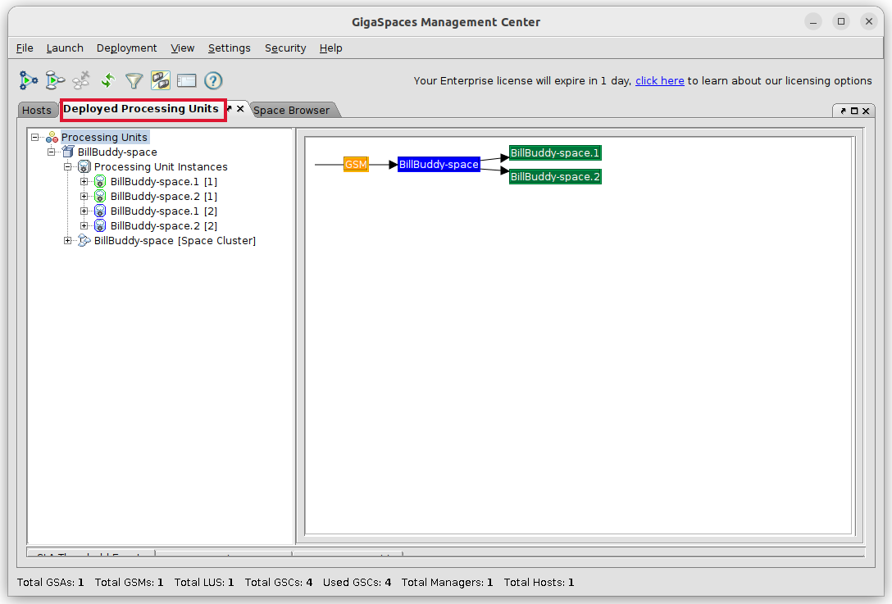
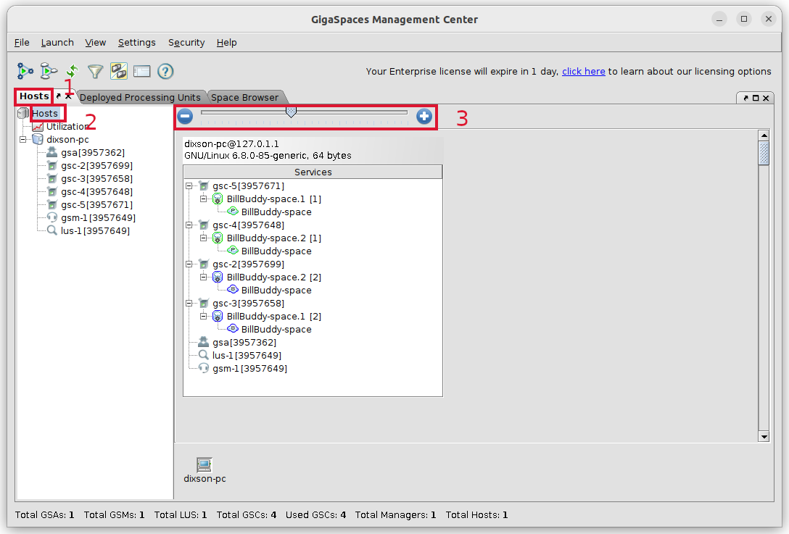
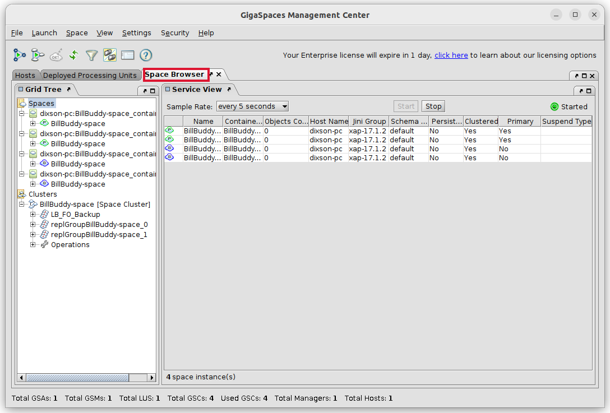
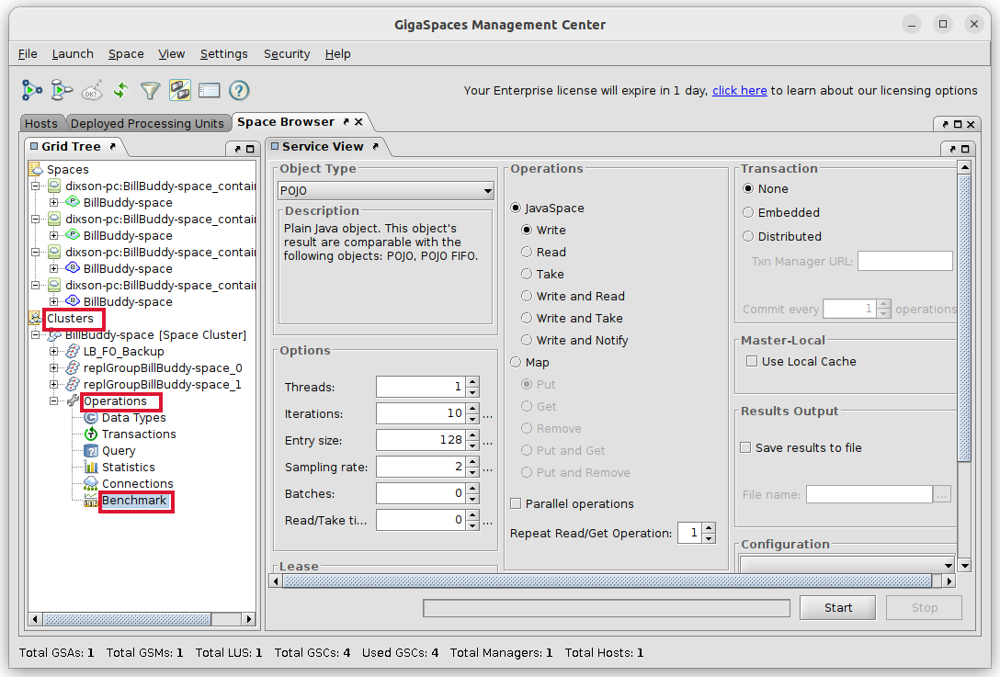
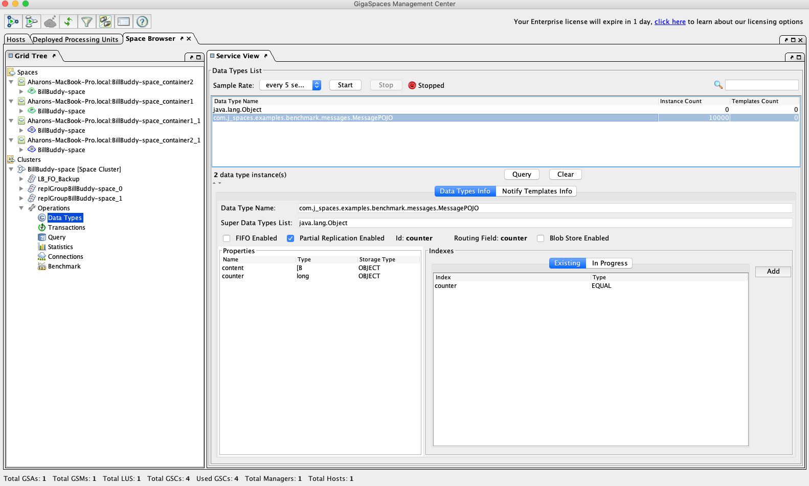
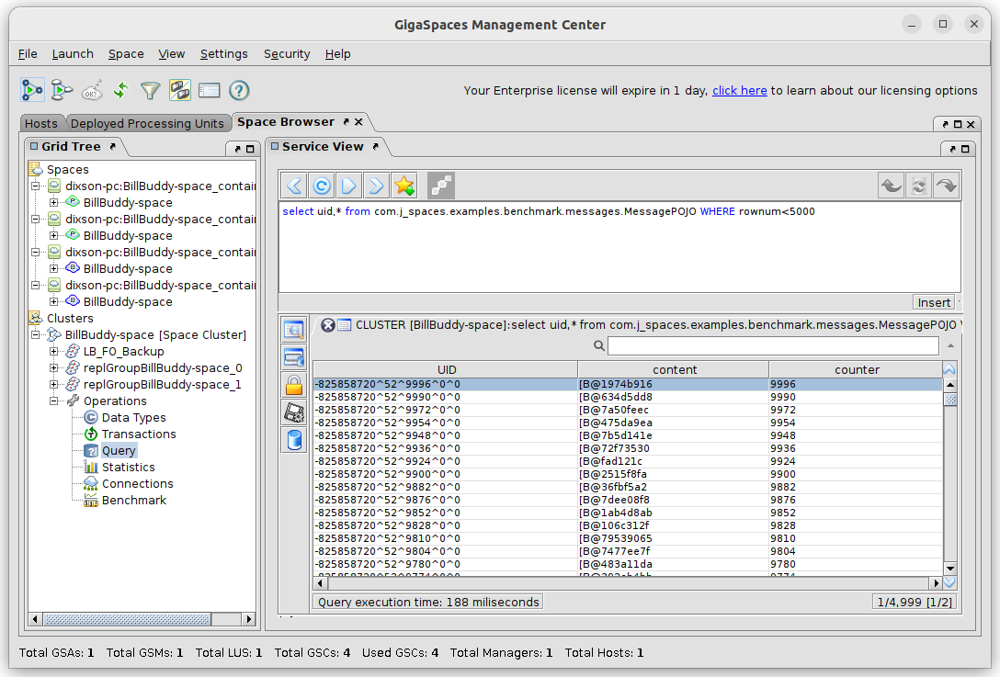
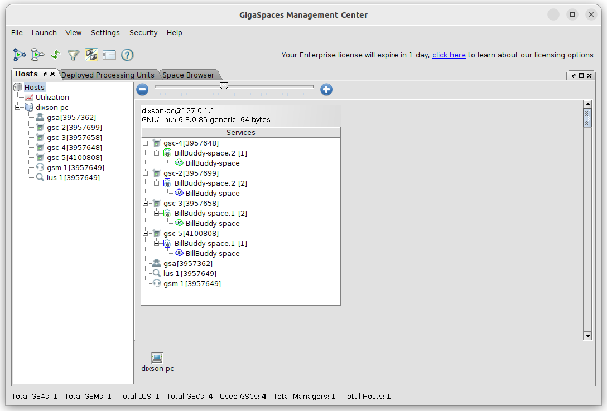

# gs-admin-training - lab04-application_components

## 	Application Level Components

###### Lab Goals 
 * Be introduced to and experience application level components.
 * Deploy, test and un-deploy applications (such as a space).
 * Experience the self-healing capability of the space.

###### Lab Description
In this lab you will start GigaSpaces service grid, deploy a Space, perform some benchmarks using a benchmark tool that will test your space, and undeploy the space. You will perform most actions using the GigaSpaces Management Center. You will also try to check the self-healing capabilities of the space by stopping a GSC and see how GigaSpaces heals itself.

## 1 Start the service grid

1. Go to `$GS_HOME/bin`
2. Run: `./gs.sh host run-agent --auto --gsc=4`
3. In a separate console window, run `./gs-ui.sh`.  
   *Note: Beginning version 17.0, gs-ui now requires a separate download. Please contact support@gigaspaces.com for more information.*
4. Under the 'Hosts' tab, click on one of the GSC processes to see the process information and log.

## 2	Deploy a space
1. Use the “Deploy an In Memory Data Grid” option in the menu (see top left red arrow in the diagram below).
   
2. A Deployment Wizard screen will open.

3. Fill in the fields as follows (see red arrows for locations).

| Field Name| Value |
|---|---|
| **Space (aka Data Grid) Name** | BillBuddy-space |
| **Cluster schema**| Partitioned|
| **Number of Instances** | 2 |
| **Backups (per each instance)** | 1 |
| **Maximum Instances Per VM** | 1 |

4. Press the Deploy button. The following should be the status of the deployment wizard after all deployments are done:

   

5. Press the close button.

6. Examine the "Deployed Processing Units" tab.

   * View the 'Deployed Processing Units' tab.

     

   * Identify the primary and backup partitions. From the 1. 'Hosts' tab. 2. Select the 'Hosts' item at the root of the tree. 3. You may need to expand the view to see the items.

      

7. Examine which space instance is located on which GSC?

8. Examine the 'Space Browser' tab

   

## 3	Test your space

We will now examine several operations that allow you to test, monitor and examine objects that are stored in the space. The tools that we will use are: Benchmark, Statistics and Query, located in the circle at the snapshot below.

###### Write objects to the space
1. In the 'Space Browser' tab, in the left pane, expand 'Clusters' | 'Operations' | 'Benchmark'.

   
   The benchmark tool allows you to perform operations against the space.

2. Perform a write and read 10,000 POJOs.
   (Simply press start but examine the tool input data prior to activating it).

##### View statistics
3. While the benchmark is executing go to the 'Statistics' operation (above Benchmark) and check the statistics.

4. Perform more benchmarks and view the result in the statistics page. For example perform a read. Your statistics view might look something like this:

   

5. Go to the 'Data Types' operation and select the `MessagePOJO` data type and press 'Query'.
   

6. You will be brought into the 'Query' view.
   
   What you see is the list of Space Object types (Classes) that are currently stored in the space.

   In later lessons we will use this view to query the objects.

7. Examine the objects written to space.

## 4	Self-Healing

In this exercise you will be introduced to the self-healing capabilities of a space.
Basically we will ‘kill’ (using Windows Task Manager or kill -9) a GSC process and see that it restarts automatically by the gs-agent and that new partition are created accordingly.

1. Each process ID (all are JVMs) is shown at the Hosts tab (see red circle). Choose 1 of the GSCs PID (with primary space instance on it) and use the Task Manager or (kill -9 for Linux) in order to kill the process.  
   

   If the PID is not shown in the Task Manager simply choose "View -> Select Columns" and add the PID column.

2. Monitor the view in the 'Hosts' tab in order to check the recovery status.

3. The following is a summary of the self-healing process.

   * A backup was promoted to Primary.
   * GSC was re-launched by the gs-agent.
   * A new backup partition was provisioned.
   
4. Recovery is performed, the backup partition is now a primary.
   

5. Restart a primary partition by selecting the GSC of the primary partition and choosing 'Restart' from the context menu. What happens?
 
## 5	Un-deploy a space 

1. Click on 'Deployed Processing Units' tab. Select 'BillBuddy-space', right click and choose 'Undeploy'

## Additional resources
 * [Instructions for cli](./README.md)
 * [Instructions for REST API](./restapi-README.md)
 * [Instructions for ops-manager](./opsui-README.md)
 * [Instructions for webui](./webui-README.md)

