# gs-admin-training - lab04-application_components

## 	Application Level Components

###### Lab Goals 
 * Be introduced to and experience application level components.
 * Deploy, test and un-deploy applications (such as a space).
 * Experience the self-healing capability of the space.

###### Lab Description
In this lab you will start GigaSpaces service grid, deploy a Space, perform some benchmarks using a benchmark tool that will test your space, and undeploy the space. You will perform most actions using the GigaSpaces Ops-ui.

## 1 Start the service grid

1. Go to `$GS_HOME/bin`
2. Run: `./gs.sh host run-agent --auto --gsc=4`
3. Go to the web Management Console `localhost:8090`

###### Checking the logs
4. In a browser window go to `http://localhost:8090/`.  
   Click on 'Monitor my services'.  
   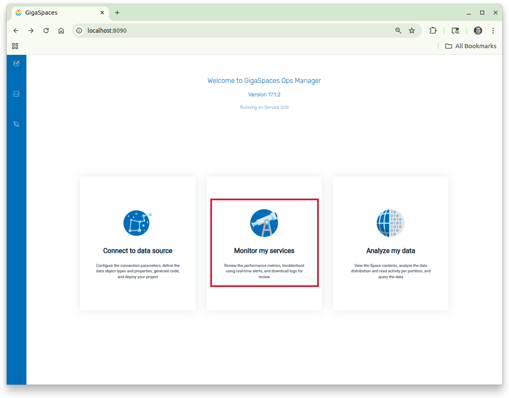  
5. Click on the Download icon.  
   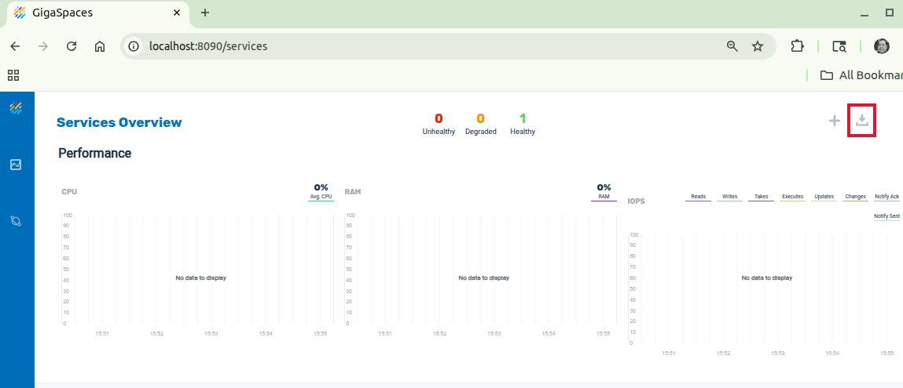  
   This action will download the logs from the server through the browser and place in your local Downloads directory for further analysis.  

## 2	Deploy a space
###### Introduction to the Ops-ui
The Ops-ui gets deployed as part of the REST Manager and is a lightweight UI that is good when working with Processing Units.

1. In the 'Services Overview' window, Click on '+' (Plus) icon. Choose "Deploy a Space Service" option from the context menu.

   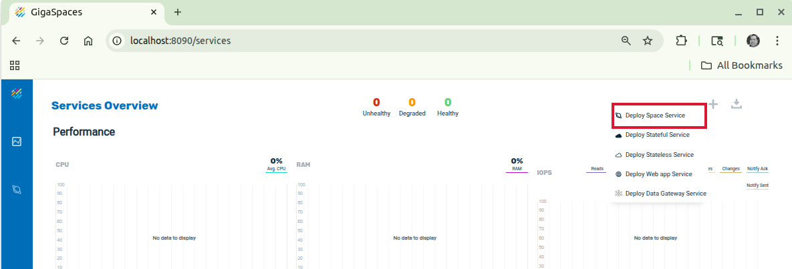

2. Fill in the fields as follows:

   | Field Name| Value |
   |---|---|
   | **Service name** | BillBuddy-space |
   | **Cluster schema** | partitioned |
   | **Number of partitions** | 2 |
   | **High availability** | true |

3. Press the 'Apply' button.
   You should see the following message 'Service BillBuddy-space deployed successfully'.  
   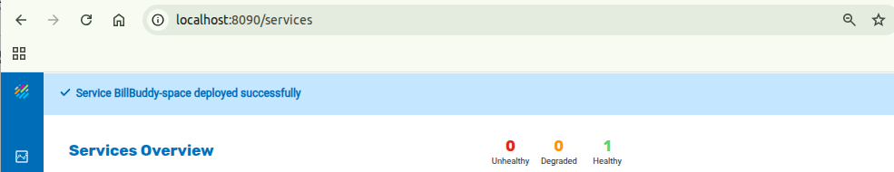

4. Examine the Space. 
   We want to drill down to the Space details.  
    * Click on Space tile (in the Services Overview).  
      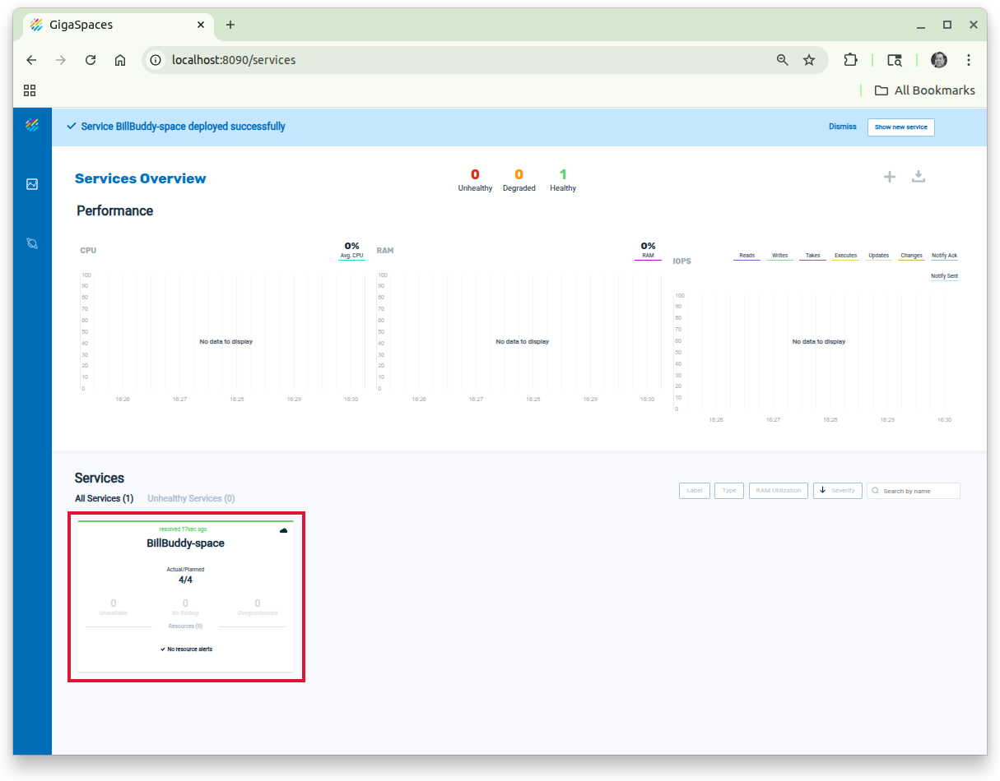  
    * The new screen gets redrawn, now click on the button in the top right corner with the Space: BillBuddy-space.  
      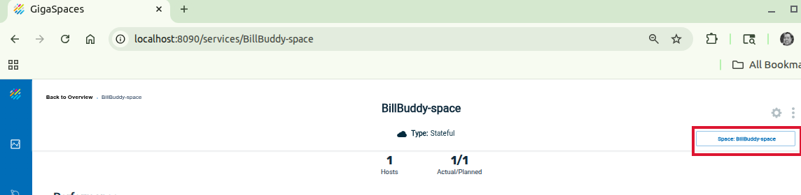
      You can also click on the icon that looks like Saturn  in the left nav, then click on the 'BillBuddy-space' (tile).  
    * Identify the primary and backup partitions.  
      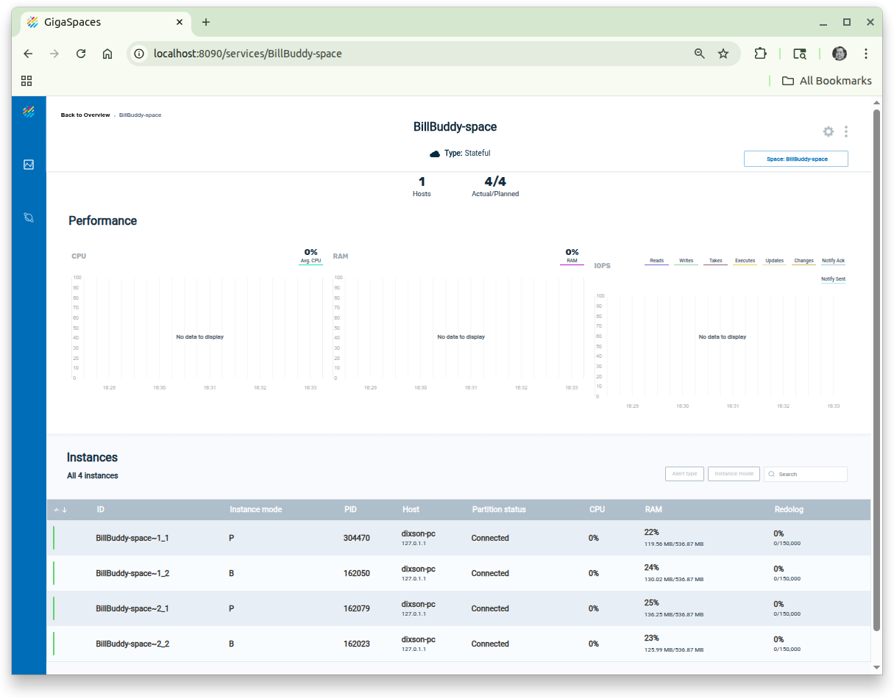

5. Which space instance is located on which GSC?

## 3	Test your space
We will now examine several operations that allow you to test, monitor and examine objects that are stored in the space.

###### Write objects to the space
1. Go to the project folder at `$GS_ADMIN_TRAINING/lab04-application_components`.
2. Run `mvn package`
3. Run the script located at `$GS_ADMIN_TRAINING/lab04-application_components/scripts/writeObjects.sh` in order to write 10,000 objects to the space.

##### View operations statistics
4. View the operations statistics by drilling down into the space from the Services Overview page.  
   *Go back in the browser or  
    Go to home  | 'Monitor my services' | 'BillBuddy-space' (tile) or  
    In the left nav, click on the Services  icon, then click on 'BillBuddy-space' (tile)* 
    

##### View data types
5. View the data types, by clicking on the button labelled 'Space: BillBuddySpace' in the top right corner.
   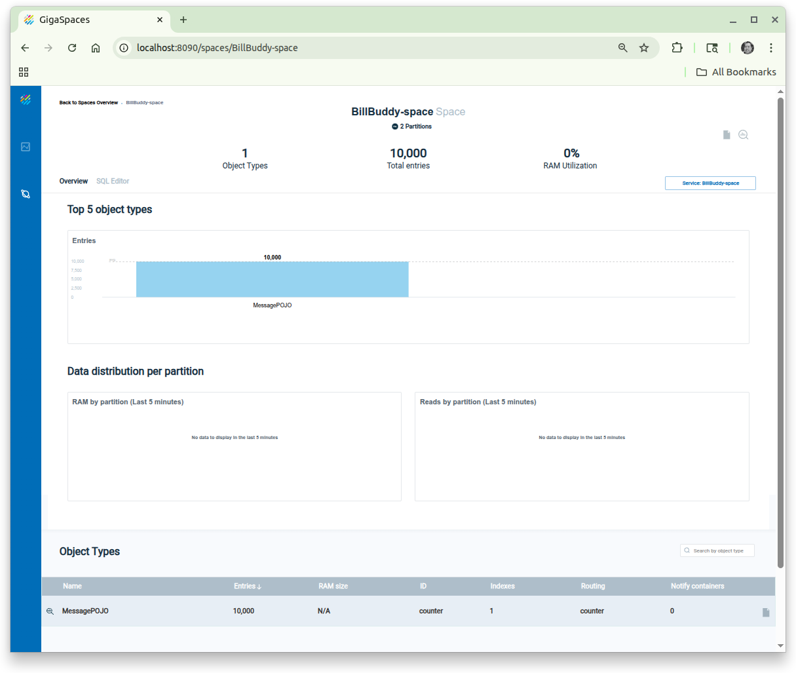  
   Click on the 'MessagePOJO' to get details about this type. *It also serves the purpose to put a sample query in the query pane in the next step.*
###### Query the "MessagePOJO" type

6. Click on SQL Editor (tab) *may need to scroll up*

   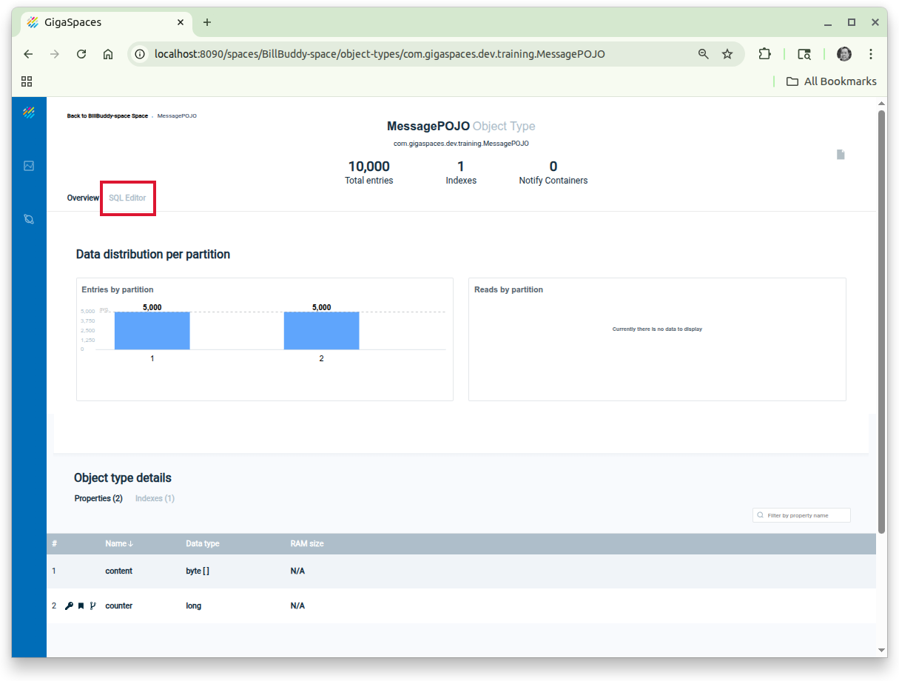

   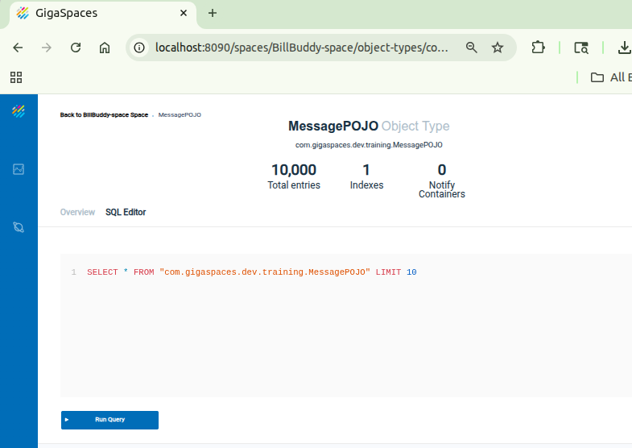

## 4	Undeploy a space 

In the Service view for the BillBuddy-space, click on the gear icon. A context menu should appear. Choose 'Undeploy service'

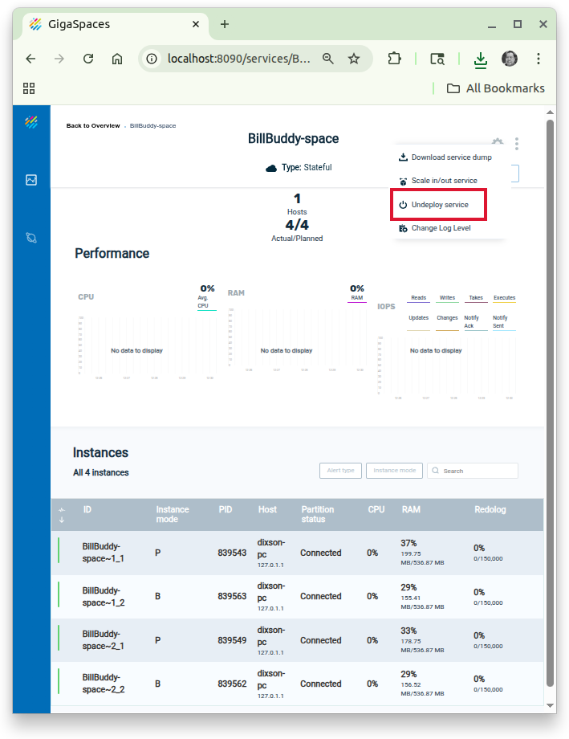

## Additional resources
 * [Instructions for cli](./README.md)
 * [Instructions for REST API](./restapi-README.md)
 * [Instructions for gs-ui](./gsui-README.md)
 * [Instructions for webui](./webui-README.md)

