# gs-admin-training - lab04-application_components

## 	Application Level Components

###### Lab Goals 
 * Be introduced to and experience application level components.
 * Deploy, test and un-deploy applications (such as a space).
 * Experience the self-healing capability of the space.

###### Lab Description
In this lab you will start GigaSpaces service grid, deploy a Space, perform some benchmarks using a benchmark tool that will test your space, and undeploy the space. This version of the README.md will demonstrate how to use the REST Manager. You will also try to check the self-healing capabilities of the space by stopping a GSC and see how GigaSpaces heals itself.

## 1 Start the service grid

1. Go to `$GS_HOME/bin`
2. Run: `./gs.sh host run-agent --auto --gsc=4`

###### Checking the logs
The logs are stored in the `$GS_HOME/logs` directory. `cd` to this directory.
 * The default log file name format is `<date>~<time>-gigaspaces-<process>-<hostname>-<pid>.log`
 * The **gsa** log file contains the **GridServiceAgent** logs. This log will have messages concerning the start or restart of the GigaSpaces processes.
 * The **manager** log will contain messages from the LUS, Zookeeper and the REST Manager. We will go into further detail in this in a later chapter. On the service grid, this log will also have messages concerning the Processing Unit (PU)/ application deployment lifecycle.
 * The **gsc** log is the **GridServiceContainer** log. Applications get deployed to a gsc, so deployment issues, PU issues will appear here.
   
## 2	Deploy a space
###### Introduction to the REST Manager
1. In a browser window go to `http://localhost:8090/v2/index.html#/`.

   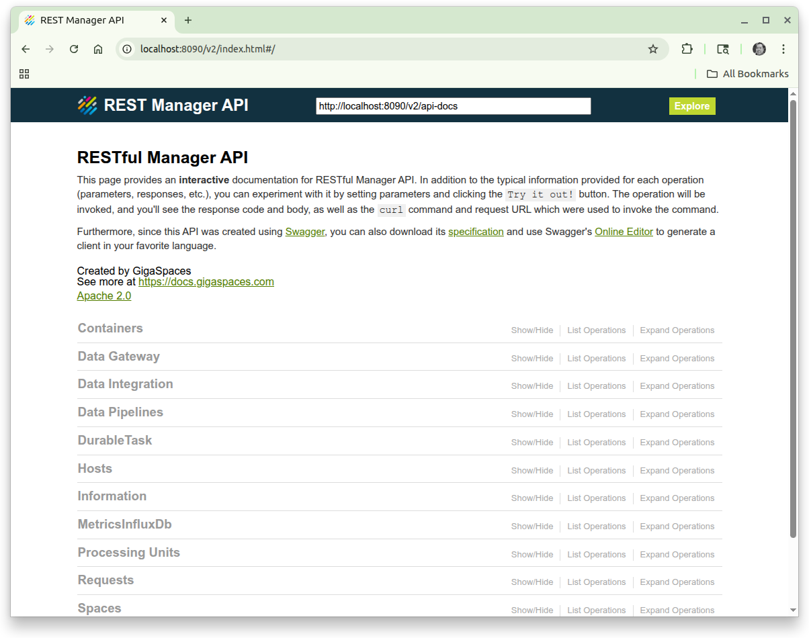

   The REST Manager is at the core of the other UIs such as the cli. The cli depends upon the REST Manager to run commands.

   The REST Manager was created using [Swagger](https://swagger.io)   

###### Deploy a space
2. We wish to deploy a space using the following configuration:

   | Field Name| Value |
   |---|---|
   | **Space Name** | BillBuddy-space |
   | **Number of partitions** | 2 |
   | **Backups (true or false)** | true |

   Select  `Spaces`. Note the categories are alphabetized, and `Spaces` can be found towards the bottom.

   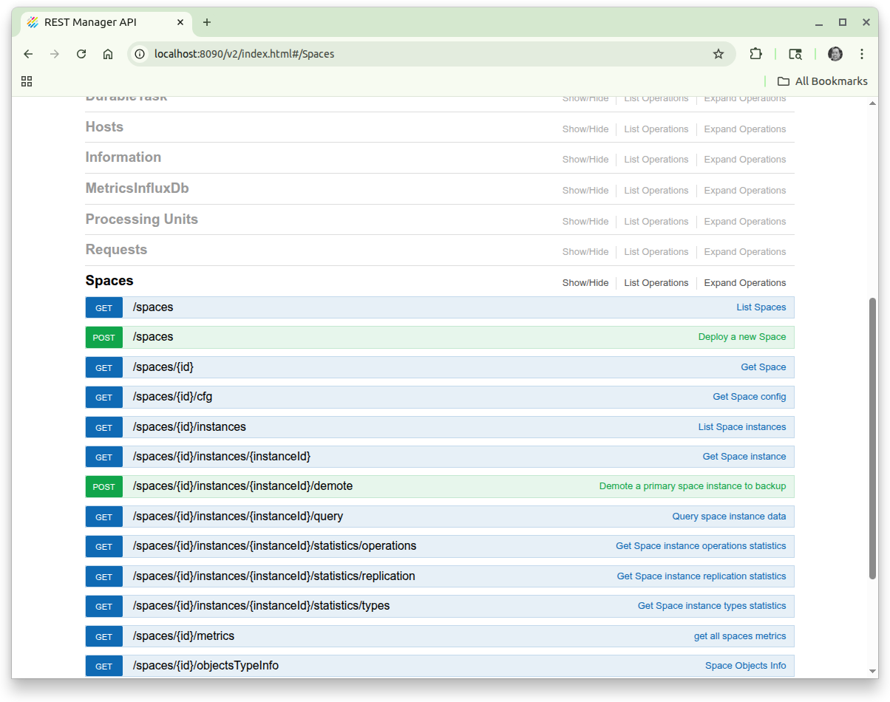

   Click on `Deploy a new Space` (or any link on that row).

   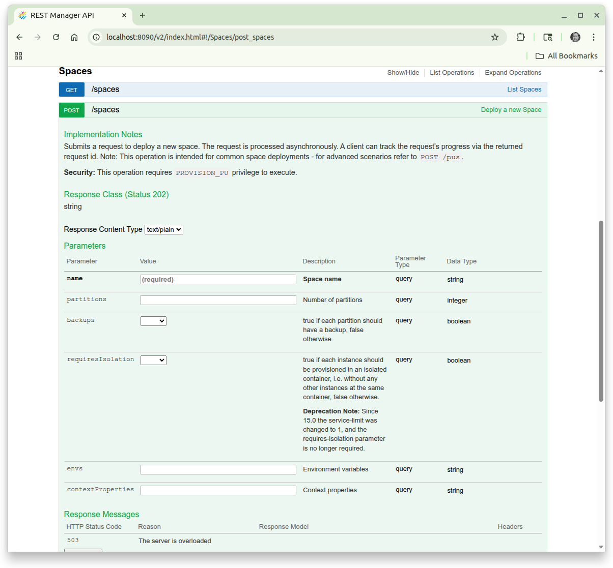

   |Field| Input|
   |---|---|
   |**name**|`BillBuddy-space`|
   |**partitions**|2|
   |**ha**|true|

   Click on the `Try it out!` button.

   When the screen gets redrawn you will get a result similar to the following:
   
   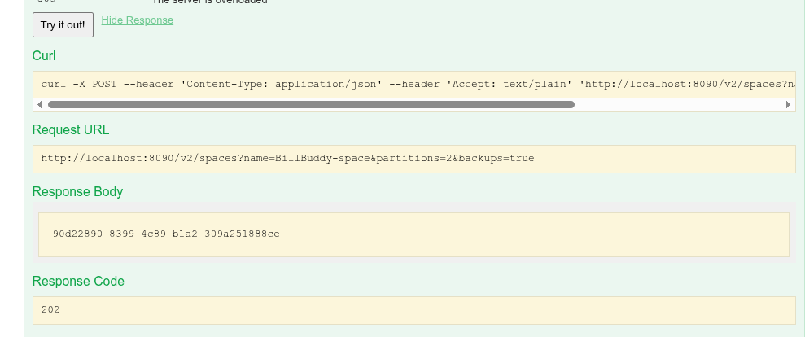

###### Checking the response status
    3. The Response Body contains a request id. Copy this. This can be used to check the status of the deployment.  
   Expand `Requests` | `Get Request`. In the **id** field, put the request id.

   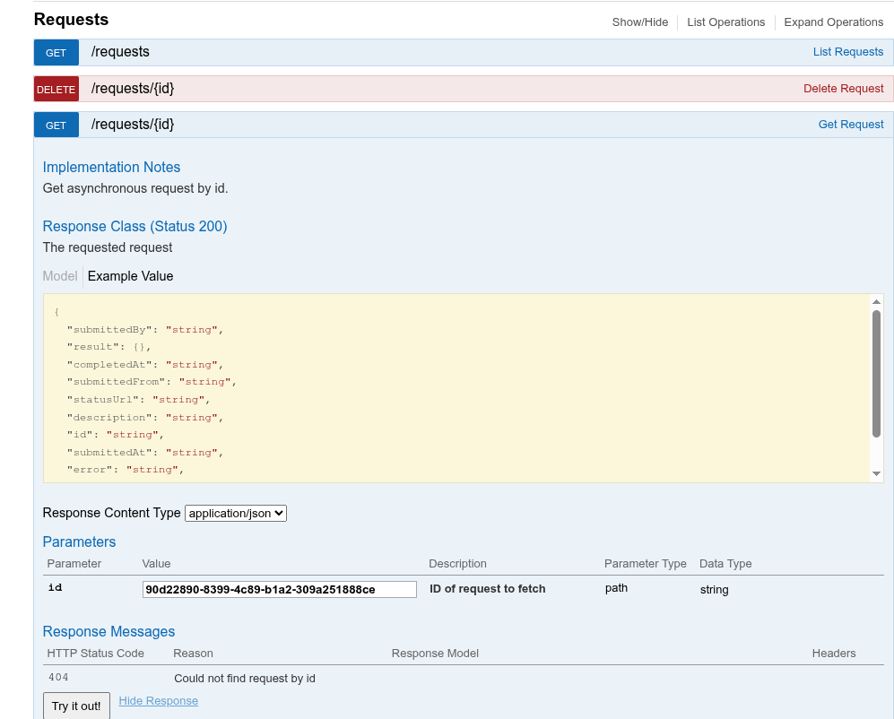   
   You should see a response similar to the following:   
   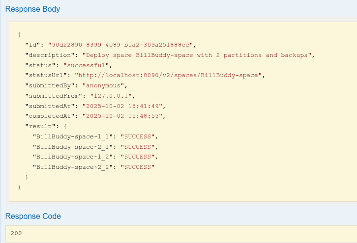

###### Examine the Processing Units
4. Under the **Processing Units** section, click on `Lists processing units`. Then click on the `Try it out!` button.  

   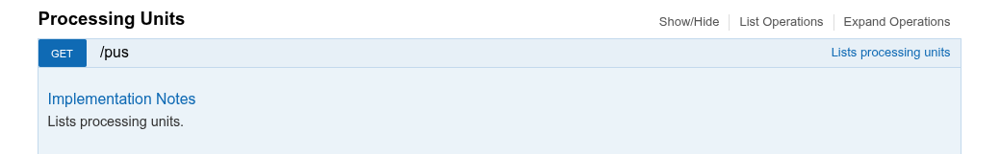

   It should look like the following:

   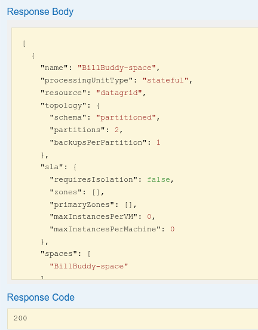

###### Examine the Spaces
5. Expand 'Spaces' | 'GET' `/spaces` `List Spaces` to get general information on all currently deployed spaces.    
   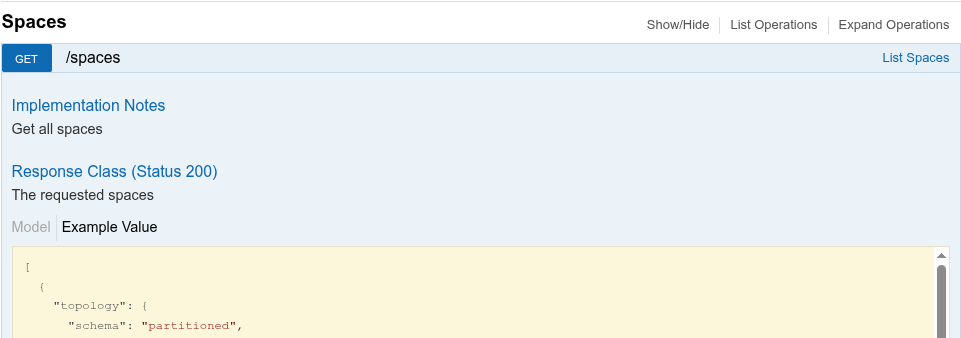  
   Click the `Try it Now!` button. You should now see the following:  
   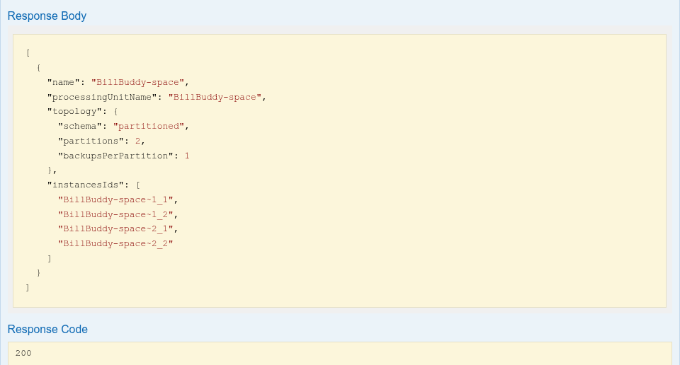

6. To identify the primary and backup partitions for BillBuddy-Space, expand 'Spaces' | 'GET' `/spaces/{id}/instances` `List Space instances`.  
 
   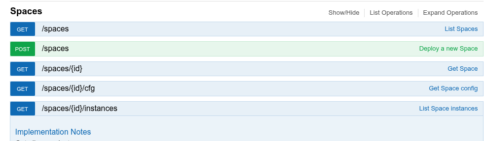  
   Enter for id: `BillBuddy-space`  
   Click on the `Try it now!` button.  
   You should see a result like the following:    
   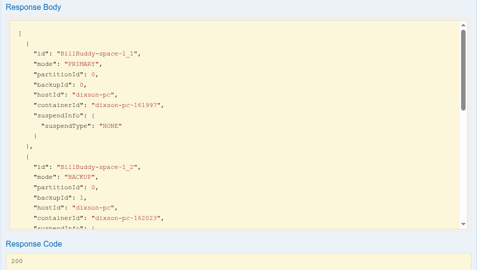

   Examine the JSON in the response. Notice each instance has an **id**, **mode**, **partitionId**, and **containerId**.  
    * The instance id has the following naming convention `<space name>~<partition number>_<1|2>`
    * In this example the PU name is the same as the space name.
    * The last digit is a 1 or 2 and it indicates whether it was started as a primary or backup partition.
    * The mode indicates whether it is a primary or backup.
    * partitionId is the partition number.
    * containerId is the id of the GSC that the instance was deployed to. It is in the form hostname~PID.
    
8. Which space instance is located on which GSC?

## 3	Test your space
We will now examine several operations that allow you to test, monitor and examine objects that are stored in the space.

###### Write objects to the space
1. Go to the project folder at `$GS_ADMIN_TRAINING/lab04-application_components`.
2. Run `mvn package`
3. Run the script located at `$GS_ADMIN_TRAINING/lab04-application_components/scripts/writeObjects.sh` in order to write 10,000 objects to the space.

###### View operation statistics
4. To get the operation statistics expand 'Spaces' | 'GET' `/spaces/{id}/statistics/operations` `Get Space operations statistics`.
   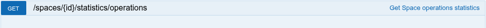

   Enter for id: `BililBuddy-space`, then click the `Try it now!` button.
   The result looks like:  
   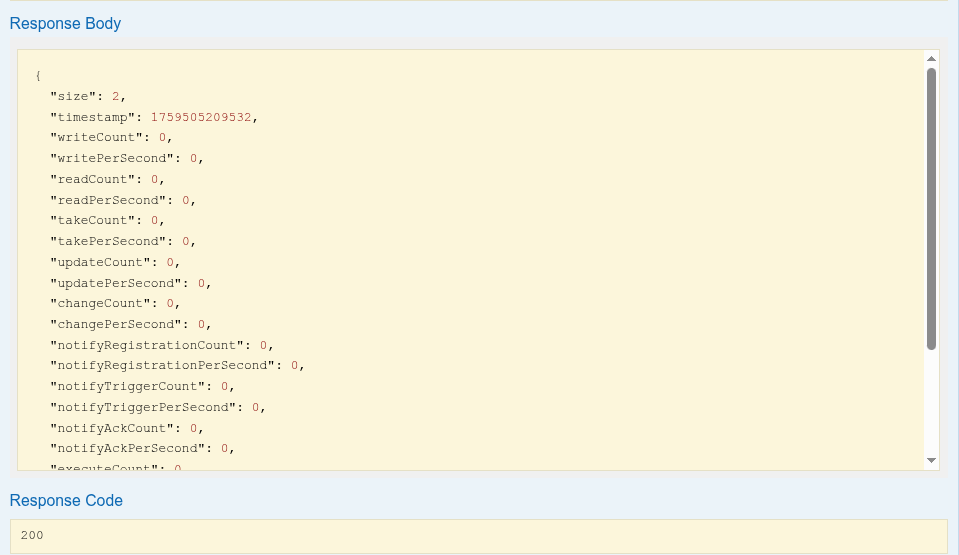

###### View data types
5. Expand 'Spaces' | `/spaces/{id}/objectsTypeInfo` `Space Objects Info`.

     
   Enter for id: `BillBuddy-space`. Click on the `Try it now!` button.    

   A browser screen like the following will be drawn:  
   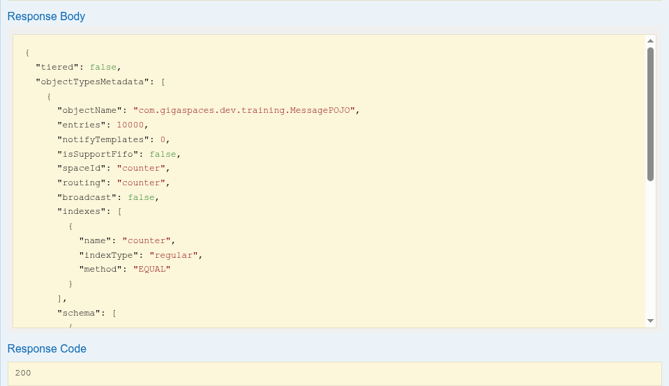

###### Query the "MessagePOJO" type
6. Expand 'Spaces' | 'GET' `/spaces/{id}/query` `Query space data`.  
   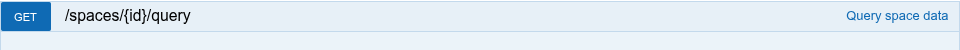  
   Enter for id: `BillBuddy-space`, typeName: `com.gigaspaces.dev.training.MessagePOJO`. Click on `Try it now!`.    
   You get the following:  
   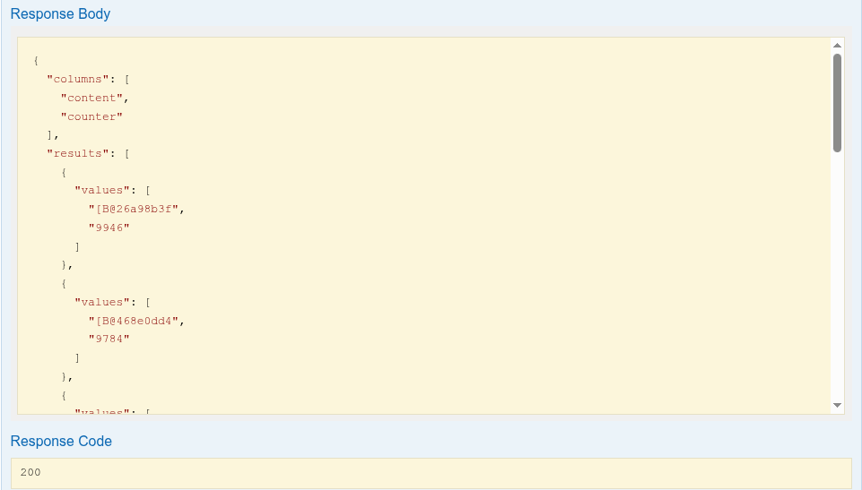  
   Note: the type name should be fully qualified class name with the package name.

## 4 Self-Healing

In this exercise you will be introduced to the self-healing capabilities of a space.
Basically we will ‘kill’ (using Windows Task Manager or kill -9) a GSC process and see that it restarts automatically by the gs-agent and that new partition are created accordingly.

1. Previously, after we deployed the space, we ran `/spaces/{id}/instances` `List Space instances` and we could see the containerIds and therefore the PIDs associated with the GSCs. Choose 1 of the GSC's PID (with primary space instance on it) and use the Task Manager or (kill -9 for Linux) in order to kill the process.

2. Once again, re-run `./gs.sh pu list-instance BillBuddy-space` in order to check the recovery status.

3. The following is a summary of the self-healing process.

 * A backup was promoted to Primary.
 * GSC was re-launched by the gs-agent.
 * A new backup partition was provisioned.
 * After running `kill 161997` which was the GSC containing the primary for the 1st partition, we get:  
   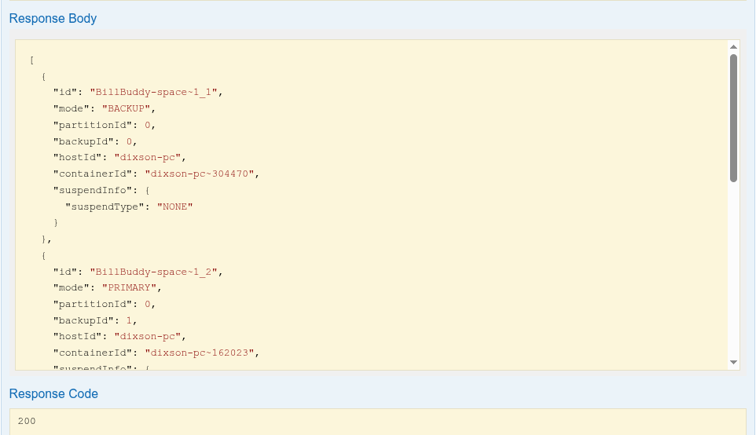  
   Note: new container with PID 304470 was created.  
 * Recovery is performed, the backup partition is now a primary.

5. Restart a primary partition by selecting the primary partition. What happens?  
   When using the REST API these endpoints can be used:  
    * 'Space' | 'GET' `/spaces/id/instances` `List Space instances`, then
    * 'Containers' | 'POST' `/containers/{id}/restart` `Restart container`  
   

6. In general, if you need to change a primary space to a backup it is better to use the demote command:  
    * 'Space' | 'GET' `/spaces/id/instances` `List Space instances`, then
    * 'Spaces' | 'POST'/spaces/{id}/instances/{instanceId}/demote, then  
      

## 5 Un-deploy a space 
To undeploy a space the following can be run:    
'Processing Units' | 'DELETE' `/pus/{id}` `Undeploys a processing unit`  
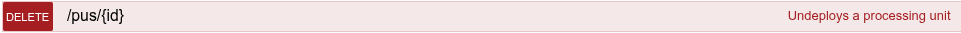

---
## Additional resources
 * [Instructions for cli](./README.md)
 * [Instructions for gs-ui](./gsui-README.md)
 * [Instructions for ops-manager](./opsui-README.md)
 * [Instructions for webui](./webui-README.md)

