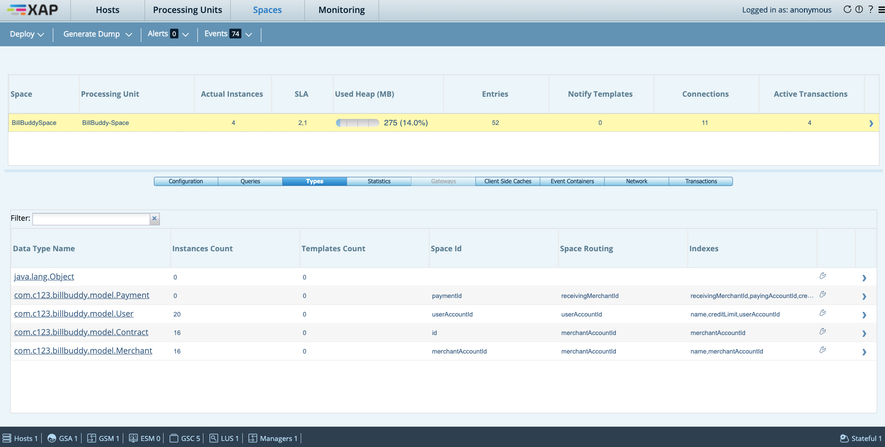
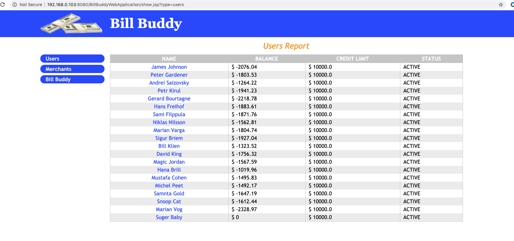

# lab05-gs_admin_training

# The Bill Buddy Application

## Lab Goals

1. Experience an application deployment process.
2. Get familiar with the BillBuddy application.

## Lab Description
In this lab we will focus on deployment and the application and not be concerned with code, therefore simply focus on the deployment process, you will use similar process throughout the labs.

#### 1	Start gs-agent

1.1 Navigate to %GS_HOME%/bin <br />
        
1.2 Start the Service Grid with a local Manager server and 5 GSCs:
```
./gs.sh host run-agent --auto --gsc=5
```
    
#### 2	Deploy BillBuddy_Space
    
2.1 Open %GS_TRAINING_HOME%/lab05-gs_admin_training project with Intellij (open pom.xml) <br />
2.2 Run mvn install <br />

    ~/gs-admin-training/lab05-gs_admin_training$ mvn install
    
    
    [INFO] Reactor Summary:
    [INFO] 
    [INFO] Lab5 ............................................... SUCCESS [  0.204 s]
    [INFO] BillBuddyModel ..................................... SUCCESS [  1.087 s]
    [INFO] BillBuddy_Space .................................... SUCCESS [  0.207 s]
    [INFO] BillBuddyAccountFeeder ............................. SUCCESS [  0.189 s]
    [INFO] BillBuddyCurrentProfitDistributedExecutor .......... SUCCESS [  0.225 s]
    [INFO] BillBuddyWebApplication ............................ SUCCESS [  0.349 s]
    [INFO] BillBuddyPaymentFeeder ............................. SUCCESS [  0.190 s]
    [INFO] ------------------------------------------------------------------------
    [INFO] BUILD SUCCESS

2.3 IntelliJ path Variables (under File | Settings | Appearance & Behavior | Path Variables)

###### Add GS_LOOKUP_GROUPS & GS_LOOKUP_LOCATORS

For example set `GS_LOOKUP_LOCATORS=localhost` and `GS_LOOKUP_GROUPS=xap-17.1.0`

2.4 Copy the runConfigurations directory to the Intellij .idea directory to enable the Java Application configurations. Restart Intellij.

2.5 Open a new Terminal and navigate to %GS_HOME%/bin <br />
```
cd %GS_HOME%/bin
```
2.6 Use GS CLI to deploy BillBuddy_Space
``` 
./gs.sh pu deploy BillBuddySpace ~/gs-admin-training/lab05-gs_admin_training/BillBuddy_Space/target/BillBuddy_Space.jar 
```
#### 3	Run BillBuddyAccountFeeder from Intellij

3.1 From the Intellij run configuration select BillBuddyAccountFeeder and run it.

###### This application writes Users, Merchants and Contracts to the Space
 
3.2 Validate Users and Merchants were written to the space using the web Management Console (localhost:8099). <br />
 Go to: Spaces Tab -> Data Types. <br />
 


3.3 Query the list of Users by executing the following SQL: <br />
Click the Data Type Name and the sql will be created for you: <br />

    SELECT * FROM com.gs.billbuddy.model.User WHERE rownum<5000
    
###### Note: Fully qualified class name is required.


#### 4	Run BillBuddyPaymentFeeder project
The BillBuddyPaymentFeeder application creates payments by randomly choosing a user, 
a merchant and an amount and performs the initial process of a payment. 
This includes deposit and withdrawal updates of each party’s balance appropriately. 
After the payment is initially processed it is written to the space for further processing. 
A new Payment is created every second.
 
4.1 Run the BillBuddyPaymentFeeder using Intellij: 
Use the same instructions as used for the BillBuddyAccountFeeder.

4.2 Validate Payments were written to the space. 
Click the Payment Data Type Name as you did in section 3.3
 
4.3 Go to the statistics operations and see that a payment is actually added every second.


4.4 Go to the Data Types view. Which objects counts are increasing?

#### 5 Deploy BillBuddyWebApplication project

5.1 Open a new Terminal and navigate to %GS_HOME%/bin/

5.2 Use GS CLI to deploy BillBuddyWebApplication
``` 
./gs.sh pu deploy --property=web.port=8082 BillBuddyWebApplication ~/gs-admin-training/lab05-gs_admin_training/BillBuddyWebApplication/target/BillBuddyWebApplication.war
```
5.3 Validate the application is deployed. 
Go to Deployed Processing Units tab and expand the BillBuddyWebApplication PU.


5.4 Click on Config.
The host, port and context-path should be used as a url to reach the BillBuddy web application: 



5.5 Congratulations, you have deployed the BillBuddy web application. 
Navigate through the application pages and investigate it.
