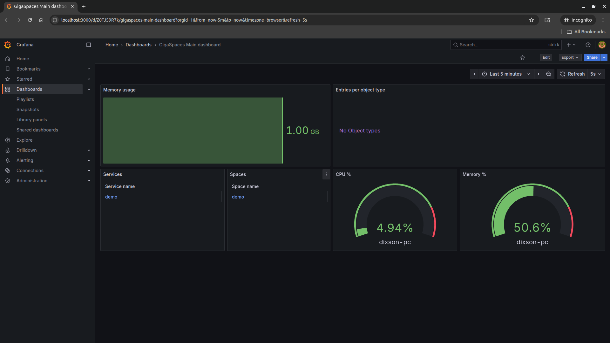
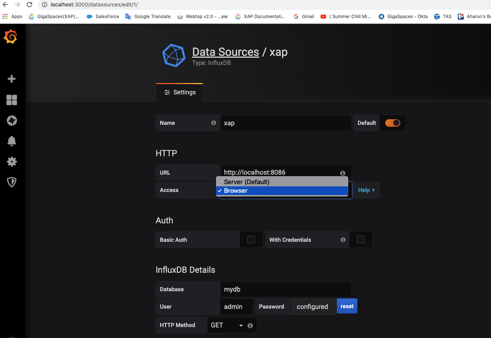
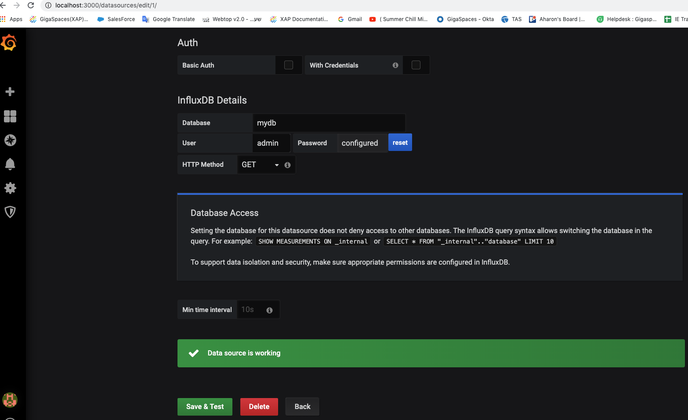
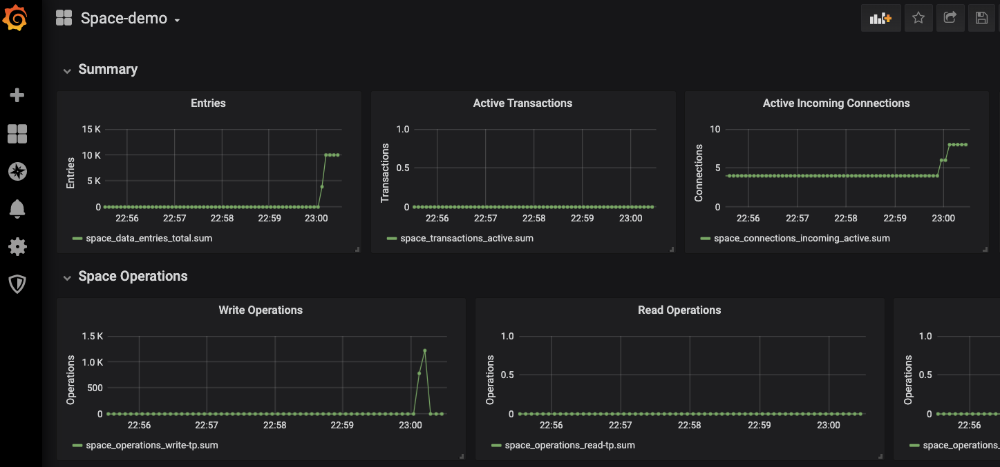

# gs-admin-training - lab06-metrics

# GigaSpaces Metrics

## Lab Goals

 * Explore the GigaSpaces metrics framework.
 * Get familiar with Grafana and InfluxDB.

## Lab Description
In this lab we will focus on GigaSpaces Metrics functionality.  
To better understand its capabilities you will set up InfluxDB and Grafana.

### 1 Download and install InfluxDB and Grafana

1. Choose for your convenience, 1 of the following 2 options:

    * InfluxDB regular installation:  
      https://www.influxdata.com/get-influxdb/

    * InfluxDB installation using docker compose  
      https://docs.docker.com/compose/install/  
      `docker-compose` is used for the convenience of managing the network communication between multiple containers. 
      ```
      cd $GS_ADMIN_TRAINING/lab07-metrics
      docker-compose up
      ```

2. Create mydb database

   Follow the instructions to create **mydb** database:  
   https://docs.influxdata.com/influxdb/v1/introduction/get-started/

   **Tip:** For docker please use the following command first:<br>
   ```
   docker exec -it <container ID> /bin/bash # get a terminal session into the InfluxDB container
   # start influx interactive session
   influx
   create database mydb
   ```

### 2 Download and install Grafana

1. Choose for your convenient 1 of the following 2 options:

   * Grafana regular installation:  
     https://grafana.com/get
   * Grafana installation using docker compose:  
     This step was done when `docker-compose up` was run for InfluxDB.

2. Verify Grafana is up and running

   * Click the following link:  
     http://localhost:3000/

     See that you can login admin/admin (skip the change password page).

### 3 Activate GS metrics
Please follow instructions at:  
https://docs.gigaspaces.com/latest/admin/web-management-monitoring.html#InstallingandConfiguringGrafana

### 4 Run GS in Demo mode
```
$GS_HOME/bin/gs.sh demo
```    
### 5 Explore Grafana dashboards

Please explore Grafana GS dashboard and see that metrics are arriving:  
https://docs.gigaspaces.com/latest/admin/web-management-monitoring.html#GettingStarted



Note: The Grafana dashboards will have been loaded by GigaSpaces. However you can also find the dashboards at `$GS_HOME/config/grafana/dashboards`.

### 6 Troubleshooting:

* Sometimes there is a need to change access from server (default) to Browser.
  


* InfluxDB connectivity test can be done:


* Check the log files at `$GS_HOME/logs`.

* An interactive Influxdb session can be started and select statements can be run:
For example,
```
select * from "space_data_total-read-count"
```

* Grafana uses http to query InfluxDB.
For example, you could run the following from the browser:
```
http://localhost:8086/query?db=mydb&q=SELECT%20*%20from%20%22space_data_total-read-count%22
```

### 7 Space dashboard:

Please use the GS benchmark tool as you did in lab03-application_components and explore the Space-demo dashboard:


### 6 Additional Resources
 * https://hub.docker.com/_/influxdb  
 * https://hub.docker.com/r/grafana/grafana
