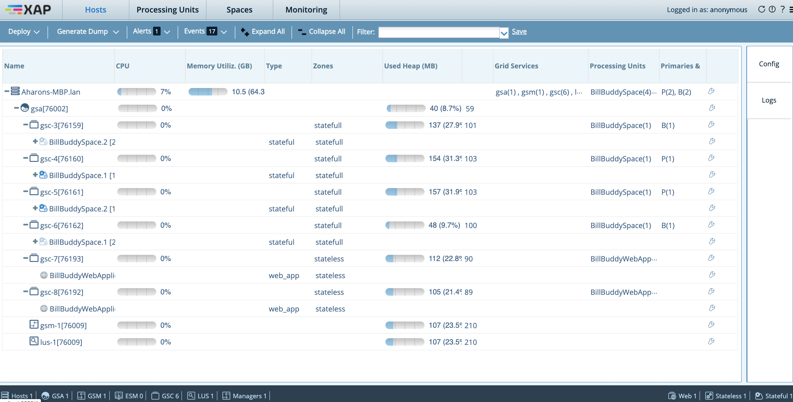

# gs-admin-training - lab11-cli

# GigaSpaces Command Line Interface

## Lab Goals

1. Explore in more detail the GigaSpaces Command Line Interface.
2. Get familiar with GigaSpaces Command Line Interface's capabilities.

## Lab Description
In this lab we will focus on GigaSpaces Command Line Interface.  
To better understand its capabilities you will practice using the GigaSpaces Command Line Interface.

### 1 GigaSpaces Command Line Interface

Please perform the following steps:

1. Run the grid without any GSC (only the GS manager).
2. Raise 6 GSC as follows:
 * 4 with zone stateful.
```
  cd $GS_HOME/bin
  export GS_GSC_OPTIONS="-Dcom.gs.zones=stateful"
  ./gs.sh host run-agent --gsc=4
```
 * 2 with zone stateless.
```
  export GS_GSC_OPTIONS="-Dcom.gs.zones=stateless"
  ./gs.sh host run-agent --gsc=2
```
3. Deploy BillBuddySpace on the 4 GSC with zone stateful, use the jar from lab05:
```   
  ./gs.sh pu deploy --zones=stateful BillBuddyPU ~/gs-admin-training/lab05-BillBuddy_training_example/BillBuddy_Space/target/BillBuddy_Space.jar
```
5. Deploy 2 instances of BillBuddyWebApplication, both instances should be located on 2 GSC of zone stateless.  
   Use the war from lab5:
```
  ./gs.sh pu deploy --zones=stateless BillBuddyWebApp ~/gs-admin-training/lab05-BillBuddy_training_example/BillBuddyWebApplication/target/BillBuddyWebApplication.war
```
**Note:** Please perform sections 1-4 **only** by using **GigaSpaces CLI**.

Once done please use GigaSpaces Web Management Console (web-ui) to verify the outcome:  

    


   
