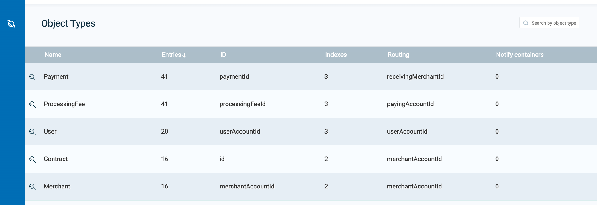

# gs-admin-training - lab12-memoryxtend

# The Bill Buddy Application with MemoryXtend

## Lab Goals

1. Experience an application deployment process.
2. Get familiar with the BillBuddy application.
3. Use GigaSpaces MemoryXtend. 

## Lab Description
You will understand MemoryXtend and its benefits by deploying a GigaSpaces application.

### Initial deployment

---
#### Start the service grid

 1. Navigate to `$GS_HOME/bin`
        
 2. Start **GigaSpaces agent** with a local Manager server and 5 GSCs:
    ```
    ./gs.sh host run-agent --auto --gsc=5
    ```
    
#### Deploy BillBuddy_Space
    
1. Open `$GS_ADMIN_TRAINING_HOME/lab12-memoryxtend` project with Intellij (open the pom.xml).
2. Run mvn package
    ```
        ~/gs-admin-training/lab12-memoryxtend$ mvn package
        
        
        [INFO] Reactor Summary:
        [INFO] 
        [INFO] lab12-memoryxtend ............................................... SUCCESS [  0.204 s]
        [INFO] BillBuddyModel ..................................... SUCCESS [  1.087 s]
        [INFO] BillBuddy_Space .................................... SUCCESS [  0.207 s]
        [INFO] BillBuddyAccountFeeder ............................. SUCCESS [  0.189 s]
        [INFO] BillBuddyCurrentProfitDistributedExecutor .......... SUCCESS [  0.225 s]
        [INFO] BillBuddyPaymentFeeder ............................. SUCCESS [  0.190 s]
        [INFO] ------------------------------------------------------------------------
        [INFO] BUILD SUCCESS
    ```
3. IntelliJ path Variables (under preferences)

    ###### Add GS_LOOKUP_GROUPS & GS_LOOKUP_LOCATORS

    For example set `GS_LOOKUP_LOCATORS=localhost` and `GS_LOOKUP_GROUPS=xap-17.1.2`

4. Copy the runConfigurations directory to the Intellij **.idea** directory to enable the Java Application configurations. Restart Intellij.

5. Open a new Terminal and navigate to `$GS_HOME/bin`
    ```
    cd $GS_HOME/bin
    ```
6. Use the gs CLI to deploy the BillBuddy_Space:
    ``` 
    ./gs.sh pu deploy BillBuddySpace ~/gs-admin-training/lab12-memoryxtend/BillBuddy_Space/target/BillBuddy_Space.jar 
    ```
#### Populate Users and Merchants
###### Run BillBuddyAccountFeeder from Intellij

1. From Intellij select the BillBuddyAccountFeeder configuration and run it.

    ###### This application writes Users, Merchants and Contracts to the Space
 
2. Validate Users and Merchants were written to the space. Please refer to 'lab03-application_components' for instructions on how to check data types.  


3. Query the list of Users by executing the following SQL:
    ```
    SELECT * FROM com.gs.billbuddy.model.User WHERE rownum<5000
    ```
    Please refer to 'lab03-application_components' for instructions on how to query.

    ###### Note: Fully qualified class name is required.


#### Simulate transactions
 * The BillBuddyPaymentFeeder application creates payments by randomly choosing a user, a merchant and an amount and performs the initial process of a payment.
 * This includes deposit and withdrawal updates of each party’s balance appropriately.
 * After the payment is initially processed it is written to the space for further processing.
 * A new Payment is created every second.
 
1. Run the BillBuddyPaymentFeeder using Intellij:  
   Use the same instructions as used for the BillBuddyAccountFeeder.

2. Validate Payments were written to the space.    
   Check the Payment Data Type Name as you did in section above for Merchants and Users.
 
3. Go to the statistics operations and see that a payment is actually added every second.  
   Please refer to 'lab03-application_components' for instructions on how to check operations statistics.

4. Check Data Types. See how many records are in the space.  

### Undeployment

---
#### Undeploy the space:  
   `./gs.sh pu undeploy BillBuddySpace`

### Deploy and restore data from disk

---
#### Deploy the space and verify that all records were restored from disk.
```
./gs.sh pu deploy BillBuddySpace ~/gs-admin-training/lab12-memoryxtend/BillBuddy_Space/target/BillBuddy_Space.jar
```
Once again, check the data types to see the records were restored from the disk back to the space.  



### Additional resources

---
See:  
 * https://docs.gigaspaces.com/latest/admin/x-memoryxtend-overview.html
 * https://docs.gigaspaces.com/latest/admin/memoryxtend-rocksdb-ssd.html
