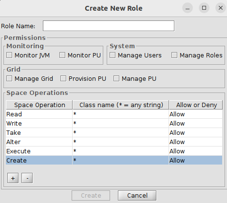

# gs-admin-training - lab13-security

# Grid and Data Security

This lab will have tasks related to security, which include:    
 * Securing the service grid.
 * Deploying a basic secured space.
 * Demonstrating a password encoding example.
 * Experimenting with roles and privileges, including writing to a secured space in a secured grid.
 
---
### 1. Configuration of secured grid

1. Navigate to the `$GS_HOME/bin` directory.  
   `cd $GS_HOME/bin`

2. Edit setenv-overrides.sh and add:

```
export GS_MANAGER_OPTIONS="-Dcom.gs.manager.rest.ssl.enabled=false"
export GS_OPTIONS_EXT="-Dcom.gs.security.enabled=true"
```
Note: Make sure you have set `GS_MANAGER_SERVERS` to localhost also.

### 2. User password encryption
#### Overview of steps:
 * Edit the security-config.xml file.
 * Use org.springframework.security.crypto.bcrypt.BCryptPasswordEncoder.
 * Encrypt and write the passwords for "gs-admin", "gs-mngr" and "gs-viewer". 
 * Verify that you can login through the Ops Manager.


##### Edit the security-config.xml as follows
1. Edit the default `$GS_HOME/config/security/security-config.xml` and configure the **BCryptPasswordEncoder**:  
   Replace:
```
<bean id="passwordEncoder" class="org.springframework.security.crypto.password.NoOpPasswordEncoder"/>
```
   with:  
```
<bean id="passwordEncoder" class="org.springframework.security.crypto.bcrypt.BCryptPasswordEncoder"/>
```
2. Add bean **DaoAuthenticationProvider**
```
    <bean id="authProvider" class="org.springframework.security.authentication.dao.DaoAuthenticationProvider">
        <property name="userDetailsService" ref="roleBasedUserService" />
        <property name="passwordEncoder" ref="passwordEncoder" />
    </bean>
 ```
3. Generating passwords  
    * Copy the runConfigurations directory to the .idea directory. Restart Intellij.
    * Open this project in Intellij (pom.xml is located at `$GS_ADMIN_TRAINING/lab13-security/pom.xml`).
    * Run the PasswordEncoderGenerator to generate the password. Pass the password that you want encoded as a program argument. 
    * Replace the passwords for gs-admin, gs-mngr, gs-viewer users in the `$GS_HOME/config/security/security-config.xml`.
4. Review the security-config.xml.  
    * For reference a copy of the [security-config.xml file](securedgridconfig/example/config/security/security-config.xml) can be found in the current project.

5. Overview of privileges:  
    * These are the privileges available on the service grid.

      
    * MANAGE_GRID - privileges associated with managing the life cycle of a service grid component.
    * MONITOR_JVM - allows for monitoring of the JVM and the ability to take heap dumps.
    * MONITOR_PU, PROVISION_PU, MANAGE_PU - privileges related to managing the life cycle of a PU.
    * SPACE_READ, SPACE_WRITE, SPACE_ALTER - These privileges allow the user the ability to read and write data.
    * For more information on Space Privileges please consult the [GigaSpaces online documentation](https://docs.gigaspaces.com/latest/security/security-quick-start-understanding-config-file.html).
    * For more information on configuring the security-config.xml, please see our guide [here](https://docs.gigaspaces.com/latest/security/security-quick-start-understanding-config-file.html).
    
### 3. Start the grid with a manager
```
./gs.sh host run-agent --manager
```
### 4. Verify logins
        
1. Open the Ops-Manager. The Ops-Manager will be deployed at: `localhost:8090`

2. Verify you can login with:         
```
    gs-viewer/gs-viewer
    gs-mngr/gs-mngr
    gs-admin/gs-admin
```
### 5. Writing to a Secured Space
#### Overview of steps:
Writing to a secured PU will be composed of:
 * Deploying a secured space.
 * Deploying a stateless PU that writes to the space.

#### Questions
 * What user will you use?
 * What privileges should this user have?

#### Solution

1. Edit the security-config.xml file and add the SPACE_WRITE, SPACE_ALTER privilege to user gs-mngr.

2. Restart the grid with a manager
```
./gs.sh host run-agent --manager
```

3. Start 2 Grid Service Containers
```        
./gs.sh --username gs-admin --password gs-admin container create --count=2 localhost
```                      
4. Deploy the PU with the secured embedded space
```
./gs.sh --username gs-admin --password gs-admin pu deploy SecuredSpace $GS_ADMIN_TRAINING/lab13-security/securedspace/target/securedspace.jar
```
Note: The space has already been configured to be secured. See the tags below or refer to the [pu.xml file](securedspace/src/main/resources/META-INF/spring/pu.xml)
```
    <os-core:embedded-space id="space" space-name="demo">
        <os-core:security secured="true"/>
    </os-core:embedded-space>
```
For more information on secured spaces please visit the [GigaSpaces online documentation](https://docs.gigaspaces.com/latest/security/securing-your-data.html)

5. Deploy the feeder PU
```
./gs.sh --username gs-admin --password gs-admin pu deploy -p=username=gs-mngr -p=password=gs-mngr Feeder ~/$GS_ADMIN_TRAINING/lab13-security/feeder/target/feeder.jar
```

6. Query the data executing the following:
Note: The fully qualified class name is required.

```
$ ./gs.sh --username gs-mngr --password gs-mngr space query demo com.gigaspaces.dev.training.common.Data 

data    id    processed    rawData    type    
0       0     false        0          0       
9       9     false        9          9       
7       7     false        7          7       
5       5     false        5          5       
3       3     false        3          3       
1       1     false        1          1       
8       8     false        8          8       
6       6     false        6          6       
4       4     false        4          4       
2       2     false        2          2       


SUMMARY     
Results:    10
```
---
### Additional Resources
An example of configuring GigaSpaces for use with ldap is available in our knowledge base at our [support portal](https://support2.gigaspaces.com). Sign up is required.
