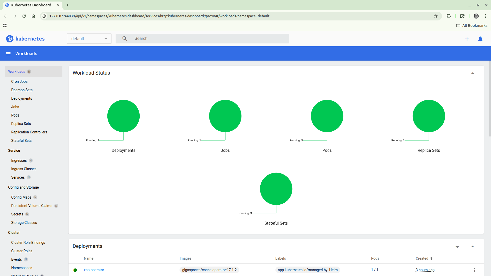
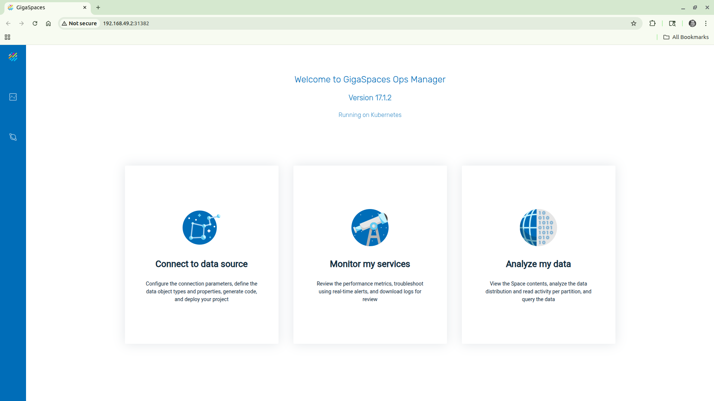
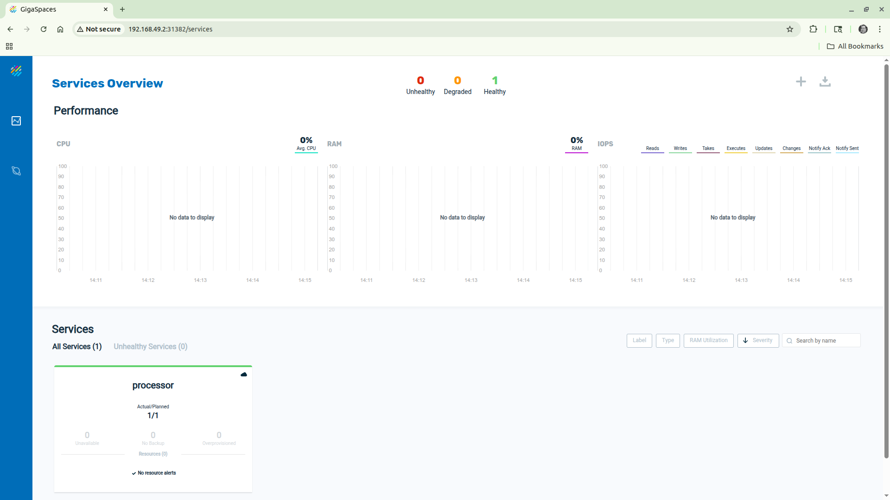
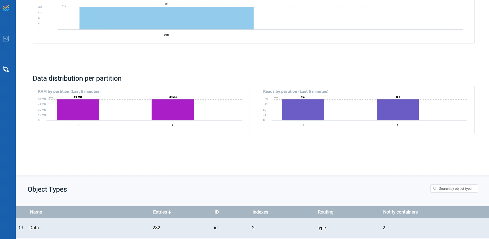
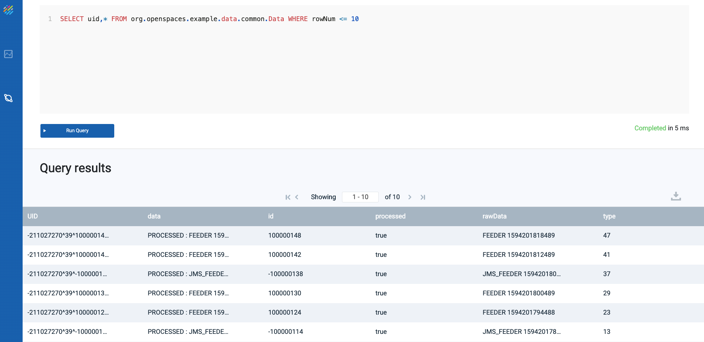
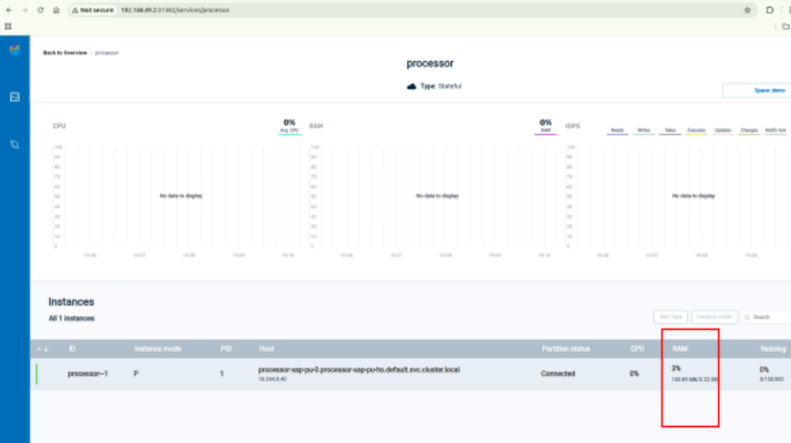
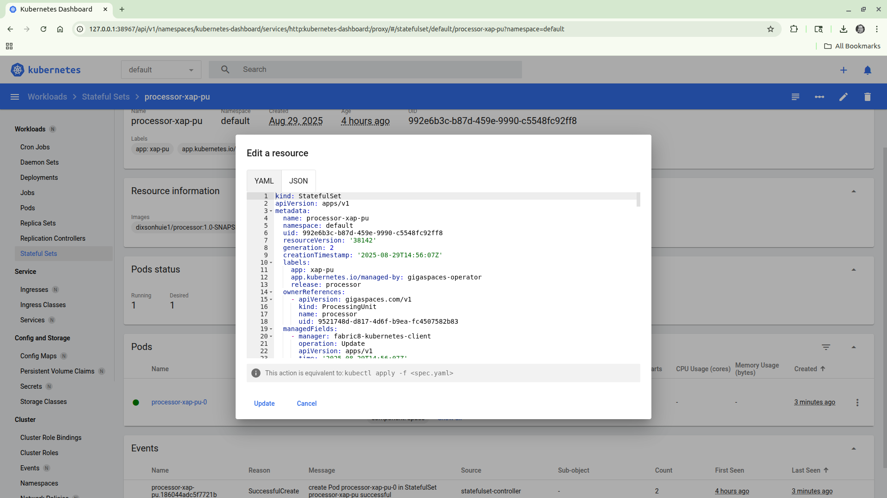
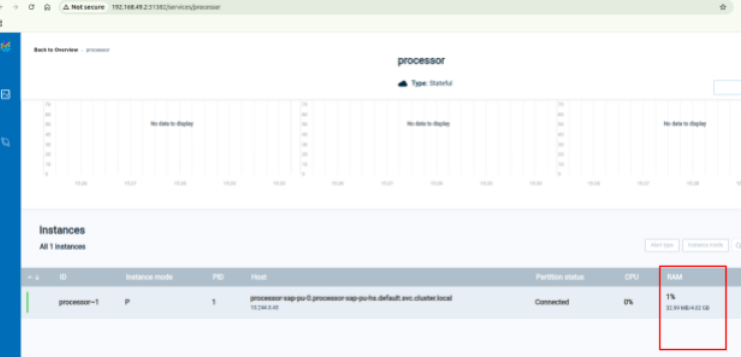

# gs-admin-training - lab14-kubernetes

# Kubernetes and Vertical scaling

## Lab Goals

 * Get experience with running a XAP PU on a Kubernetes cluster.  
 * Perform scale of a stateful PU.

## Lab Description
 * In this lab we will deploy xap-manager, xap-operator, a stateful processor pu and a stateless feeder.  
 * We will perform scaling of the processor pu.

---
## Prerequisites

---
Before beginning to work with the data grid and xap, ensure that you have the following installed on your local machine or VM:

 * [kubectl](https://kubernetes.io/docs/tasks/tools/install-kubectl/)
 * [helm](https://docs.helm.sh/using_helm/#quickstart-guide)  
   Note: _This lab has been updated to support Helm 3._
 * [minikube](https://kubernetes.io/docs/setup/minikube/)
 * [docker engine](https://docs.docker.com/engine/install/)

### minikube Setup ###
1. Configure memory and cpu:

```
    minikube config set memory 4096
    minikube config set cpus 4
```
    
2. After installation, configure the VM driver

   Note: _This step is optional_ as minikube now prefers to use **Docker** as the VM driver.  
   If you installed **VirtualBox** as the Hypervisor please run the following:

   `minikube config set vm-driver virtualbox`

3. Start Minikube:  
   `minikube start`
```
😄  minikube v1.36.0 on Ubuntu 22.04
✨  Using the docker driver based on existing profile
👍  Starting "minikube" primary control-plane node in "minikube" cluster
🚜  Pulling base image v0.0.47 ...
🔄  Restarting existing docker container for "minikube" ...
🐳  Preparing Kubernetes v1.33.1 on Docker 28.1.1 ...
🔎  Verifying Kubernetes components...
    ▪ Using image gcr.io/k8s-minikube/storage-provisioner:v5
    ▪ Using image docker.io/kubernetesui/dashboard:v2.7.0
    ▪ Using image docker.io/kubernetesui/metrics-scraper:v1.0.8
💡  Some dashboard features require the metrics-server addon. To enable all features please run:

	minikube addons enable metrics-server

🌟  Enabled addons: default-storageclass, storage-provisioner, dashboard
🏄  Done! kubectl is now configured to use "minikube" cluster and "default" namespace by default
```

4. In a separate terminal expose the minikube load balancer:  
   Note: This step is _optional_ in this lab but is useful if deploying the **dih umbrella** chart.  
   `minikube tunnel`

---
## Application Deployment

---
### Build
1. Confirm the `$DOCKER_USER_NAME` is set correctly in the [settings.sh](scripts/settings.sh) file
2. Run the [build.sh](scripts/build.sh) script which will run maven to install the project and call the [script with the docker build commands](scripts/docker-build.sh).

### Manager and Operator deployment
####  helm repo setup
Deployment steps are defined in the [deploy-k8s.sh script](scripts/deploy-k8s/deploy-k8s.sh). You can follow the steps below or run the script.

1. Add GigaSpaces helm repository to the repository list

   `helm repo add gigaspaces https://resources.gigaspaces.com/helm-charts`

2. Fetch the GigaSpaces Helm charts from the GigaSpaces repository

   Note: This step is _optional_. The charts are unpacked in your current directory and can be useful for troubleshooting.
    ```
    helm pull gigaspaces/dih    --version 17.1.2 --untar
    helm pull gigaspaces/xap-pu --version 17.1.2 --untar
    ```

#### helm manager and operator deployment
1. Deploy a **xap-manager** pod called manager:  
```
helm install manager gigaspaces/xap-manager --version 17.1.2 --set global.security.enabled=false,java.options="-Dcom.gs.hsqldb.all-metrics-recording.enabled=false"
```
2. Deploy the **xap-operator** and name it operator.  
   The xap-operator is responsible for deployment of PUs and managing the **pu** Custom Resource Definition:  
```
helm install operator gigaspaces/xap-operator --version 17.1.2 --set global.security.enabled=false
```

#### View and monitor kubernetes deployment
1. Verify that the pods are running
```
$ kubectl get pods
NAME                            READY   STATUS    RESTARTS   AGE
manager-xap-manager-0           1/1     Running   0          5m
xap-operator-674d8dcf65-vsk27   1/1     Running   0          5m
```
    
2. In a separate terminal open the Minikube Dashboard. The browser will automatically open.

    `minikube dashboard &`



3. Open Gigaspaces Ops Manager  
   On minikube this is can be done by exposing a NodePort service:  
   `kubectl apply -f manager-np.yaml`  
   Note: The manager-np.yaml can be found [here](scripts/deploy-k8s/yaml/manager-np.yaml).  
   Then to automatically open a browser window to the Ops Manager:  
   `minikube service manager-np`



---
### Processor Service deployment
#### Deploy the processor docker image
1. Deploy the processor using helm. See [deploy-k8s.sh script](scripts/deploy-k8s/deploy-k8s.sh):
```
helm install processor gigaspaces/xap-pu --version 17.1.2 --set schema=partitioned,partitions=1,ha=false,resourceUrl=pu.jar,image.repository=$DOCKER_USERNAME/processor,image.tag=1.0-SNAPSHOT,java.options="-Dcom.gs.hsqldb.all-metrics-recording.enabled=false"
```
```
$ kubectl get pod
NAME                            READY   STATUS    RESTARTS   AGE
processor-xap-pu-0              1/1     Running   0          19m
xap-manager-0                   1/1     Running   0          19m
xap-operator-674d8dcf65-vsk27   1/1     Running   0          19m

$ kubectl get crd
NAME                 CREATED AT
pus.gigaspaces.com   2025-08-14T18:32:19Z
$ kubectl get pus
NAME        STATUS
processor   DEPLOYED

```
#### Alternative steps to generate the processor service - for testing purposes
This is an alternative way to deploy the processor without using Docker.
1. In the `lab14-kubernetes` directory run `mvn clean package`
2. Run `minikube service --url manager-np` to get the manager url.
```
$ minikube service --url manager-np
http://192.168.49.2:31382
```
3. To upload the PU to manager run:
```
$GS_HOME/bin/gs.sh --server 192.168.49.2:31382 pu upload processor/target/data-processor.jar
```  
   This uses the url returned from in the previous step.  
   **The result should be:**
```
   [data-processor.jar] successfully uploaded  
   Resource URL: http://192.168.49.2:31382/v2/resources/data-processor.jar  
```
4. Deploy the processor using helm
```
helm install processor gigaspaces/xap-pu --version 17.1.2 --set schema=partitioned,partitions=1,ha=false,resourceUrl=http://xap-manager-service:8090/v2/resources/data-processor.jar,java.options="-Dcom.gs.hsqldb.all-metrics-recording.enabled=false"
```
---
### Deploy the feeder
 * The feeder uses a remote proxy/GigaSpaces client to connect to the space.  
 * It is written using Spring Boot.
 * For ease of deployment, it uses **kubectl kustomize** to substitute the docker image name.  
 * The [job.yaml file](scripts/deploy-k8s/yaml/job.yaml) is used to deploy the kubernetes Job that runs the Spring Boot code.  
   See: [run-feeder-k8s.sh](scripts/deploy-k8s/run-feeder-k8s.sh)

```
cd scripts/deploy-k8s
./run-feeder-k8s.sh
```

```
$ kubectl get pods
NAME                                READY   STATUS    RESTARTS   AGE
pod/feeder-b55xm                    1/1     Running   0          30m
pod/processor-xap-pu-0              1/1     Running   0          30m
pod/xap-manager-0                   1/1     Running   0          30m
pod/xap-operator-674d8dcf65-vsk27   1/1     Running   0          30m
```

### View and monitor GS kubernetes deployment

1. minikube dashboard


2. GS Ops Manager

Click on "Monitor my services".  



Click on "Space: demo" (button in the top right corner).  



Query the data:  



### Troubleshooting
1. If the processor service did not get deployed properly, a good place to check for errors is in the operator Pod logs. For example,
```
kubectl logs xap-operator-674d8dcf65-vsk27
```
2. For a general troubleshooting pointers related to Kubernetes please refer to this [guide](https://kubernetes.io/docs/tasks/debug/debug-application/).
3. Before deploying onto Kubernetes it is helpful to debug on a local computer. Scripts have been provided to:
 * [Start the service grid](scripts/deploy/start-service-grid.sh) on the local computer.
 * [Deploy the space service](scripts/deploy/deploy-processor.sh) locally. Deployment errors will appear in the console and in the `$GS_HOME/logs` directory. Check the manager and gsc logs.
 * Run the Spring boot [feeder](scripts/deploy/run-feeder.sh) on the local computer.
---
## Scaling GigaSpaces Applications

---

### Perform memory scaling using Kubernetes tools

1. Review current RAM occupied by the processor service.

   Click on the processor service  

   

2. Edit the current processor service's memory configuration using the minikube dashboard. Click on the processor service's StatefulSet, click on the edit (pencil icon) in the top right corner:<br/>

   

   Modify:
```
       resources:
          limits:
            memory: 5Gi
```
   Or you can use `kubectl edit statefulset/processor-xap-pu`.  
   After you have finished the edits, the pods will restart with new memory settings.

3. Check the processor service to see the memory has been increased.:  

   

### Perform memory scale using the GS CLI

1. Scale the processor service.
Getting the value for `--server` is explained in the above section: "Alternative steps to generate the processor service"
```
$GS_HOME/bin/gs.sh --server 192.168.49.2:31382 pu scale-vertical --memory=600Mi processor
```

   **The result should be:**  
```
Request ID     d00b9d04-a1e8-4b48-bd7a-2cba49a89299

Status can be tracked using the command: request status d00b9d04-a1e8-4b48-bd7a-2cba49a89299
```

2. Check the request status.
   Using the **Request ID** from the previous step:
```
$GS_HOME/bin/gs.sh --server 192.168.49.2:31382 request status d00b9d04-a1e8-4b48-bd7a-2cba49a89299
```
   ** After a some time, you should see a result similar to the output below:**  
```
REQUEST DETAILS    
ID                 d00b9d04-a1e8-4b48-bd7a-2cba49a89299                                                             
Description        Scale resources of processing unit: [processor], memory: [600Mi] with timeout of : [30000] ms    
Status             successful                                                                                       
Submitted By       anonymous
Submitted From     10.244.0.1
Submitted At       2025-08-29 19:44:31
Completed At       2025-08-29 19:44:49
Result             {processor=Success}
```
---
## Cleanup

---
### Undeploy the services
For convenience a [script](scripts/deploy-k8s/teardown-k8s.sh) containing the following commands has been included in this project.
```
kubectl delete -f job.yaml
kubectl delete -f manager-np.yaml

helm del processor
helm del operator
helm del manager
```
### Delete and stop the minikube
`minikube delete`
  
  
