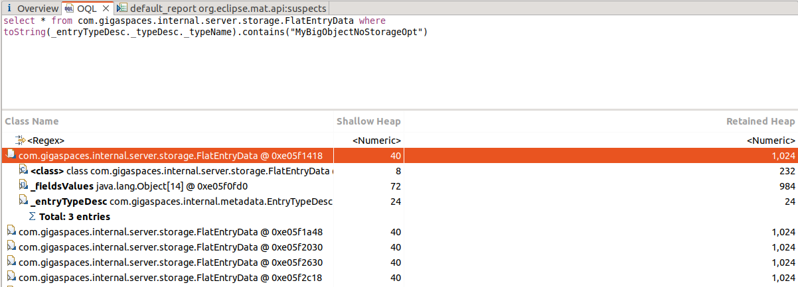
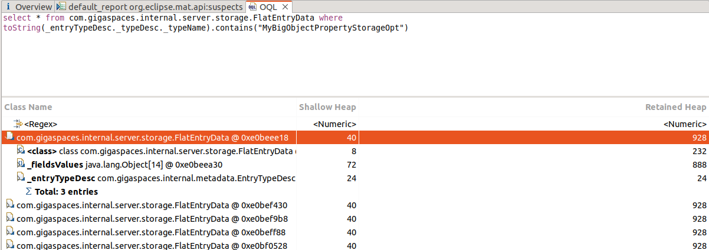
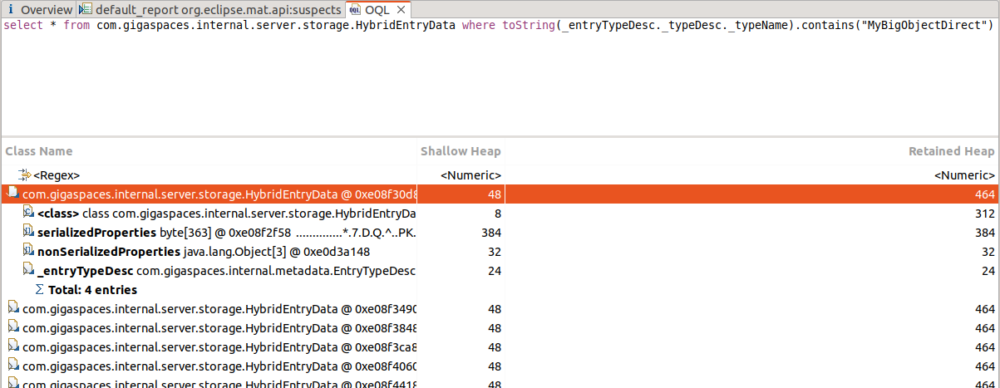
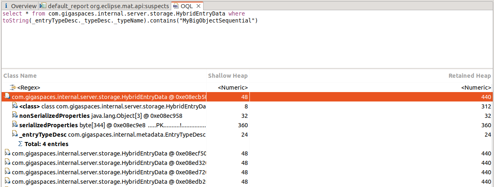

# gs-admin-training - lab15-storage_optimization

# Storage Optimization

## Lab Goals

The storage optimization feature can be used to help conserve RAM. This lab will introduce the basic concepts behind the storage optimization feature.

## Lab Description
In this lab we will need to write 4 types of Space Objects. Each type will use a different Storage Optimization.

You will write each Space Object separately to the space and use Memory Analyzer (MAT) to measure its heap size.

### Lab Exercise
#### Requirements:
###### 1. Create 4 different objects according to the following requirements:

 * Space Id - Integer
 * Order Index key - String *will be filled with 1 char*
 * Equal and Order key - String *will be filled with 1 char*
 * Ten properties - String *will be filled with 5 chars*
 * Payload - String array *will be filled with 150 chars*

###### 2. Annotate the 4 Objects as follows:

 * The first will not have any optimization.
 * The second will use the Storage Types that has been introduced in version 15.2.  
   See: https://docs.gigaspaces.com/latest/dev-java/storage-types-controlling-serialization.html?Highlight=storage%20adapters  
   This storage optimization is intended to help with individual properties.
 * The third will use the new Direct Storage Optimization that has been introduced in version 15.8.  
   See: https://docs.gigaspaces.com/latest/dev-java/storage-optimization.html?Highlight=Storage%20optimization  
   This will use a chunk of storage to store individual properties to further increase storage optimization.
 * The fourth will use the new Sequential Storage Optimization that has been introduced in version 15.8. Same page as above.  
   This will also use a chunk of storage to store individual properties to further increase storage optimization. But the manner it which the chunk storage is accessed differs from the Direct Storage Optimization.

###### 3. Start the Grid
`./gs.sh host run-agent --manager --gsc=1`
    
###### 4. Deploy "demo" space with 1 partition (no backup)
`./gs.sh space deploy demo`

###### 5. Write the first type to the space

 * Fill the first type with data.
 * Write 10K instances to the space. For your convenience a JUnit application configuration has been created.
    * Open the `$GS_ADMIN_TRAINING/lab15-storage_optimization` project in Intellij (open the pom.xml).
    * Copy runConfigurations to the Intellij .idea directory.
      ```
      cp -r runConfigurations ./idea/
      ```
    * Restart Intellij
    * Run the SpaceTestCase run configuration. You can modify the `-Dtest.case` System Property. This System Property controls which type to write.  
      The values can be `NONE, BINARY_COMPRESSED_PROPS, DIRECT, SEQUENTIAL`. 
 * Open the Ops Manager and verify that you see the entries. 

###### 6. Take a heap dump
 * Open the Ops Manager and take the heap dump of the space.
 * Alternatively, from the command line run, `jmap -dump:live,format=b,file=/path/to/dump/heap_<storage type>-<pid>.hprof <pid>`
 * Un-deploy "demo" space.

###### 7. Analyze the heap dump
 * Launch the Memory Analyzer Tool (MAT) and open the heap dump you have just created.
   See: https://eclipse.dev/mat/
 * Verify its size.
 * Open the OQL tab and run the following query for MyBigObjectNoStorageOpt:
```
select * from com.gigaspaces.internal.server.storage.FlatEntryData where toString(_entryTypeDesc._typeDesc._typeName).contains("MyBigObjectNoStorageOpt")
``` 
###### 8. Repeat steps 4-7 for each type
 * Run the following query for MyBigObjectPropertyStorageOpt:  
```
select * from com.gigaspaces.internal.server.storage.FlatEntryData where toString(_entryTypeDesc._typeDesc._typeName).contains("MyBigObjectPropertyStorageOpt")
```
 * Run the following query for MyBigObjectDirect:  
```
select * from com.gigaspaces.internal.server.storage.HybridEntryData where toString(_entryTypeDesc._typeDesc._typeName).contains("MyBigObjectDirect")
```
 * Run the following query for MyBigObjectSequential:  
```
select * from com.gigaspaces.internal.server.storage.HybridEntryData where toString(_entryTypeDesc._typeDesc._typeName).contains("MyBigObjectSequential")
```

### Solution

---

##### MyBigObjectNoStorageOpt - Footprint per Object 1,024 byte | Total Heap size (= 35.4)


<br/>
<br/>
<br/>
<br/>

##### MyBigObjectPropertyStorageOpt - Footprint per Object 928 byte | Total Heap size (= 34.5)


<br/>
<br/>
<br/>
<br/>

##### MyBigObject158Direct - Footprint per Object 464 byte | Total Heap size (= 30.1)


 * In the new HybridEntryData class it is nice to see the division between the serialized and the non-serialized properties.

<br/>
<br/>
<br/>
<br/>

##### MyBigObject158Sequential - Footprint per Object 440 byte | Total Heap size (= 29.9)


 * In the new HybridEntryData class it is nice to see the division between the serialized and the non-serialized properties.

<br/>
<br/>
<br/>
<br/>  

##### Table Summary #####

| | Footprint per Object (bytes) | Total RAM (MB) |
|---|---|---|
| **MyBigObjectNoStorageOpt** | 1024 | 35.4 |
| **MyBigObjectPropertyStorageOpt** | 928 | 34.5 |
| **MyBigObjectDirect** | 464 | 30.1 |
| **MyBigObjectSequential** | 440 | 29.9 |
