# ODSX Lab-A

## Lab Summary
   
     1.Repositories needed to run Lab
     2.AWS Configuration
     3. Environment setup (STATELESS ODSX)
        3.1 Download Installers on mounted folders
        3.2  Installers on mount
        3.3 ODSX Configuration setup(STATELESS ODSX)
        3.4 ODSX Configuration security setup
        3.5 ODSX Configuration new host / supporting jar setup
        3.6 Installation
        3.7 Usage
        3.8 Host configurations
     4. DIH
        4.1 DI (Zookeeper+kafka+telegraf+DI-services)
        4.2 Grafana
        4.3 Influxdb
        4.4 Manager
        4.5 Space
        4.6 Northbound
            4.6.1 Applicative
            4.6.2 Management
            4.6.3 Agent
    

### 1. Repositories needed to run Lab

  -  Main : https://github.com/GigaSpaces-ProfessionalServices/gs-odsx.git
  -  Release : https://github.com/GigaSpaces-ProfessionalServices/gs-odsx/releases/tag/v3.51-sox-release 
  -  https://github.com/GigaSpaces-ProfessionalServices/CSM-Magic-Tools.git
  -  https://github.com/Gigaspaces/insightedge-training/tree/master/Day4/17_TieredStorage

### 2. AWS Configurations
1. Create EC2- Instances on AWS based on your requirement (OS: Redhat:7.7 RHEL)
   Minimum Setup :
   Pivot (ODSX)-1
   Manager-3
   Space-2
   DataIntegration-1
   Grafana and Influx - (pivot)
   Northbound applicative-1
   Northbound management-1
   kapacitor (DataIntegration)

2. Make each ec2- instances root(user) accessible.

  - By default EC2 instance is with default user ec2-user

  <code>  
    sudo sed -e 's/^PermitRootLogin.*/PermitRootLogin without-password/g' -i /etc/ssh/sshd_config
       
    sudo sed -e 's/^AllowUsers.*/AllowUsers ec2-user root/g' -i /etc/ssh/sshd_config
    
    sudo -s
    
    cd
    
    sudo sed -e 's/no-port/#no-port/g' -i ~/.ssh/authorized_keys
    
    sudo sed -e 's/ssh-rsa/\nssh-rsa/g' -i ~/.ssh/authorized_keys
    
    useradd gsods
    
    mkdir /home/dbsh
    mkdir /opt/Kafka
    
    mkdir /dbagigasoft
  </code>

### 3. Environment setup (STATELESS ODSX)
  - Select EFS from AWS :
  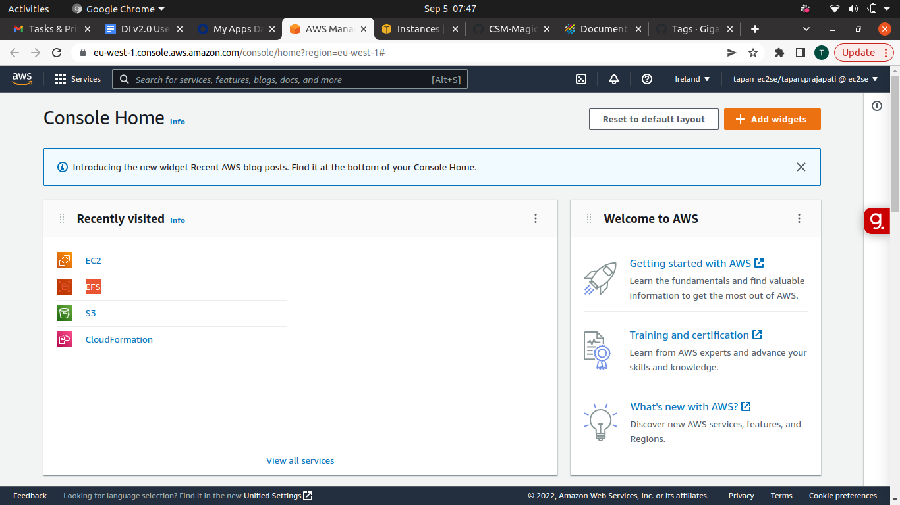
  - In AWS go to EFS -> create -> 
  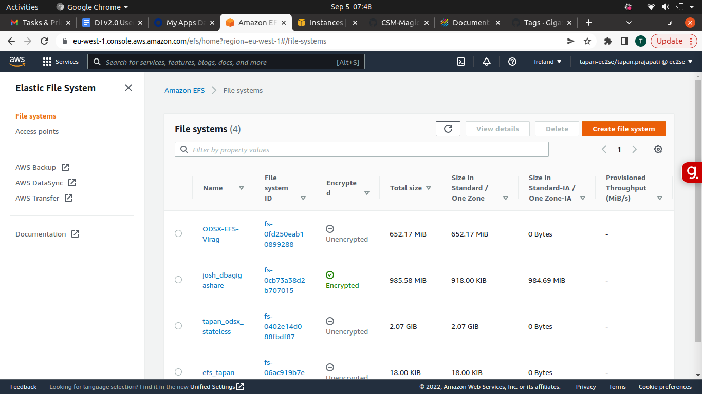
  - Make sure security group is same for EFS and EC2 user
  - For Pivot machine create directory structure same as app.yaml file
      - sudo mkdir -p /dbagigashare/current/data-integration/di-manager/ /dbagigashare/current/data-integration/di-mdm/ /dbagigashare/current/data-integration/di-flink/ /dbagigashare/current/telegraf/jars /dbagigashare/current/grafana/dashboards/ /dbagigashare/current/telegraf/scripts/space /dbagigashare/current/telegraf/config/pivot /dbagigashare/current/telegraf/config/agent /dbagigashare/current/kapacitor/config /dbagigashare/current/kapacitor/templates /dbagigashare/current/kapacitor/alerts /dbagigashare/current/gs/upgrade /dbagigashare/current/gs/config/space /dbagigashare/current/gs/config/metrics /dbagigashare/current/gs/jars/space /dbagigashare/current/gs/config/license /dbagigashare/current/grafana/catalog/jars /dbagigashare/current/data-validator/files /dbagigashare/current/data-validator/jars /dbagigashare/current/gs/jars/ts /dbagigashare/current/mq-connector/adabas/jars /dbagigashare/current/mq-connector/adabas/config /dbagigashare/current/mssql/files /dbagigashare/current/mq-connector /dbagigashare/current/security/jars/cef /dbagigashare/current/gs/config/log/ /dbagigashare/current/gs/jars /dbagigashare/current/gs/config/ts /dbagigashare/current/odsx /dbagigashare/current/mssql/jars /dbagigashare/current/mssql/scripts /dbagigashare/current/db2/jars /dbagigashare/current/db2/scripts /dbagigashare/current/cr8 /dbagigashare/current/grafana /dbagigashare/current/influx /dbagigashare/current/gs /dbagigashare/current/jdk /dbagigashare/current/kafka /dbagigashare/current/nb /dbagigashare/current/nb/applicative/ssl /dbagigashare/current/nb/management/ssl /dbagigashare/current/sqlite /dbagigashare/current/security /dbagigashare/current/unzip /dbagigashare/current/zk /dbagigashare/current/telegraf
  - Go to EFS -> created EFS -> Click on Attach copy the command and point to /dbagigashare instead of efs
  
  -Get Details of efs to mount directory
  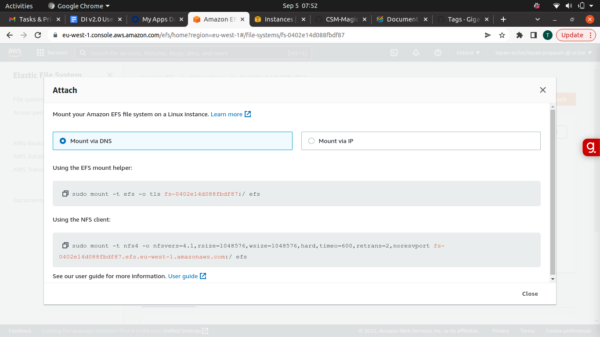
  - Go to other machine create directory /dbagigashare,  install NFS and run same attach command to mount created shared directory /dbagigashare
  - Run / Install NFS : sudo yum install -y nfs-utils
  - Mount shared file location /dbagigashare/current in AWS with all installer servers (NFS).

##### 3.1 Download Installers on mounted folders
 
  - Copy respected installers inside folders 
      
      - /dbagigashare/current/jdk : https://tapangigaspaces.s3.us-east-2.amazonaws.com/odsx/install/java/jdk-11.0.11_linux-x64_bin.rpm
      - /dbagigashare/current/unzip : https://tapangigaspaces.s3.us-east-2.amazonaws.com/odsx/install/unzip/unzip-6.0-21.el7.x86_64.rpm
      - /dbagigashare/current/gs : https://gigaspaces-releases-eu.s3.amazonaws.com/insightedge/16.1.1/gigaspaces-smart-dih-enterprise-16.1.1.zip
      - /dbagigashare/current/gs/config/ : https://tapangigaspaces.s3.us-east-2.amazonaws.com/odsx/install/gs/xap_logging.properties
      - /dbagigashare/current/gs/config/ : https://tapangigaspaces.s3.us-east-2.amazonaws.com/odsx/install/gs/space.properties
                                          - https://tapangigaspaces.s3.us-east-2.amazonaws.com/odsx/install/gs/spaceproperty.properties
                                          - https://tapangigaspaces.s3.us-east-2.amazonaws.com/odsx/install/gs/TieredCriteria.tab
      - /dbagigashare/current/db2/jars/  :https://tapangigaspaces.s3.us-east-2.amazonaws.com/odsx/install/db2/db2jcc_license_cu-4.16.53.jar
                                         - https://tapangigaspaces.s3.us-east-2.amazonaws.com/odsx/install/db2/db2jcc-4.26.14.jar
      - /dbagigashare/current/db2/scripts/ : https://tapangigaspaces.s3.us-east-2.amazonaws.com/odsx/install/db2/load_JOTBMF11_MATI_ISKY.sh
      - /dbagigashare/current/mssql/files/ : https://tapangigaspaces.s3.us-east-2.amazonaws.com/odsx/install/mssql/SQLJDBCDriver.conf
                                            - https://tapangigaspaces.s3.us-east-2.amazonaws.com/odsx/install/mssql/udkods2.keytab
      - /dbagigashare/current/mssql/jars/ : https://tapangigaspaces.s3.us-east-2.amazonaws.com/odsx/install/mssql/mssqlFeeder-1.0.0.jar
      - /dbagigashare/current/mssql/scripts/ : https://tapangigaspaces.s3.us-east-2.amazonaws.com/odsx/install/mssql/load_JOTBMF01_TN_MATI.sh                         
      
      - /dbagigashare/current/nb : https://tapangigaspaces.s3.us-east-2.amazonaws.com/odsx/install/nb/nb-infra-0.0.21.tar.gz
      - /dbagigashare/current/nb/applicative/ : https://tapangigaspaces.s3.us-east-2.amazonaws.com/odsx/install/nb/nb.conf.template
      - /dbagigashare/current/nb/management/  : https://tapangigaspaces.s3.us-east-2.amazonaws.com/odsx/install/nb/nb.conf.template
      
      - /dbagigashare/current/grafana : https://tapangigaspaces.s3.us-east-2.amazonaws.com/odsx/install/grafana/grafana-7.3.7-1.x86_64.rpm
                                     - https://tapangigaspaces.s3.us-east-2.amazonaws.com/odsx/install/grafana/gs_config.yaml
      - /dbagigashare/current/grafana/catalog/jars/ : https://tapangigaspaces.s3.us-east-2.amazonaws.com/odsx/install/grafana/catalogue-service.jar                                       
      
      - /dbagigashare/current/influx : https://tapangigaspaces.s3.us-east-2.amazonaws.com/odsx/install/influxdb/influxdb-1.8.4.x86_64.rpm
      
      - /dbagigashare/current/kafka : https://tapangigaspaces.s3.us-east-2.amazonaws.com/odsx/install/kafka/kafka_2.13-2.8.1.tgz
      
      - /dbagigashare/current/zk : https://dlcdn.apache.org/zookeeper/zookeeper-3.6.3/apache-zookeeper-3.6.3-bin.tar.gz
      
      - /dbagigashare/current/kafka : https://tapangigaspaces.s3.us-east-2.amazonaws.com/odsx/install/jolokia/jolokia-agent.jar
      
      - /dbagigashare/current/telegraf : https://dl.influxdata.com/telegraf/releases/telegraf-1.19.3-1.x86_64.rpm
          - Create same directory structure as : https://github.com/GigaSpaces-ProfessionalServices/CSM-Magic-Tools/tree/master/alerts/telegraf
      
      - /dbagigashare/current/kapacitor : https://repos.influxdata.com/rhel/8/x86_64/stable/kapacitor-1.6.2-1.x86_64.rpm
      - /dbagigashare/current/kapacitor: http://www6.atomicorp.com/channels/atomic/centos/7/x86_64/RPMS/jq-1.6-2.el7.x86_64.rpm
      - /dbagigashare/current/kapacitor: http://www6.atomicorp.com/channels/atomic/centos/7/x86_64/RPMS/oniguruma-6.8.2-1.el7.x86_64.rpm
        - For more directories and supporting files
          - Ref : https://github.com/GigaSpaces-ProfessionalServices/CSM-Magic-Tools/tree/master/alerts/kapacitor
          
      - /dbagigashare/current/security/config : https://tapangigaspaces.s3.us-east-2.amazonaws.com/odsx/install/security/ldap-security-config.xml
      - /dbagigashare/current/security/jars  : https://tapangigaspaces.s3.us-east-2.amazonaws.com/odsx/install/security/spring-ldap-core-2.3.3.RELEASE.jar
                                              - https://tapangigaspaces.s3.us-east-2.amazonaws.com/odsx/install/security/spring-security-ldap-5.1.7.RELEASE.jar
                                              - https://tapangigaspaces.s3.us-east-2.amazonaws.com/odsx/install/security/VaultSupport-1.0-SNAPSHOT.jar
      - /dbagigashare/current/security/cef/jars : https://tapangigaspaces.s3.us-east-2.amazonaws.com/odsx/install/security/CEFLogger-1.0-SNAPSHOT.jar
      
      - /dbagigashare/current/data-integration/dim/ : https://giga-di.s3.eu-west-1.amazonaws.com/di-packages/manualBuild/di-manager-0.0.12.4.tar.gz 
      - /dbagigashare/current/data-integration/mdm/ : https://giga-di.s3.eu-west-1.amazonaws.com/di-packages/manualBuild/di-mdm-0.0.12.4.tar.gz 
      - /dbagigashare/current/data-integration/flink : https://giga-di.s3.eu-west-1.amazonaws.com/Flink/flink-1.15.0-bin-scala_2.12.tgz
                                                   
      - /dbagigashare/current/gs/config/license/gs-license.txt write tryme or if you have valid license then put it.
      
      - Copy <odsx>/config/metrics.xml.template - /dbagigashare/current/gs/config/metrics/
      - Copy <odsx>/config/nb.conf.template To -  /dbagigashare/current/nb/applicative
                                                 - /dbagigashare/current/nb/management

##### 3.2  Installers on mount
 
  - Listed directories after creation on mounted servers/ hosts
  - 
  - 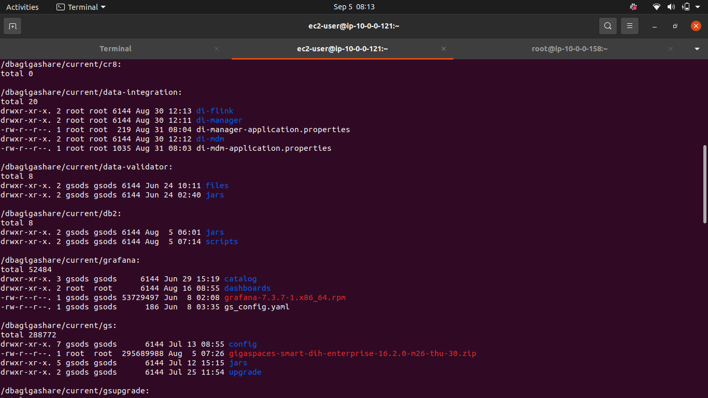
  - 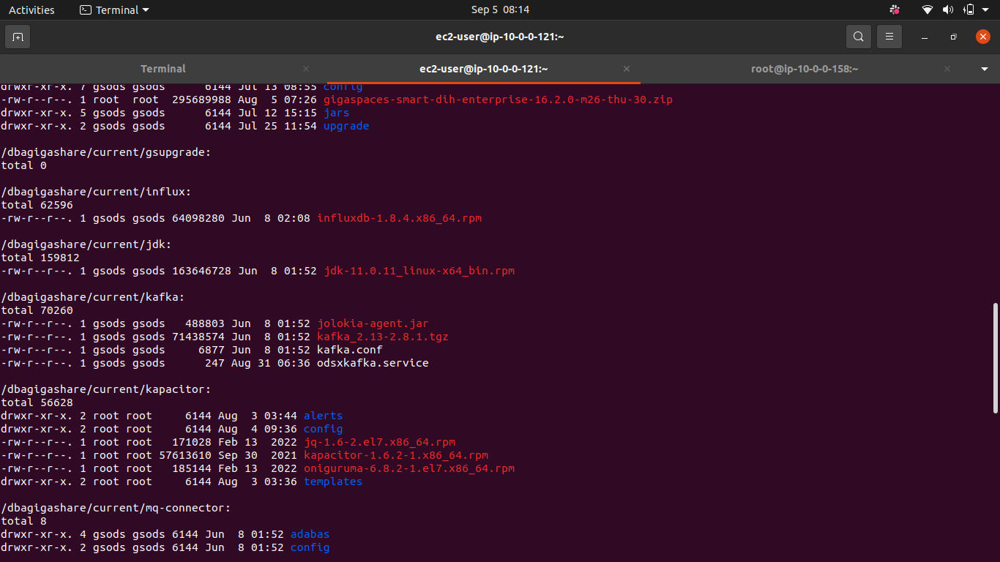
  - 
  - 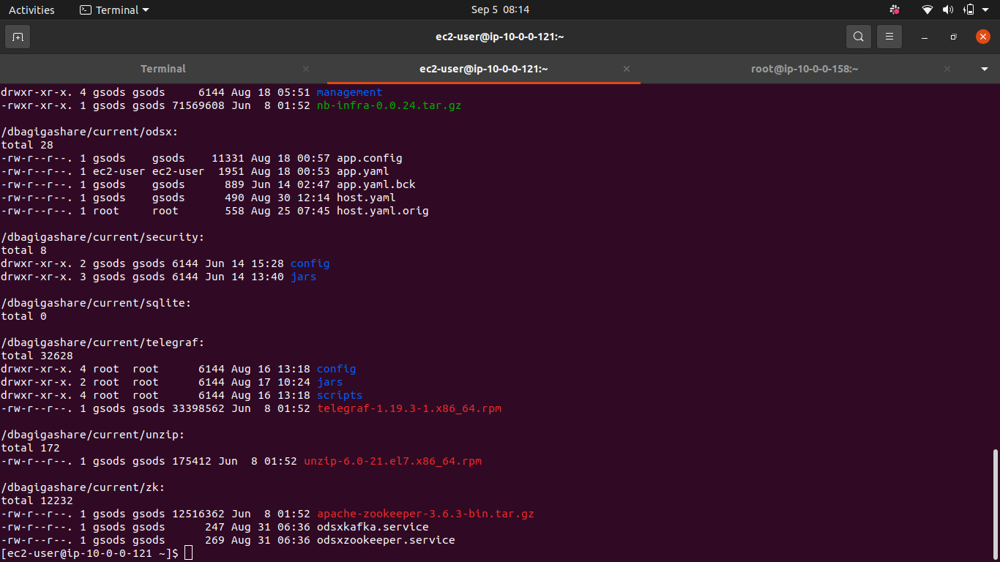 

##### 3.3 ODSX Configuration setup(STATELESS ODSX)

  - GIT URL : https://github.com/GigaSpaces-ProfessionalServices/gs-odsx/tags
  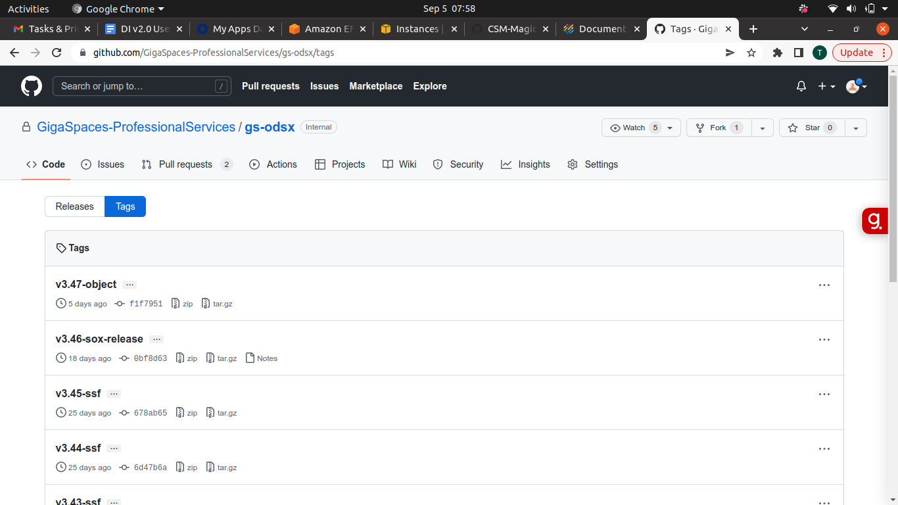
  - Download suffix with release so you will get mail branch which is simillar to bank env 
  - Trace odsx version by tags suffix.  
  - Download from git or copy .zip file to pivot / odsx server which will act as admin
  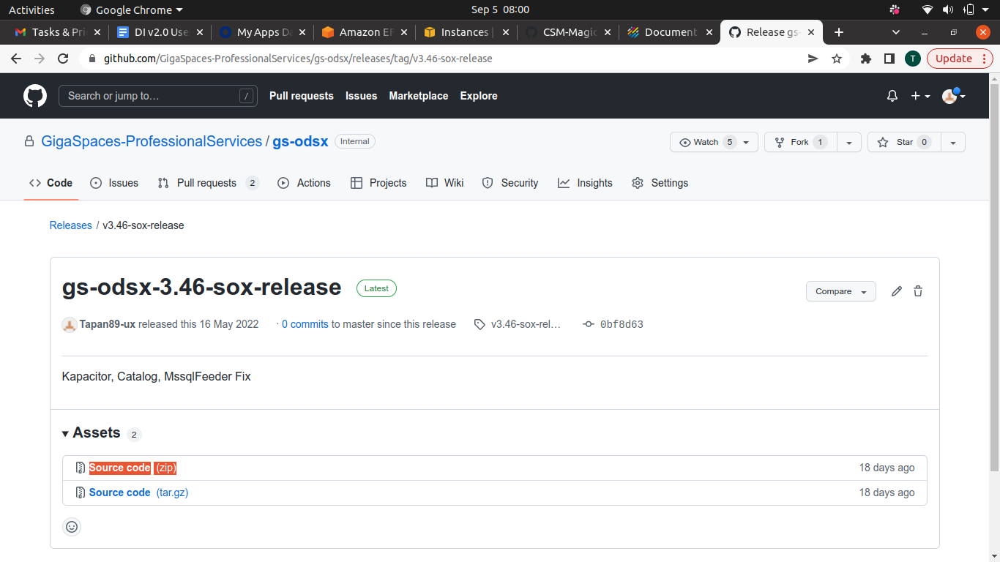
  - Unzip the .zip file check pythonpath in .bashrc or .bash_profile it should point to current unzipped odsx version.
  - export PYTHONPATH=/home/ec2-user/gs-odsx-3.46-sox-release
  - Open terminal and go to scripts folder
    -  [ec2-user@ip-10-0-0-121 scripts]$ pwd
       /home/ec2-user/gs-odsx-3.46-sox-release/scripts
       [ec2-user@ip-10-0-0-121 scripts]$ ./setup.sh 
    -  Run ./setup.sh
  - Copy <gs-odsx-home>/config/app.config, host.yaml, app.yaml -> files into /dbagigashare/current/odsx/
  - Go to odsx folder and run ./odsx.py file. Check whether menu is popuo or not.
  - If you are on AWS EC2 then modify flag cluster.usingPemFile=True
  - Uncomment or add your pem file cluster.pemFile=
  - Security : app.setup.profile=security  if you want to do secure setup
            - For unsecure installation : app.setup.profile= (keep blank)
  - If you are on DR envirounment app.setup.env=#dr (remove #) app.setup.env=dr
  - To Create Tag: 
    - git tag -a v1.1 -m 'tag for release 1.1'
    - git push origin v1.1
    - Release branch tag need to keep updated to release with latest
                        
##### 3.4 ODSX Configuration security setup

  - app.config : app.setup.profile=security
  - After security installation of Manager, Space servers go to /dbagiga/gigaspaces-smart-ods/config/security/security.properties Make sure below configuration is present
    - com.gs.security.security-manager.class=com.gigaspaces.security.spring.SpringSecurityManager
      spring-security-config-location=../config/security/security-config.xml
  - Go to respected scripts files and mention user / password = gs-admin (ONLY FOR AWS EC2 these changes shold not committed) 
     Example : odsx_security_servers_manager_list.py
        username = "gs-admin"#str(getUsernameByHost(managerHost,appId,safeId,objectId))
        password = "gs-admin"#str(getPasswordByHost(managerHost,appId,safeId,objectId))

##### 3.5 ODSX Configuration new host / supporting jar setup

  - Configurations for new host section need to be done under utils/ods_cluster_config.py
  - To add new host Example : 2 space servers but need to add 4 then
  - host.yaml -> add entries host1,host2 ... host4 and mention the respected IP / hostname
  - app.yaml maintain the supporting jars in yaml configuration
     Example : 
     gs:
         config:
           log:
             xap_logging: xap_logging.properties
                
##### 3.6 Installation

1. Clone this project from git repository.
   
    URL : https://github.com/GigaSpaces-ProfessionalServices/gs-odsx.git
    
2. Open terminal and go to scripts folder 

   cd gs-odsx/scripts

3. Run setup script using 

   ./setup.sh
  - Exit from terminal and Re-login to Pivot (ODSX) machine
4. Give permission to your pem file

  - chmod 400 gs-odsx/aharon_ami.pem

##### 3.7 Usage

    Go to main Project directory from terminal window (cd gs-odsx-3.46-sox-release/)
##### 3.8 Host configurations
  - Copy <gs-odsx-home>/config/app.config, host.yaml, app.yaml -> files into /dbagigashare/current/odsx/
  - Configure required hosts for respected feature installer
    
  - 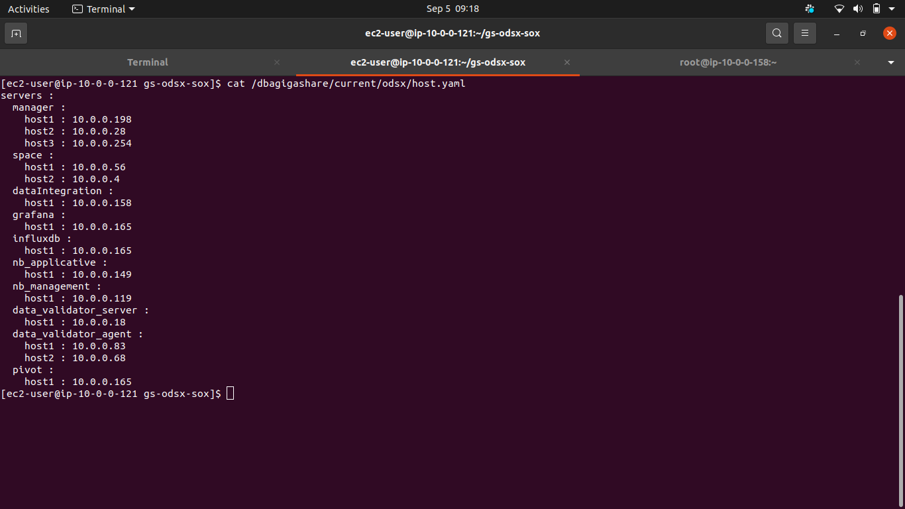
##### 3.9 Menu driven** 

Run below will start displaying various menu options 

./odsx.py

### 4. DIH
#### 4.1 DI server(Kafka+zk+telegraf+DI-services) Menu -> Servers -> DI

##### 4.1.1 Install

 - Install DI with cluster mode
   - 3/4 host / servers needed to install 
   - Single node also supports.
   - 
   - 
   - 
   - Verify by List
   - 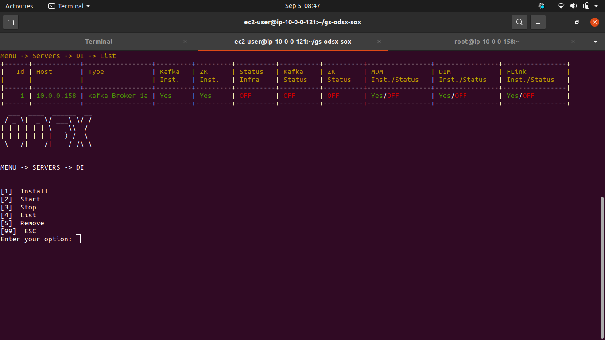

##### 4.1.2 Start   
- After installation complete start DI servers
- Verify DI servers by logged in to any of host and execute below command:

 - 
 - 
 - Verify by List
 - 

    source /home/dbsh/setenv.sh;
    $ZOOKEEPERPATH/bin/zkCli.sh -server localhost:2181 <<< "ls /brokers/ids" | tail -n 2

 

##### 4.1.3 Stop
   - 
   - Verify by list  

##### 4.1.4 Remove
   - 
   - 
   - Verify by List

#### 4.2 Grafana Server (Menu -> Servers -> Grafana)**

##### 4.2.1 Install

- Keep Grafana rpm file under /dbagigashare/current/grafana/grafana-7.3.7-1.x86_64.rpm

- 

##### 4.2.2 Start

- It will start Grafana server
 - Verify Grafana started or not by http://< Grafana host >:3000/ web browser

 
 - Verify after starting grafana on UI
 - <host>:3000 
 - Username/Password : admin/admin
 

##### 4.2.3 Stop

- It will stop Grafana service on installed host
  - 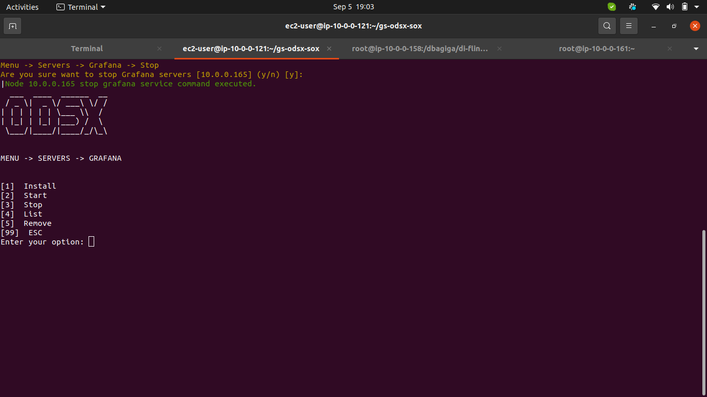
##### 4.2.4 Remove

   - It will Remove and uninstall Grafana host

#### 4.3 Influxdb (Menu -> Servers -> Influxdb)
 
##### 4.3.1 Install
- Keep rpm file under /dbagigashare/current/influx/ 
- By default service will start and create default database mydb

##### 4.3.2 Start

- It will start influxdb service 
- Verify it by :
    - [root@ip-10-0-0-165 ~]# influx
      -Connected to http://localhost:8086 version 1.8.4
      =InfluxDB shell version: 1.8.4
      
      influx> show databases
      - name: databases
        
        name
        ----
        mydb
        _internal
        telegraf
        
      influx> use mydb
        
        Using database mydb
        
      influx> show measurements
        
        name: measurements
        name
        ----
        jvm_memory_gc_count
        jvm_memory_gc_time
        .....
##### 4.3.3 Stop

- It will stop influxdb service on installed host

##### 4.3.4 Remove
- It will Remove and uninstll Infuxdb host

#### 4.4 Manager (Menu -> Servers -> Manager)
 
##### 4.4.1 Install  
  - This option will install manager and prerequisite software for running Manager (**On Remote machine**).
    
  - Example  :

    java : /dbagigashare/current/jdk/jdk-11.0.11_linux-x64_bin.rpm 

    unzip : /dbagigashare/current/unzip/unzip-6.0-21.el7.x86_64.rpm 

    gs  : /dbagigashare/current/gs/gigaspaces-xap-enterprise-16.0.0.zip
    license : Configure license under /dbagigashare/current/gs/config/license/gs-license.txt
    ##### Read summary carefully each parameter need to configure    
    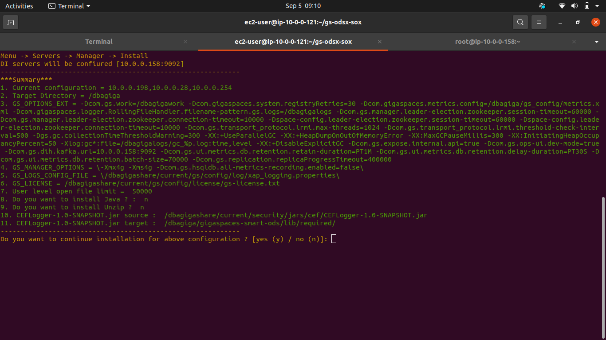
    - Proceed with Installation Param up to final confirmation of installation.
   
    
    After completion of installation do list
    
    - Menu -> Servers -> Manager -> List
    
    
  
   - It will add the newly installed manager into cluster.config file as place holders instead of host.

##### 4.4.2 Start

- This option will start the manager which is installed on remote machine.
- By default it will start all, you can choose menu for individual start
  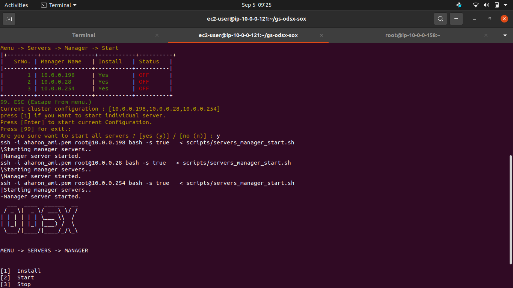
  
  Verify manager start with browser. 
  - Verify with old ui
  
  - Verify with ops manager
  
  - Verify with odsx
  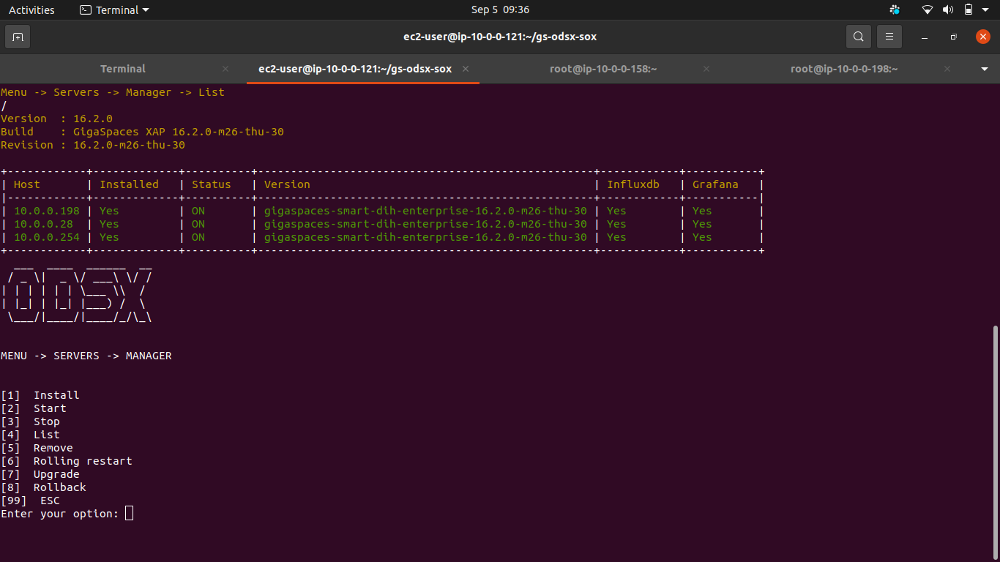
##### 4.4.3 Stop

- This option will stop the manager which is currently running on remote machine.
  - Verify manager stop with browser. 
  - Verify with old ui
  
  - Verify with ops manager
  
  - Verify with odsx
  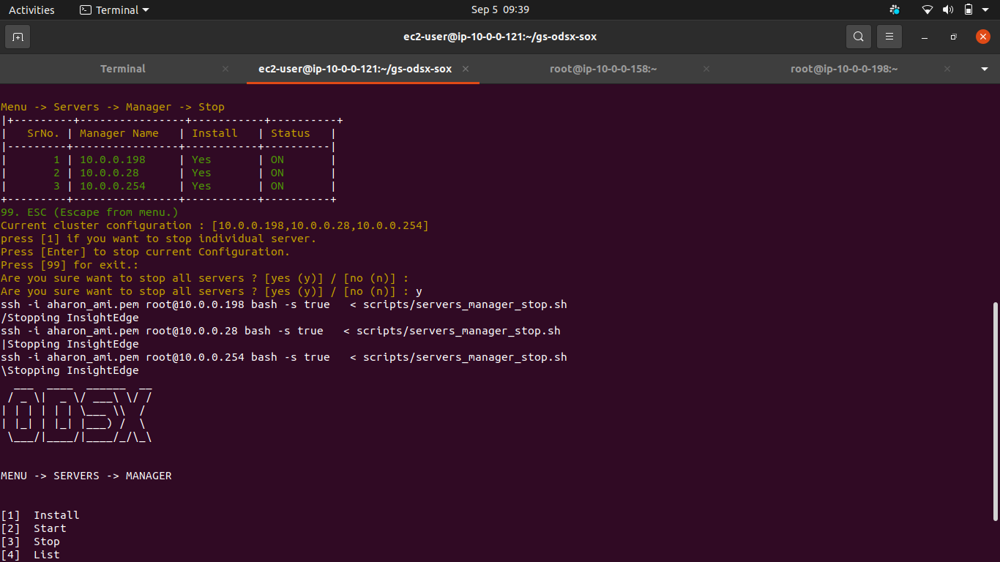

##### 4.4.4 List

- It will list out the configured manager from the cluster.config file.
 -   

  

##### 4.4.5 Remove

- It will remove installed manager servers from cluster config and optional to remove supported software java / unzip

##### 4.4.6 Upgrade
   - You can change the version of manager 
   - Put GS installer under /dbagigashare/current/gs/upgrade/ 
     - [ec2-user@ip-10-0-0-121 gs-odsx-sox]$ ls /dbagigashare/current/gs/upgrade/
       gigaspaces-smart-dih-enterprise-16.2.0-m4-sun-10.zip
   
   
   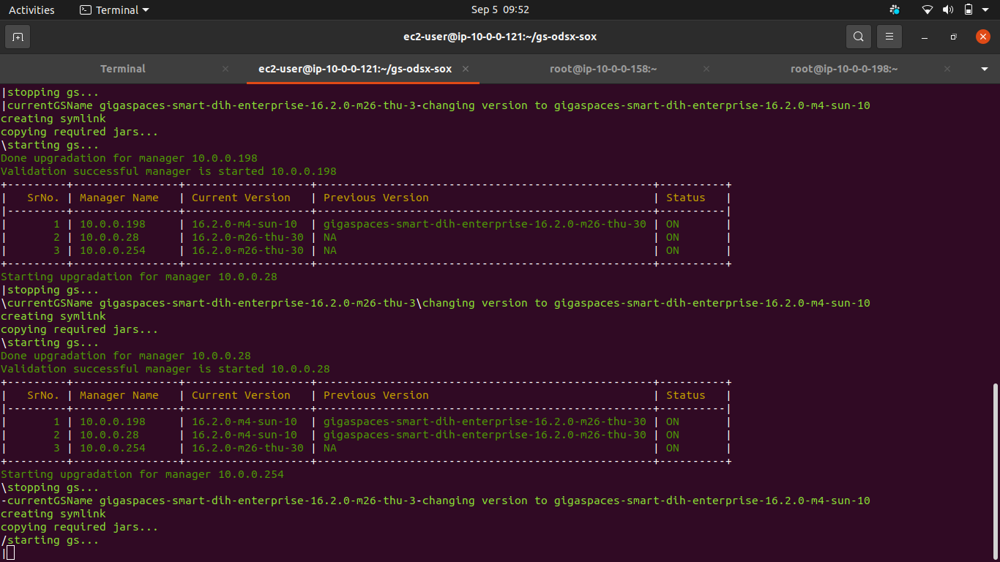
    
   - Verify it by odsx List
   
   
##### 4.4.7 Rollback
   - This option will rollback upgraded version to previous one
   
   
   - Verify it by odsx list
   

#### 4.5 Space Server (Menu -> Servers -> Space)
 
##### 4.5.1 Install

  - This option will install space server and prerequisite software for running Space server (**On Remote machine**).
    
  - Example  :

    java : /dbagigashare/current/jdk/jdk-11.0.11_linux-x64_bin.rpm 

    unzip : /dbagigashare/current/unzip/unzip-6.0-21.el7.x86_64.rpm 

    gs  : /dbagigashare/current/gs/gigaspaces-xap-enterprise-16.0.0.zip
    
    - Verify number of GSC and Memory required for GSCs
    
    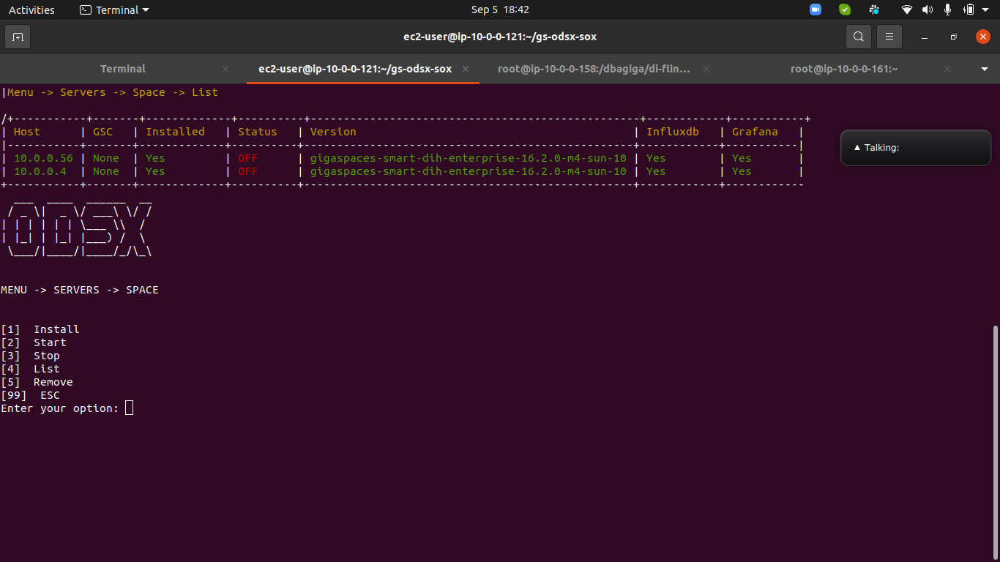
    
##### 4.5.2 Start 

- This option will start the stopped space servers with specified GSC / manager / region at the time of installation
 - Space sever will take time curerntly sleep time is 60 Secs it will up all GSCs
 - Based on number of input GSCs it will take time to up.

  

  
  
  
       
##### 4.5.3 Stop 

- This option will stop the space server

  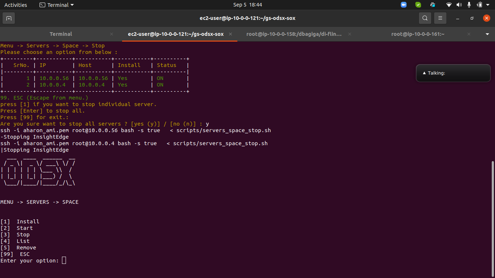
  
  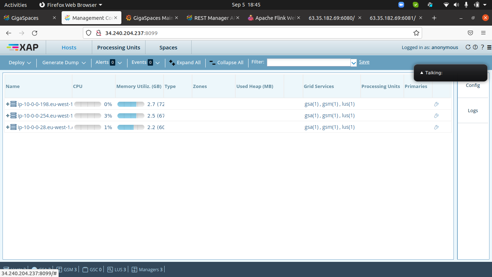

##### 4.5.4 Remove

- It will remove installed space servers from cluster config and optional to remove supported software java / unzip 

#### 4.6 Northbound (Menu -> Servers -> Northbound)
 
##### 4.6.1 Install
  - NB Applicative - different host
  - NB Management -  different host
  - NB Agent - Space host
  - Installation is two type all or individual
    -Individual - one can perform individual installation of NB Applicative / Management / Agent
    - All - one can install all at once
  - Copy <odsx>/config/nb.conf.template into 
    - /dbagigashare/current/nb/management
    - /dbagigashare/current/nb/applicative
    
  - Applicative : 
   -  Verify configuration and sever details
    
    
    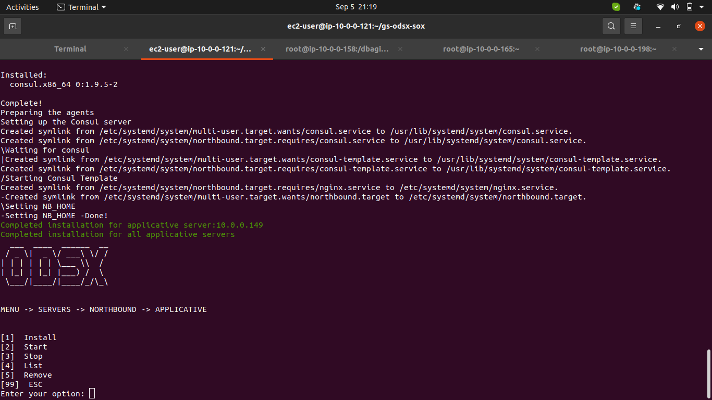
    
    
    
    
    - Verify it on odsx status
  - Management :
   -  Verify configuration and sever details
    
    
    
    
    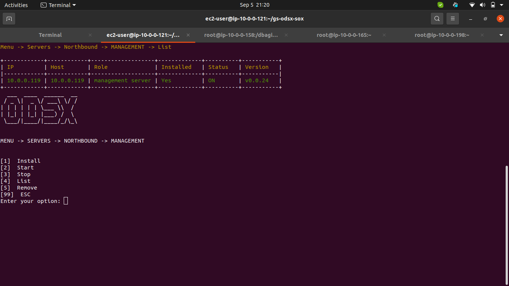
    - Verify it on odsx status
  - Agent :
    -  Verify configuration and sever details
    
    
    
    
    
    - Verify it on odsx status
    
##### 4.6.2 Start

- It will start northbound service on specified server   
##### 4.6.3 Stop

- It will stop northbound service on specified server

##### 4.6.4 Remove

  - It will remove and uninstall northbound service on specified server
