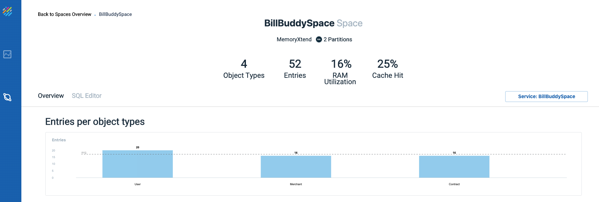
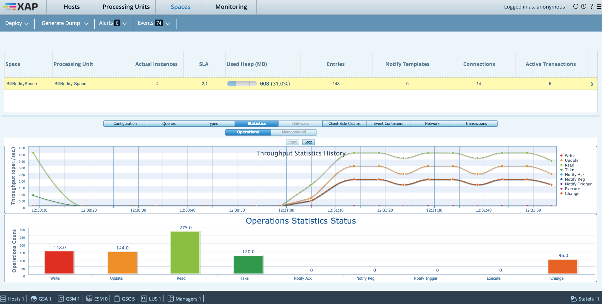
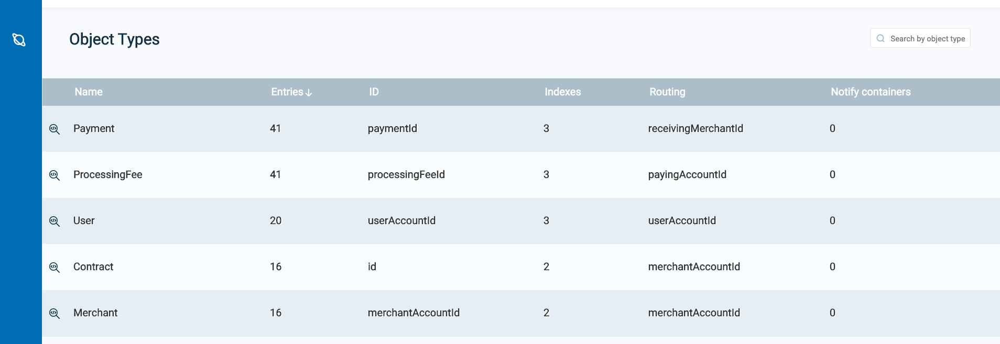
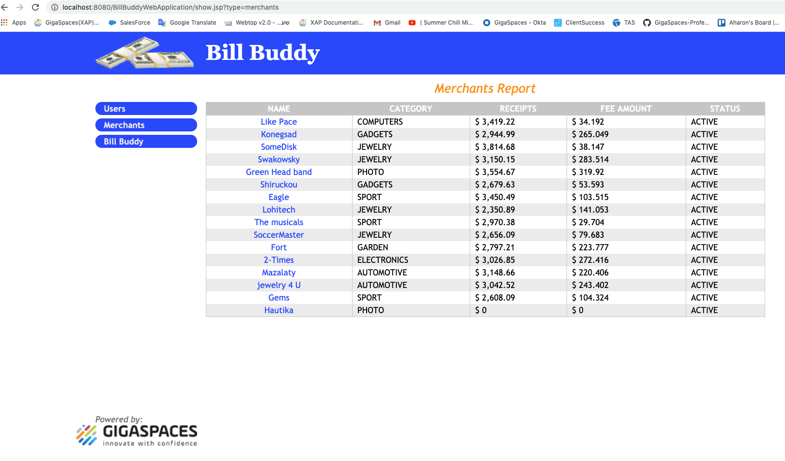

# xap-admin-training - lab-mx (MemoryXtend)

# The Bill Buddy Application

## Lab Goals

1. Experience an application deployment process.  
2. Get familiar with the BillBuddy application  
3. Use GigaSpaces Memory Extend 

## Lab Description
In this lab we will focus on deployment and the application and not be concerned with code, therefore simply focus on the deployment process, you will use similar process throughout the labs.

#### 1	Start gs-agent

1.1 Navigate to %XAP_HOME/bin  
        
1.2 Start gs-agent with local Manager server and 5 GSCs:

    ./gs.sh host run-agent --auto --gsc=5
    
    
#### 2	Deploy BillBuddy_Space
    
2.1 Open %XAP_TRAINING_HOME%/xap-admin-training-lab-mx project with intellij (open pom.xml)  
2.2 Run mvn install  

    ~/xap-admin-training/xap-admin-training-lab-mx$ mvn install
    
    
    [INFO] Reactor Summary:
    [INFO] 
    [INFO] lab-mx ............................................... SUCCESS [  0.204 s]
    [INFO] BillBuddyModel ..................................... SUCCESS [  1.087 s]
    [INFO] BillBuddy_Space .................................... SUCCESS [  0.207 s]
    [INFO] BillBuddyAccountFeeder ............................. SUCCESS [  0.189 s]
    [INFO] BillBuddyCurrentProfitDistributedExecutor .......... SUCCESS [  0.225 s]
    [INFO] BillBuddyWebApplication ............................ SUCCESS [  0.349 s]
    [INFO] BillBuddyPaymentFeeder ............................. SUCCESS [  0.190 s]
    [INFO] ------------------------------------------------------------------------
    [INFO] BUILD SUCCESS

2.3 IntelliJ path Variables (under preferences)

###### Add GS_LOOKUP_GROUPS & GS_LOOKUP_LOCATORS

2.4 Run mvn xap:intellij

###### This will add the predefined Run Configuration Application to your Intellij IDE.

    ~/xap-admin-training/xap-admin-training-lab-mx$ mvn xap:intellij
    
    [INFO] lab-mx ............................................... SUCCESS [  0.586 s]
    [INFO] BillBuddyModel ..................................... SKIPPED
    [INFO] BillBuddy_Space .................................... SKIPPED
    [INFO] BillBuddyAccountFeeder ............................. SKIPPED
    [INFO] BillBuddyCurrentProfitDistributedExecutor .......... SKIPPED
    [INFO] BillBuddyWebApplication ............................ SKIPPED
    [INFO] BillBuddyPaymentFeeder ............................. SKIPPED
    [INFO] ------------------------------------------------------------------------
    [INFO] BUILD SUCCESS

2.5 Open a new Terminal and navigate to %XAP_TRAINING_HOME%/gigaspaces-xap/bin/  

    cd $XAP_HOME/bin
           
2.6 Use XAP CLI to deploy BillBuddy_Space
 
    ./gs.sh pu deploy BillBuddySpace ~/xap-admin-training/xap-admin-training-lab-mx/BillBuddy_Space/target/BillBuddy_Space.jar 

#### 3	Run BillBuddyAccountFeeder from Intellij

3.1 From the Intellij run configuration select BillBuddyAccountFeeder and run it.

###### This application writes Users, Merchants and Contracts to the Space
 
3.2 Validate Users and Merchants were written to the space using the web Management Console (localhost:8099).  
 Go to: Spaces Tab -> Data Types.  
 

3.3 Can be seen in the new Ops Manager (localhost:8090): 

3.4 Query the list of Users by executing the following SQL:  
Click the Data Type Name and the sql will be created for you:  

    SELECT * FROM com.gs.billbuddy.model.User WHERE rownum<5000
    
###### Note: Fully qualified class name is required.

#### 4	Run BillBuddyPaymentFeeder project
The BillBuddyPaymentFeeder application creates payments by randomly choosing a user, 
a merchant and an amount and performs the initial process of a payment. 
This includes deposit and withdrawal updates of each party’s balance appropriately. 
After the payment is initially processed it is written to the space for further processing. 
A new Payment is created every second.
 
4.1 Run the BillBuddyPaymentFeeder using Intellij: 
Use the same instructions as used for the BillBuddyAccountFeeder.

4.2 Validate Payments were written to the space. 
Click the Payment Data Type Name as you did in section 3.3
 
4.3 Go to the statistics operations and see that a payment is actually added every second.

4.4 Go to the Data Types view. see haw many records are in the space. 

## 5 Deploy BillBuddyWebApplication project

5.1 Open a new Terminal and navigate to %XAP_TRAINING_HOME%/gigaspaces-xap/bin/

5.2 Use XAP CLI to deploy BillBuddyWebApplication
 
    ./gs.sh pu deploy BillBuddyWebApplication ~/xap-admin-training/xap-admin-training-lab-mx/BillBuddyWebApplication/target/BillBuddyWebApplication.war

5.3 Validate the application is deployed.  
 

5.4 Use the url to provision the BillBuddy web tool:  
* http://localhost:8080/BillBuddyWebApplication  

 

#### 6 Undeploy the application 

* Undeploy the space: 
   `./gs.sh pu undeploy BillBuddySpace`
   
#### 7 Deploy the space and verify that all records were restored from SSD.
    ./gs.sh pu deploy BillBuddySpace ~/xap-admin-training/xap-admin-training-lab-mx/BillBuddy_Space/target/BillBuddy_Space.jar
* Go to the new UI (new Ops manager) and see that all records indeed restored from the SSD back to the space. 

