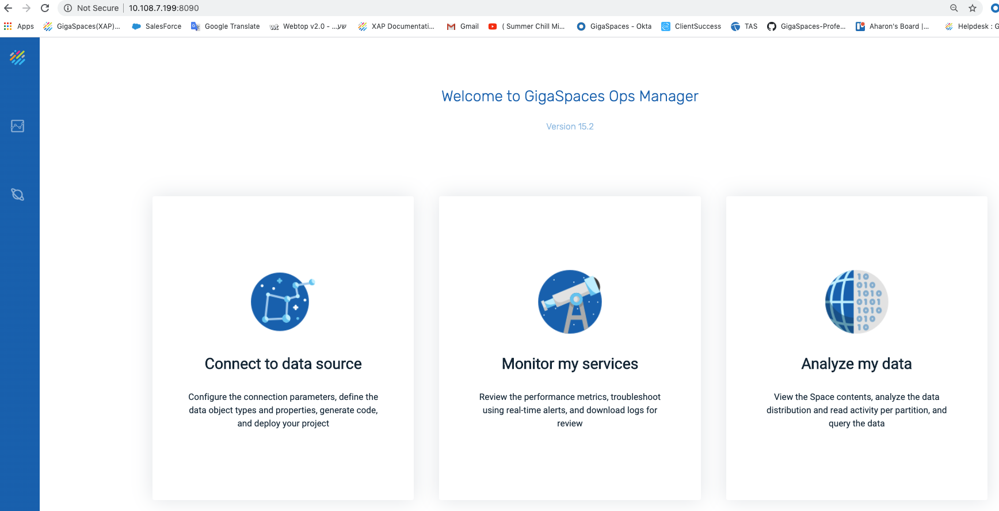
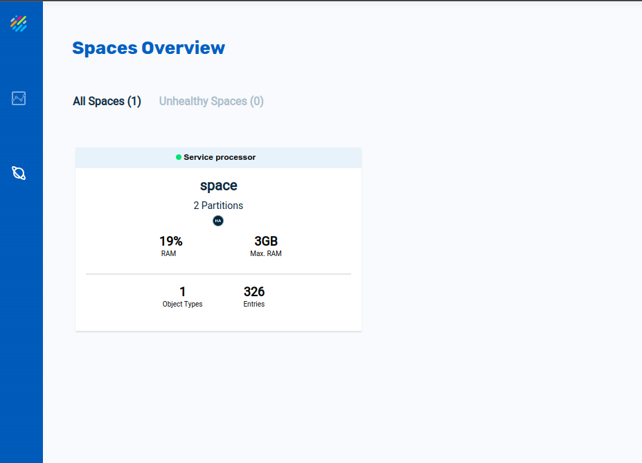
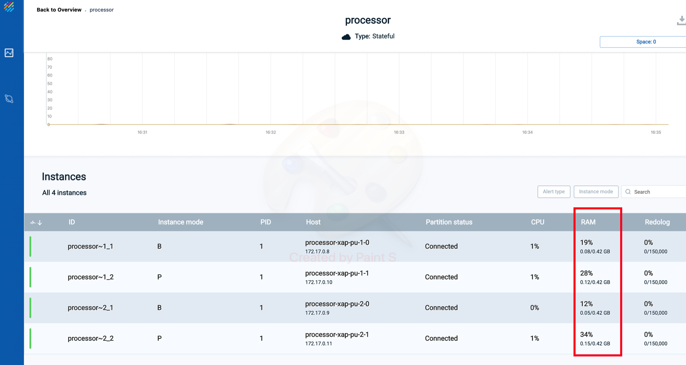
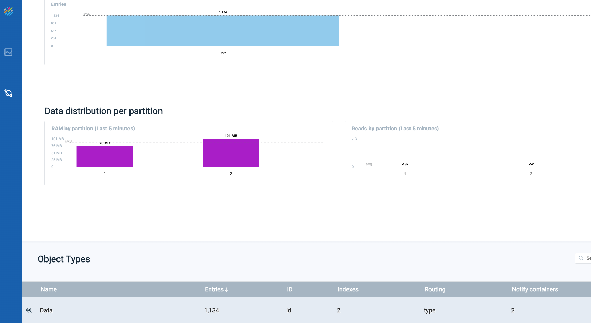

# xap-admin-training - lab14

# Kubernetes & Vertical scaling

## Lab Goals

Get experience with running XAP PU on Kubernetes cluster.   
Perform scale of a stateful pu.  

## Lab Description
In this lab we will deploy xap-manager, xap-operator, stateful processor pu and stateless feeder.   
We will perform scaling of the processor pu. 

## Prerequisites
Before beginning to work with the data grid and xap, 
ensure that you have the following installed on your local machine or a VM:  

[kubectl](https://kubernetes.io/docs/tasks/tools/install-kubectl/)

[helm](https://docs.helm.sh/using_helm/#quickstart-guide)  
Important: Previous versions of this lab supported Helm 2 only. 
As of XAP 15.5, Helm 3 is supported in XAP 15.5 release.
This lab has been updated to support Helm 3.

[minikube](https://kubernetes.io/docs/setup/minikube/)  

[docker engine](https://docs.docker.com/engine/install/)  

##### 1. Configure memory and cpu:

    minikube config set memory 4096
    minikube config set cpus 4
    
##### 2. After installation, configure the VM driver 
(Note: If you installed VirtualBox as the Hypervisor run the following. This step is optional as minikube now prefers to use Docker as the VM driver)

    minikube config set vm-driver virtualbox
    
##### 3. Start Minikube:

    minikube start
    
    😄  minikube v1.17.1 on Ubuntu 18.04
        ▪ KUBECONFIG=/home/dixson/kubeconfig
    ✨  Automatically selected the docker driver. Other choices: virtualbox, ssh, none
    👍  Starting control plane node minikube in cluster minikube
    🚜  Pulling base image ...
    💾  Downloading Kubernetes v1.20.2 preload ...
        > preloaded-images-k8s-v8-v1....: 491.22 MiB / 491.22 MiB  100.00% 4.38 MiB
    🔥  Creating docker container (CPUs=4, Memory=4096MB) ...
    🐳  Preparing Kubernetes v1.20.2 on Docker 20.10.2 ...
        ▪ Generating certificates and keys ...
        ▪ Booting up control plane ...
        ▪ Configuring RBAC rules ...
    🔎  Verifying Kubernetes components...
    🌟  Enabled addons: storage-provisioner, default-storageclass
    🏄  Done! kubectl is now configured to use "minikube" cluster and "default" namespace by default

    
##### 4. In a separate terminal expose Minikube LoadBalancer:
 
    minikube tunnel
    

### 1. Deploying and Managing "xap processor feeder application"
#### 1.1  Get the required GigaSpaces Helm charts
##### 1.1.1 Add xap Helm Repo to the Repo List 
 
    helm repo add gigaspaces https://resources.gigaspaces.com/helm-charts
    
##### 1.1.2 Fetch the GigaSpaces Helm Charts from the GigaSpaces Repository 
(The chart xap is unpacked in your current directory - this step is optional)

    helm pull gigaspaces/xap --version 16.2 --untar
    helm pull gigaspaces/xap-pu --version 16.2 --untar
    
#### 1.2  Deploy a Management Pod called testmanager:

    helm install testmanager gigaspaces/xap-manager
     
#### 1.3 Deploy the xap-operator called operator:

    helm install operator gigaspaces/xap-operator --version 16.2 --set manager.name=testmanager

#### 1.4  View and monitor kubernetes deployment
##### 1.4.1 Verify that the pod is running

    kubectl get pods
    NAME                        READY   STATUS    RESTARTS   AGE
    testmanager-xap-manager-0       1/1     Running   0          26m
    xap-operator-5566dd4587-4kwcq   1/1     Running   0          25m

##### 1.4.2 In a separate terminal open Minikube Dashboard. The browser will automatically open.

    minikube dashboard &
       

##### 1.4.3 Open Gigaspaces Ops Manager

###### 1.4.3.1 Get the manager ip by running "kubectl get services", the manager ip will be the EXTERNAL-IP. in this case 10.108.7.199

    kubectl get services
    NAME                              TYPE           CLUSTER-IP     EXTERNAL-IP    PORT(S)                                        AGE
    kubernetes                        ClusterIP      10.96.0.1      <none>         443/TCP                                        4m17s
    testmanager-xap-manager-hs        ClusterIP      None           <none>         2181/TCP,2888/TCP,3888/TCP,4174/TCP            19s
    testmanager-xap-manager-service   LoadBalancer   10.108.7.199   10.108.7.199   8090:32221/TCP,4174:31234/TCP,8200:31837/TCP   19s
                                   
                                   
###### 1.4.3.2 Open Gigaspaces Ops Manager by browsing to <EXTERNAL-IP>:8090 

#### 1.5  Generate the process and feeder jars and upload them

1. `cd $GS_HOME/examples/data-app/event-processing`
2. `./build.sh package`
3. `$GS_HOME/bin/gs.sh --server 10.108.7.199`
4. `pu upload $GS_HOME/examples/data-app/event-processing/processor/target/data-processor.jar` 
    **The result should be:** 
    [data-processor.jar] successfully uploaded
    Resource URL: http://10.108.7.199:8090/v2/resources/data-processor.jar
5. `pu upload $GS_HOME/examples/data-app/event-processing/feeder/target/data-feeder.jar` 
    **The result should be:** 
    [data-feeder.jar] successfully uploaded
    Resource URL: http://10.108.7.199:8090/v2/resources/data-feeder.jar
    
#### 1.6 Deploy the processor service

`helm install processor gigaspaces/xap-pu --version 16.2 --set manager.name=testmanager,partitions=2,ha=true,pu.dynamic-partitioning=true,readinessProbe.enabled=true,resourceUrl=http://10.108.7.199:8090/v2/resources/data-processor.jar`

    kubectl get pod
    NAME                        READY   STATUS    RESTARTS   AGE
    processor-xap-pu-0              1/1     Running   0          19m
    processor-xap-pu-1              1/1     Running   0          19m
    processor-xap-pu-2              1/1     Running   0          19m
    processor-xap-pu-3              1/1     Running   0          18m
    testmanager-xap-manager-0       1/1     Running   0          28m
    xap-operator-5566dd4587-4kwcq   1/1     Running   0          26m

#### 1.7 Deploy the feeder service

`helm install feeder gigaspaces/xap-pu --version 16.2 --set manager.name=testmanager,resourceUrl=http://10.108.7.199:8090/v2/resources/data-feeder.jar`
    
    kubectl get pod
    NAME                        READY   STATUS    RESTARTS   AGE
    feeder-xap-pu-0                 1/1     Running   0          17m
    processor-xap-pu-0              1/1     Running   0          20m
    processor-xap-pu-1              1/1     Running   0          20m
    processor-xap-pu-2              1/1     Running   0          20m
    processor-xap-pu-3              1/1     Running   0          20m
    testmanager-xap-manager-0       1/1     Running   0          29m
    xap-operator-5566dd4587-4kwcq   1/1     Running   0          27m

#### 1.8 View and monitor GS kubernetes deployment

##### 1.8.1 Minikube dashboard

##### 1.8.2 GS Ops Manager 

Click on "Monitor my services" 

Click on "Space" 

Query the data: 

### 2  Vertical Scaling with the GigaSpaces CLI

#### 2.1 Review current RAM occupied by the processor service

1. Click on the "processor" service  

   
   
2. Edit the current "processor" service's memory configuration using the minikube dashboard. Click on the processor service's StatefulSet, click on the edit (pencil icon) in the top right corner: 
   
   
   
3. Click on Space overview:  

   

#### 2.2 Perform memory scale using GS CLI

1. Scale processor partition 2:
   `$GS_HOME/bin/gs.sh --server 10.108.7.199 pu scale-vertical --memory=600Mi processor`  
   
   **The result should be:** 
   Request ID     1    
   
   Status can be tracked using the command: request status 1
   
   `request status 1` 
   
   **The result should be:** 
   REQUEST DETAILS    
   ID                 1                                                      
   Description        Patch request for StatefulSet: [processor-xap-pu-2]    
   Status             running                                                
   Submitted By       anonymous                                              
   Submitted From     192.168.99.1                                           
   Submitted At       2020-07-08 09:52:23 
   
   **Finally the result should be:** 
   `request status 1` 
   
   REQUEST DETAILS    
   ID                 1                                                      
   Description        Patch request for StatefulSet: [processor-xap-pu-2]    
   Status             successful                                             
   Submitted By       anonymous                                              
   Submitted From     192.168.99.1                                           
   Submitted At       2020-07-08 09:52:23                                    
   Completed At       2020-07-08 09:54:28
   
2. Partition 2 Memory should be bigger: 
   Looking at GS Ops manager service view: 
   
   
   
   Looking at the minikube dashboard pods view:
   
   
3. Horizontally scale processor service:
   `$GS_HOME/bin/gs.sh --server 10.108.7.199 pu scale-horizontal processor 1`  
   
   **The result should be:** 
   Request ID     d68580a4-a020-4cbe-b7b2-8ad57aa14098    

   Status can be tracked using the command: request status d68580a4-a020-4cbe-b7b2-8ad57aa14098

   `$GS_HOME/bin/gs.sh --server 10.108.7.199 request status d68580a4-a020-4cbe-b7b2-8ad57aa14098` 
      
   **Finally the result should be:** 
    
   REQUEST DETAILS    
   ID                 d68580a4-a020-4cbe-b7b2-8ad57aa14098                             
   Description        Scale partitions of processing unit: [processor], target: [1]    
   Status             successful                                                       
   Status Url         http://10.108.7.199:8090/v2/pus/processor                       
   Submitted By       anonymous                                                        
   Submitted From     172.17.0.1                                                       
   Submitted At       2022-10-05 17:33:51                                              
   Completed At       2022-10-05 17:33:52  
   
    
4. There should be a single partition: 
      Looking at GS Ops manager service view: 
      
       
      
      Looking at the Space Overview view: 
      

5. No data is lost and feeder is still working: 
   

      
### 3  Undeploy the services
    helm del feeder
    helm del processor
    helm del operator
    helm del testmanager
    
### 4  Delete and stop the minikube
    minikube delete
  
  

