# ODSX Lab-A

## Lab Summary
   
1. Download required files
2. Environment setup and AWS Configuration (STATELESS ODSX)
3. Prerequisties - prepare your files before running the scripts
4. Prerequisites - Run the scripts  
5. ODSX Configuration
     * ODSX Configuration security setup
     * ODSX Configuration new host / supporting jar setup
6. DIH
     * DI (Zookeeper+kafka+telegraf+DI-services)
     * Grafana
     * Influxdb
     * Manager
     * Space
     * Northbound
        * Applicative
        * Management
        * Agent
  ----------------------------------------------
<br />

### 1. Download required files

* Main : https://github.com/GigaSpaces-ProfessionalServices/gs-odsx.git
* Release : https://github.com/GigaSpaces-ProfessionalServices/gs-odsx/archive/refs/tags/v3.55-release.tar.gz 
* https://github.com/GigaSpaces-ProfessionalServices/CSM-Magic-Tools.git
  

### 2. Environment setup and AWS Configuration (STATELESS ODSX)

* Create EC2 Instances on AWS based on your requirement (OS: Redhat:7.7 RHEL)
  <br />
  * Pivot (ODSX)-1
  * Manager-3
  * Space-2
  * DataIntegration-1
  * Grafana and Influx - (on pivot)
  * Northbound applicative-1
  * Northbound management-1
  
<br />
      
* Prepare pivot and other insatnces by using the lab scripts.
  The following steps will be done:

  * On pivot:

    1. Create required local folders
    2. Install NFS server (/dbagigashare will be shared for all the remote hosts)
    3. Allow SSH to Pivot as root (blocked by default in aws)
    4. Install the required rpms.
    5. Create gsods user
   

  * On remote hosts:
    1. Creates required local folders
    2. Allow SSH to Pivot as root (blocked by default in aws)
    3. create gsods user

-----------------------------------------------------------------
   - Connect to the PIVOT machine ans swith user to root.
   - Upload the pre-req scripts, odsx tar file and your pem (ssh-key) to /tmp. 
   - Extract the tar file, your work dirctory should be like:

   ```
-rwxrwxr-x. 1 centos centos    4238 Sep 20 12:29 1-odsx_aws_prereq.sh
-rwxrwxr-x. 1 centos centos    1906 Sep 19 13:03 2-odsx_create_folders_in_pivot.sh
-rwxrwxr-x. 1 centos centos    5486 Sep 20 12:57 3-odsx_download_sources.sh
-rwxr-xr-x. 1 centos centos    1434 Sep 20 11:46 4-install_odsx.sh
-rwxr-xr-x. 1 root   root       492 Sep 22 07:54 5-test_ssh_from_pivot_to_all.sh
-r--------. 1 centos centos    1675 Sep 19 13:04 aharon_ami.pem
-rw-r--r--. 1 centos centos 3918775 Sep 19 13:34 gs-odsx-3.55-release.zip

   ```
  - Create a txt (i.e: lab17_aws_hosts.txt) file which contains your aws instances IP or hostname, one IP on each line.
  ```
  cat lab17_aws_hosts.txt

10.0.1.29
10.0.2.30
10.0.3.40

  ```
- Run the scripts one-by-one, as root:
  
```
./1-odsx_aws_prereq.sh

ODSX lab script #1
==================
Pleae enter the aws user [centos] :
Please enter the pivot private ip or hostname (don't use localhost/127.0.0.1) [10.0.3.70]:
Please provide the hosts text file wich contains all the aws instances ips EXCLUDING Pivot ip [./hosts.txt]: lab17_aws_hosts.txt


Pivot IP: 10.0.3.70
ssh_key: ./aharon_ami.pem
Remote aws hosts ip: 10.0.3.26
10.0.3.141
10.0.1.133
10.0.3.70
10.0.3.25
10.0.1.214
10.0.2.5
10.0.3.104
10.0.3.90

The following steps will be done:

On pivot:

1. Create required local folders
2. Install NFS server (/dbagigashare will be shared for all the remote hosts)
3. Allow SSH to Pivot as root (blocked by default in aws)
4. Install the required rpms.
5. Create gsods user

On remote hosts:

1. Creates required local folders
2. Allow SSH to Pivot as root (blocked by default in aws)
3. create gsods user

Press Y/y to continue or any key to exit. y

```
        

      
  
Run below will start displaying various menu options 

./odsx.py

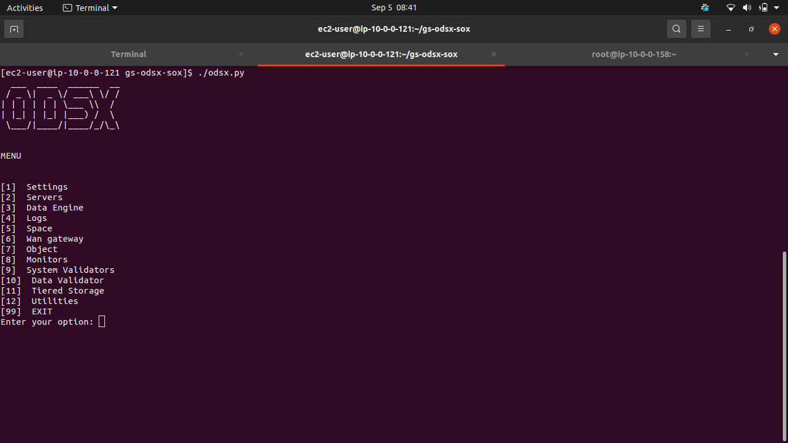

### 4. DIH
#### 4.1 DI server(Kafka+zk+telegraf+DI-services) Menu -> Servers -> DI

##### 4.1.1 Install

 - Install DI with cluster mode
   - 3/4 host / servers needed to install 
   - Single node also supports.
   - 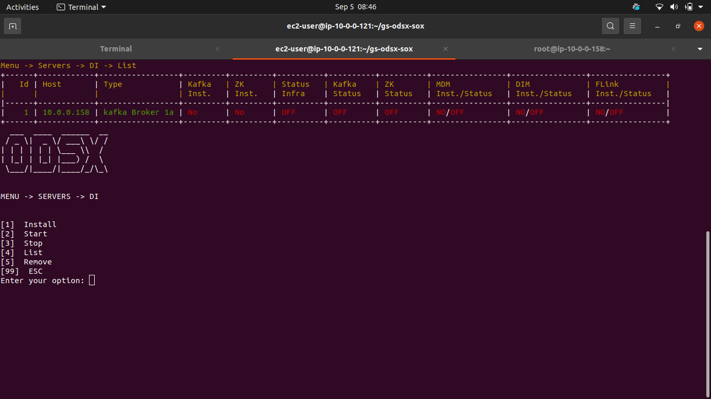
   - 
   - 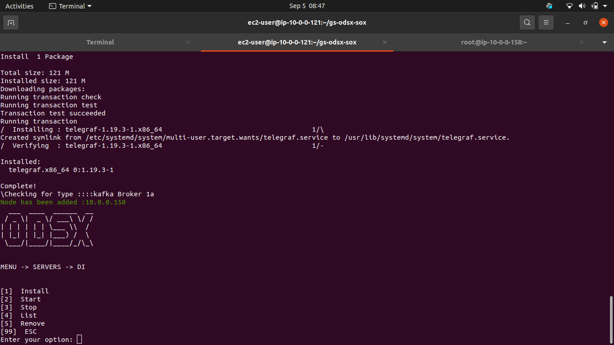
   - Verify by List
   - 

##### 4.1.2 Start   
- After installation complete start DI servers
- Verify DI servers by logged in to any of host and execute below command:

 - 
 - 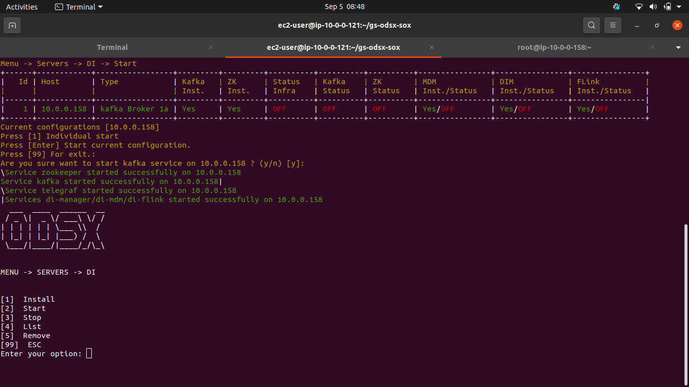
 - Verify by List
 - 

    source /home/dbsh/setenv.sh;
    $ZOOKEEPERPATH/bin/zkCli.sh -server localhost:2181 <<< "ls /brokers/ids" | tail -n 2

 

##### 4.1.3 Stop
   - 
   - Verify by list  

##### 4.1.4 Remove
   - 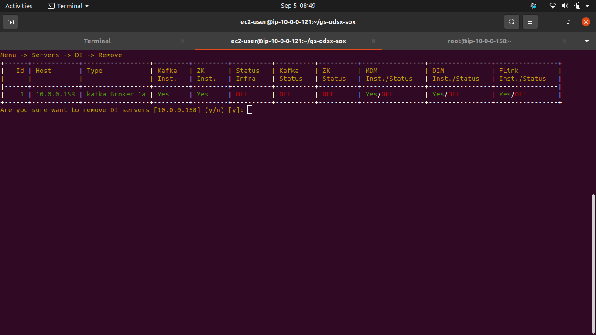
   - 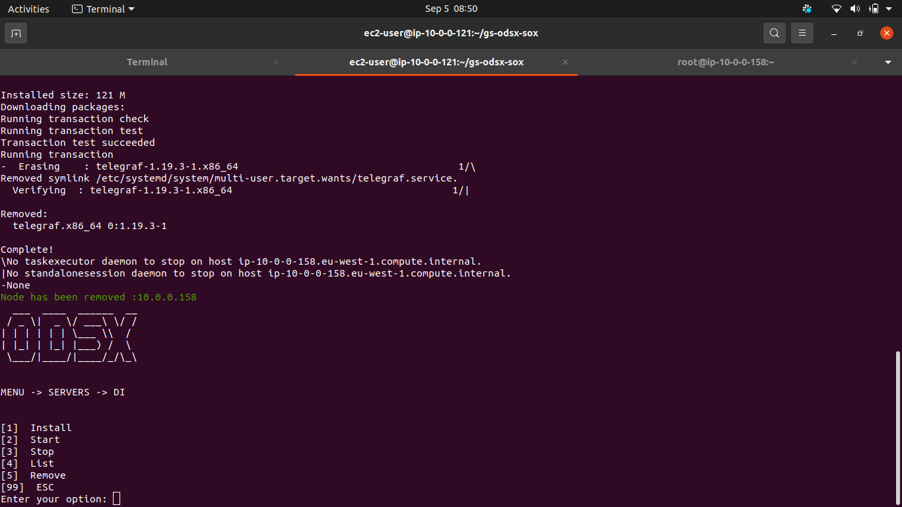
   - Verify by List

#### 4.2 Grafana Server (Menu -> Servers -> Grafana)**

##### 4.2.1 Install

- Keep Grafana rpm file under /dbagigashare/current/grafana/grafana-7.3.7-1.x86_64.rpm

- 

##### 4.2.2 Start

- It will start Grafana server
 - Verify Grafana started or not by http://< Grafana host >:3000/ web browser

 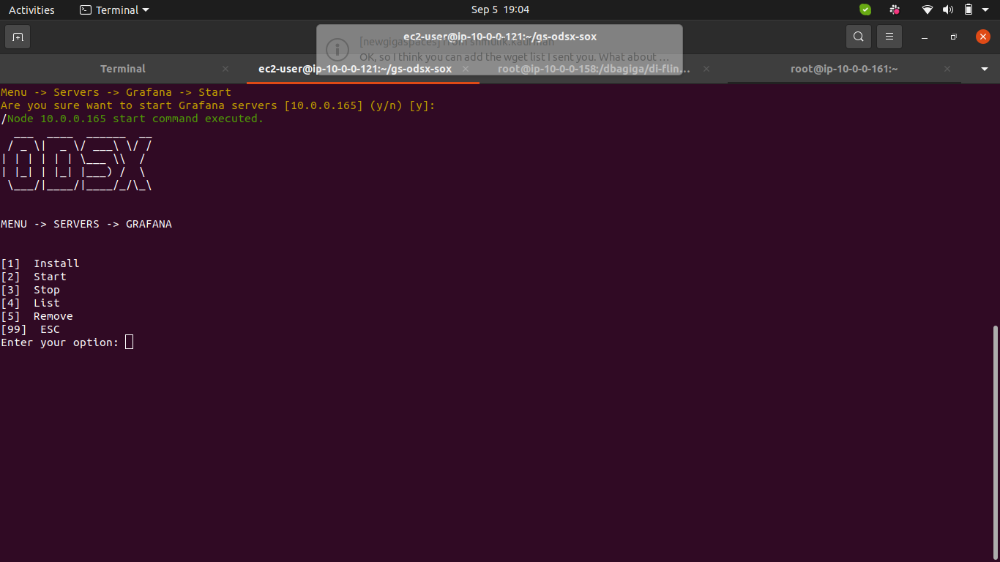
 - Verify after starting grafana on UI
 - <host>:3000 
 - Username/Password : admin/admin
 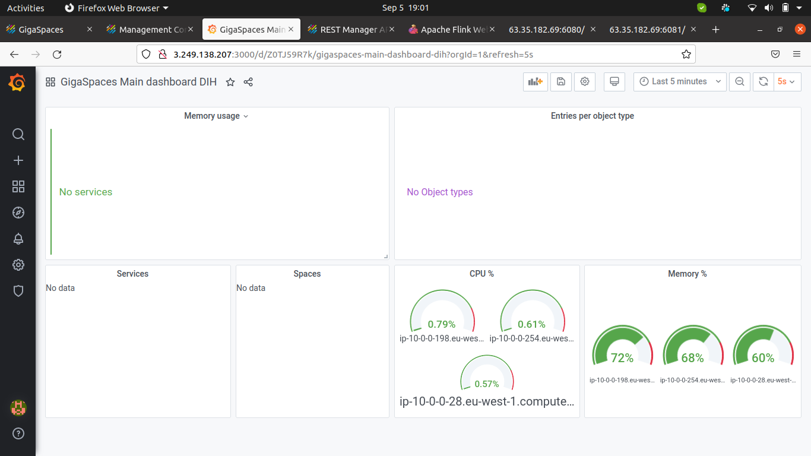

##### 4.2.3 Stop

- It will stop Grafana service on installed host
  - 
##### 4.2.4 Remove

   - It will Remove and uninstall Grafana host

#### 4.3 Influxdb (Menu -> Servers -> Influxdb)
 
##### 4.3.1 Install
- Keep rpm file under /dbagigashare/current/influx/ 
- By default service will start and create default database mydb

##### 4.3.2 Start

- It will start influxdb service 
- Verify it by :
    - [root@ip-10-0-0-165 ~]# influx
      -Connected to http://localhost:8086 version 1.8.4
      =InfluxDB shell version: 1.8.4
      
      influx> show databases
      - name: databases
        
        name
        ----
        mydb
        _internal
        telegraf
        
      influx> use mydb
        
        Using database mydb
        
      influx> show measurements
        
        name: measurements
        name
        ----
        jvm_memory_gc_count
        jvm_memory_gc_time
        .....
##### 4.3.3 Stop

- It will stop influxdb service on installed host

##### 4.3.4 Remove
- It will Remove and uninstll Infuxdb host


#### 4.4 Manager (Menu -> Servers -> Manager)
 
##### 4.4.1 Install  
  - This option will install manager and prerequisite software for running Manager (**On Remote machine**).
    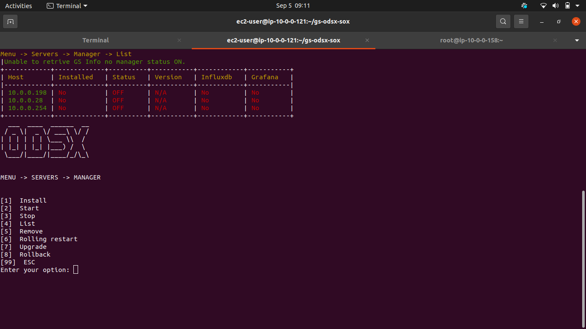
  - Example  :

    java : /dbagigashare/current/jdk/jdk-11.0.11_linux-x64_bin.rpm 

    unzip : /dbagigashare/current/unzip/unzip-6.0-21.el7.x86_64.rpm 

    gs  : /dbagigashare/current/gs/gigaspaces-xap-enterprise-16.0.0.zip
    license : Configure license under /dbagigashare/current/gs/config/license/gs-license.txt
    ##### Read summary carefully each parameter need to configure    
    
    - Proceed with Installation Param up to final confirmation of installation.
   
    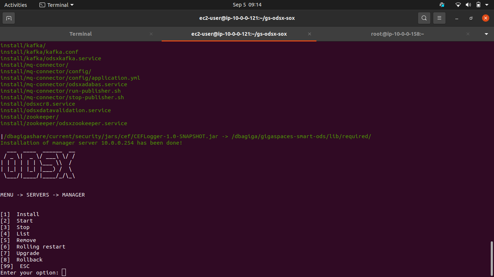
    After completion of installation do list
    
    - Menu -> Servers -> Manager -> List
    
    
  
   - It will add the newly installed manager into cluster.config file as place holders instead of host.

##### 4.4.2 Start

- This option will start the manager which is installed on remote machine.
- By default it will start all, you can choose menu for individual start
  
  
  Verify manager start with browser. 
  - Verify with old ui
  
  - Verify with ops manager
  
  - Verify with odsx
  
##### 4.4.3 Stop

- This option will stop the manager which is currently running on remote machine.
  - Verify manager stop with browser. 
  - Verify with old ui
  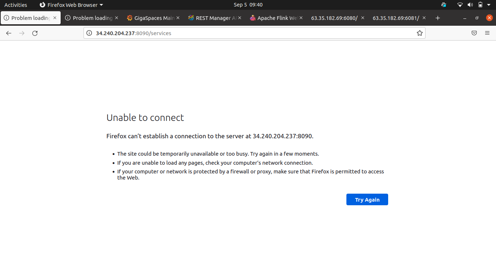
  - Verify with ops manager
  
  - Verify with odsx
  

##### 4.4.4 List

- It will list out the configured manager from the cluster.config file.
 -   

  

##### 4.4.5 Remove

- It will remove installed manager servers from cluster config and optional to remove supported software java / unzip

##### 4.4.6 Upgrade
   - You can change the version of manager 
   - Put GS installer under /dbagigashare/current/gs/upgrade/ 
     - [ec2-user@ip-10-0-0-121 gs-odsx-sox]$ ls /dbagigashare/current/gs/upgrade/
       gigaspaces-smart-dih-enterprise-16.2.0-m4-sun-10.zip
   
   
   
    
   - Verify it by odsx List
   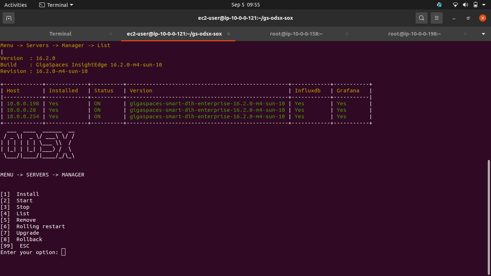
   
##### 4.4.7 Rollback
   - This option will rollback upgraded version to previous one
   
   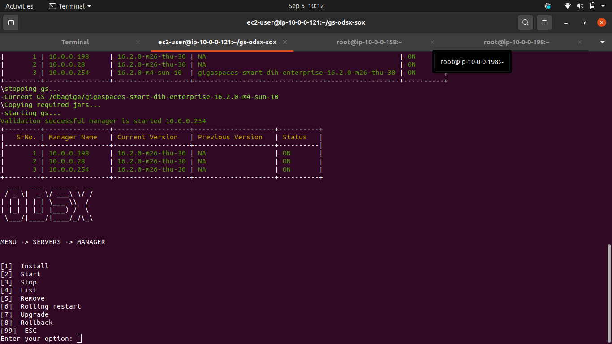
   - Verify it by odsx list
   


#### 4.5 Space Server (Menu -> Servers -> Space)
 
##### 4.5.1 Install

  - This option will install space server and prerequisite software for running Space server (**On Remote machine**).
    
  - Example  :

    java : /dbagigashare/current/jdk/jdk-11.0.11_linux-x64_bin.rpm 

    unzip : /dbagigashare/current/unzip/unzip-6.0-21.el7.x86_64.rpm 

    gs  : /dbagigashare/current/gs/gigaspaces-xap-enterprise-16.0.0.zip
    
    - Verify number of GSC and Memory required for GSCs
    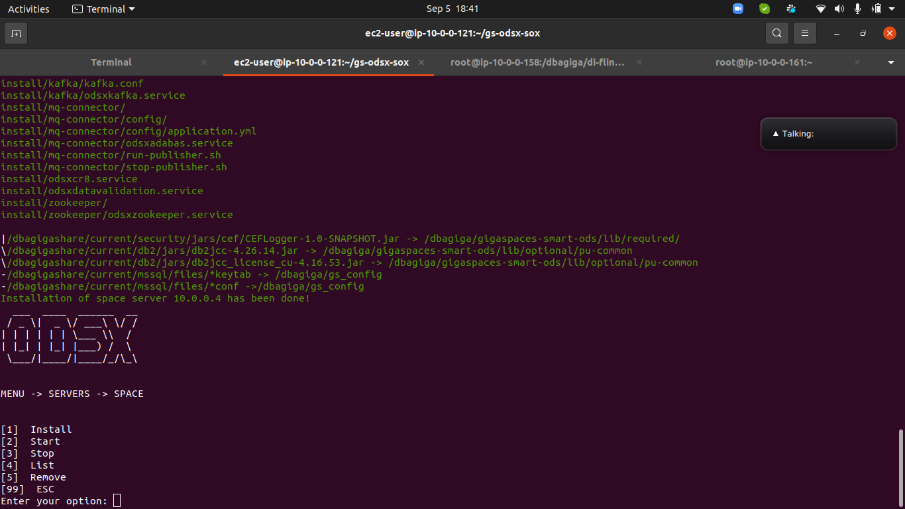
    
    
##### 4.5.2 Start 

- This option will start the stopped space servers with specified GSC / manager / region at the time of installation
 - Space sever will take time curerntly sleep time is 60 Secs it will up all GSCs
 - Based on number of input GSCs it will take time to up.

  

  
  
  
       
##### 4.5.3 Stop 

- This option will stop the space server

  
  
  

##### 4.5.4 Remove

- It will remove installed space servers from cluster config and optional to remove supported software java / unzip 


#### 4.6 Northbound (Menu -> Servers -> Northbound)
 
##### 4.6.1 Install
  - NB Applicative - different host
  - NB Management -  different host
  - NB Agent - Space host
  - Installation is two type all or individual
    -Individual - one can perform individual installation of NB Applicative / Management / Agent
    - All - one can install all at once
  - Copy <odsx>/config/nb.conf.template into 
    - /dbagigashare/current/nb/management
    - /dbagigashare/current/nb/applicative
    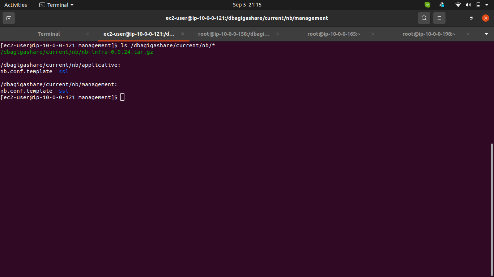
  - Applicative : 
   -  Verify configuration and sever details
    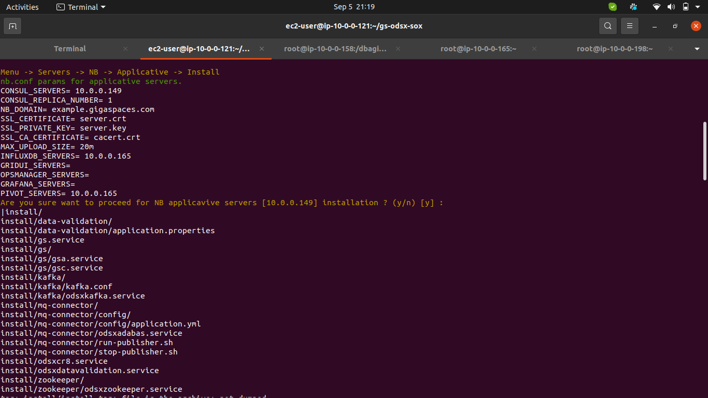
    
    
    
    
    
    
    - Verify it on odsx status
  - Management :
   -  Verify configuration and sever details
    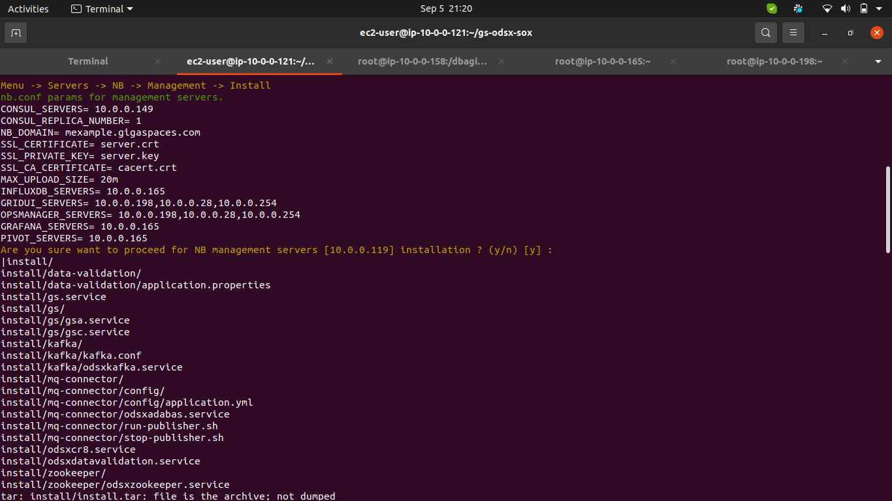
    
    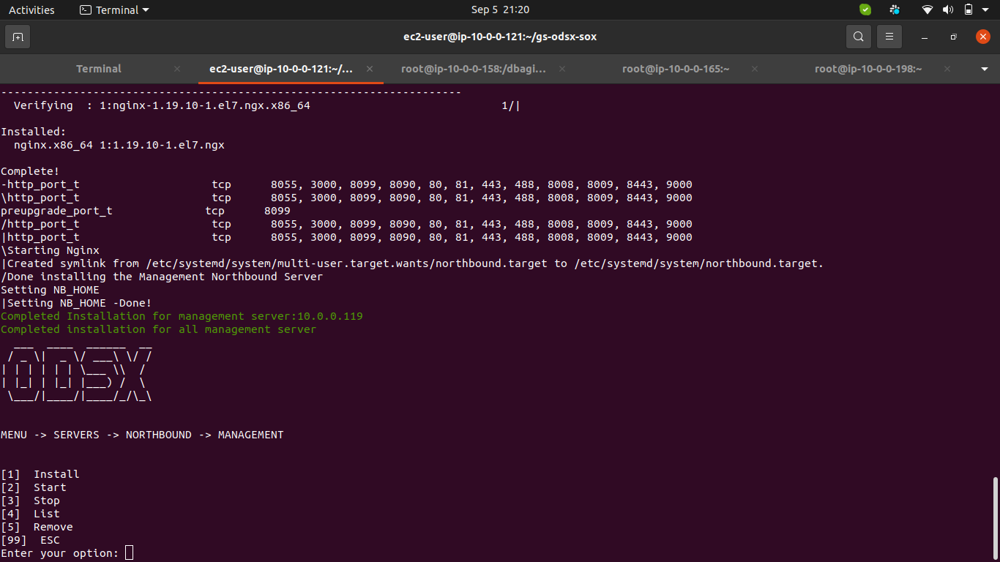
    
    
    - Verify it on odsx status
  - Agent :
    -  Verify configuration and sever details
    
    
    
    
    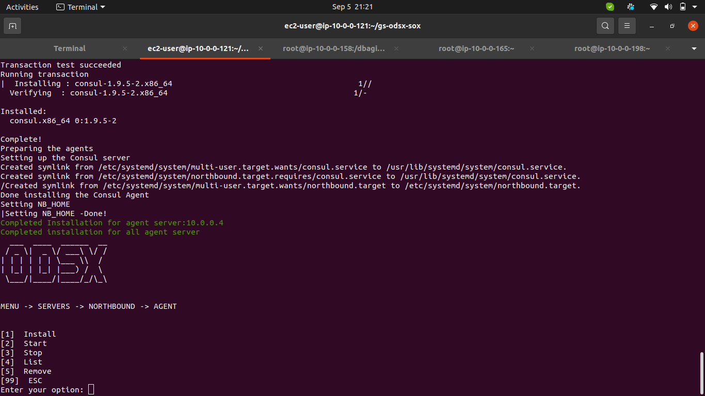
    - Verify it on odsx status
    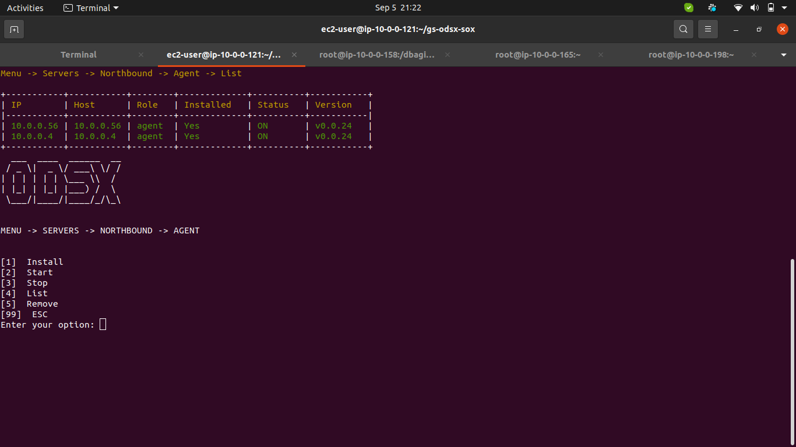
##### 4.6.2 Start

- It will start northbound service on specified server   
##### 4.6.3 Stop

- It will stop northbound service on specified server

##### 4.6.4 Remove

  - It will remove and uninstall northbound service on specified server
