# <u>ODSX</u>

- Repositories needed to run Lab

  -  https://github.com/GigaSpaces-ProfessionalServices/gs-odsx.git  (Currently 23-Feb-2022 latest code is available in di_branch)
  -  https://github.com/GigaSpaces-ProfessionalServices/CSM-Magic-Tools.git
  -  https://github.com/Gigaspaces/insightedge-training/tree/master/Day4/17_TieredStorage

## <u>AWS Configurations</u>
1. Create EC2- Instances on AWS based on your requirement (OS: Redhat:7.7 RHEL)
   
   Pivot (ODSX)-1,Manager-3, Space-2,DataIntegration-3,Grafana and Influx -1,Northbound server-3,Northbound management-1

2. Make each ec2- instances root(user) accessible.

  - By default EC2 instance is with default user ec2-user
  
 `  
    
    sudo sed -e 's/^PermitRootLogin.*/PermitRootLogin without-password/g' -i /etc/ssh/sshd_config
   
    sudo sed -e 's/^AllowUsers.*/AllowUsers ec2-user root/g' -i /etc/ssh/sshd_config
    
    sudo -s
    
    cd
    
    sudo sed -e 's/no-port/#no-port/g' -i ~/.ssh/authorized_keys
    
    sudo sed -e 's/ssh-rsa/\nssh-rsa/g' -i ~/.ssh/authorized_keys
    
    useradd gsods
    
    mkdir /home/dbsh
    
    mkdir /dbagigasoft
    `
    
### <u>Installation</u>

1. Clone this project from git repository.
    
    URL : https://github.com/GigaSpaces-ProfessionalServices/gs-odsx.git
    
2. Open terminal and go to scripts folder 

   cd gs-odsx/scripts

3. Run setup script using 

   ./setup.sh
   
  - Exit from terminal and Re-login to Pivot (ODSX) machine
    
4. Give permission to your pem file

  - chmod 400 gs-odsx/aharon_ami.pem
   
### <u>SetupFiles</u>

Make sure all pre-requisite installation rpms / zip installer available inside odsx/install/.. respected folders

    1. List setup files :
    cd gs-odsx/
    ls install/java
    ls install/unzip
    ls install/gs
    ls install/nb
    ls install/telegraf
    ls install/grafana
    ls install/influxdb
    ls install/kafka
    
### Installer Links :
    * These links are on 24th Feb 2022 please put latest version of installer if required
    
    Java  : https://tapangigaspaces.s3.us-east-2.amazonaws.com/odsx/install/java/jdk-11.0.11_linux-x64_bin.rpm
    Unzip : https://tapangigaspaces.s3.us-east-2.amazonaws.com/odsx/install/unzip/unzip-6.0-21.el7.x86_64.rpm
    gs :  https://tapangigaspaces.s3.us-east-2.amazonaws.com/odsx/install/gs/gigaspaces-smart-ods-enterprise-16.0.0.zip
    nb : https://tapangigaspaces.s3.us-east-2.amazonaws.com/odsx/install/nb/nb-infra-0.0.21.tar.gz
    grafana : https://tapangigaspaces.s3.us-east-2.amazonaws.com/odsx/install/grafana/grafana-7.3.7-1.x86_64.rpm
    influxdb : https://tapangigaspaces.s3.us-east-2.amazonaws.com/odsx/install/influxdb/influxdb-1.8.4.x86_64.rpm
    kafka : https://tapangigaspaces.s3.us-east-2.amazonaws.com/odsx/install/kafka/kafka_2.13-2.8.1.tgz 
    
### <u>Usage</u>

    Go to main Project directory from terminal window (cd gs-odsx/)

**Menu driven** 

Run below will start displaying various menu options 

./odsx.py

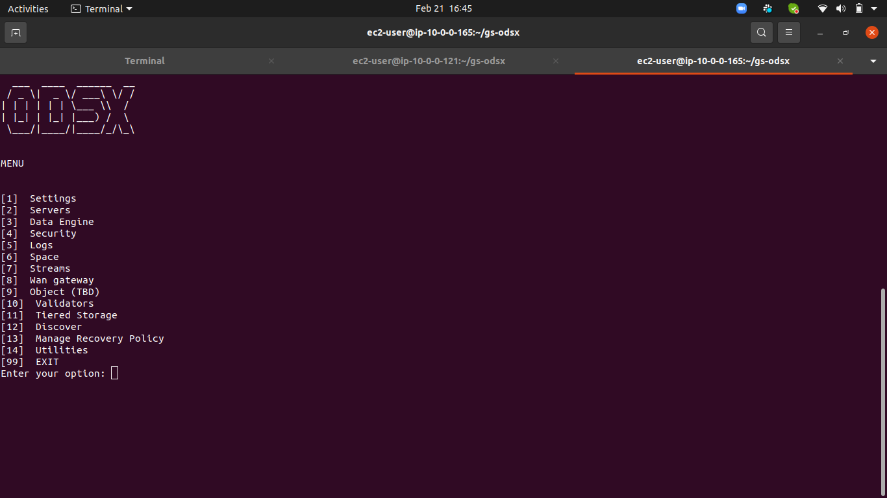

**1. Install DI server(Kafka) Menu -> Servers -> DI**
###  Install
 - Install DI with cluster mode
   - 3 host / servers needed to install 
   - Required gs-odsx/install/kafka/kafka_2.13-2.8.1.tgz

### Start   
- After installation complete start DI servers
- Verify DI servers by logged in to any of host and execute below command:

 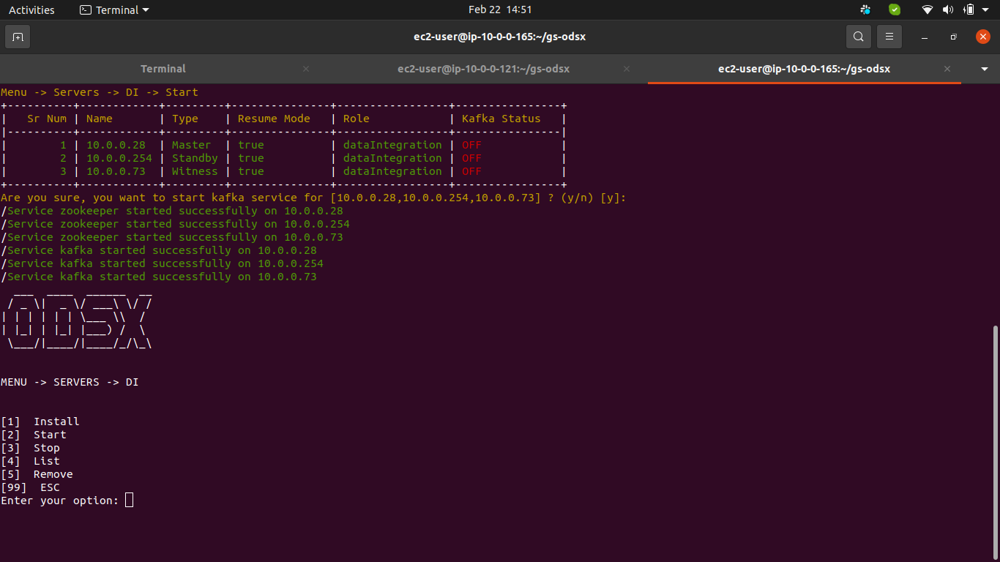
  
    `source /home/dbsh/setenv.sh;
     $KAFKAPATH/bin/zookeeper-shell.sh localhost:2181 ls /brokers/ids;`
     
 

**2. Install Grafana server**

- Verify Grafana started or not by web browser with respect to <0.0.0.0>:3000 port

**3. Install Influxdb server**

**4. Install Manager server**

- Verify on browser webui manager servers started or not
 
**5. Install Space server**

- Verify on browser webui space servers started or not
 - Configure metrics.xml (For influxdb and grafana with gigaspace)
   - Menu -> Utilities -> Metrics
      
**6. Install Northbound server**

- Install northbound with management server
- Start Nothbound - management server
- Open Web-UI, OPS-Manager and Grafana with respect to Nothbound management host with https it should give same result as without nothbound host

**7. Deploy Tiered Storage**
- Deploy space with ODSX Bi_Optional_pu.jar 
- Run feeder from any one of manager server.
  - You can find sample feeder https://github.com/Gigaspaces/insightedge-training/tree/master/Day4/17_TieredStorage
  - Modify according to your available space and configuration 
-  Update Cache Policy
    -  Modify criteria file and proceed with this step
-  Observe the updated criteria file and based on critera data has been reflected on OPS manager

**Grafana Server (Menu -> Servers -> Grafana)**

###### Install

- Keep Grafana rpm file under gs-odsx/install/grafana/grafana-7.3.7-1.x86_64.rpm

###### Start

- It will start Grafana server
 - Verify Grafana started or not by http://< Grafana host >:3000/ web browser
 
 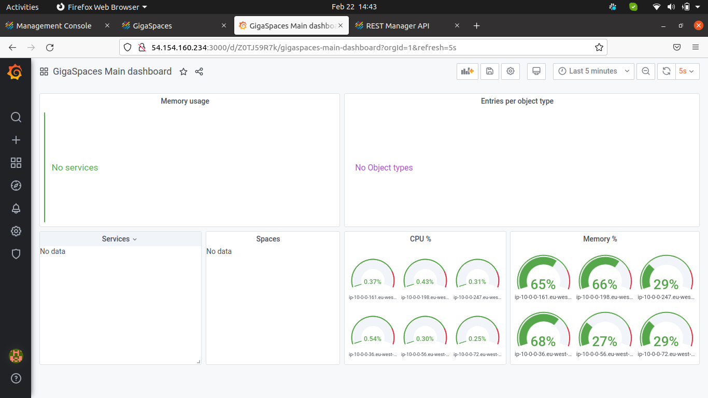
 
###### Stop

- It will stop Grafana service on installed host

###### Remove
- It will Remove and uninstall Grafana host

**Influxdb (Menu -> Servers -> Influxdb)**

###### Install

- Keep Influx rpm file under gs-odsx/install/influxdb/influxdb-1.8.4.x86_64.rpm 
- By default service will start and create default database mydb

###### Start

- It will start influxdb service 
 
###### Stop

- It will stop influxdb service on installed host

###### Remove
- It will Remove and uninstll Infuxdb host

**Manager (Menu -> Servers -> Manager)**

###### Install

- This option will install manager and prerequisite software for running Manager (**On Remote machine**).

- This option has two mode with AirGap and without AirGap. 

- You can enable AirGap mode (No internet) in config/cluster.config.

- With AirGap mode (**AirGap=true**).

  - These must be installation files must be present in /home/gs-odsx/install/gs under appropriate folders  i.e : gs, java,  unzip

  - Example  :

    java : /home/ubuntu/install/java/jdk-11.0.11_linux-x64_bin.rpm 

    unzip : /home/ubuntu/install/unzip/unzip-6.0-21.el7.x86_64.rpm 

    gs  : /home/ubuntu/install/gs/gigaspaces-xap-enterprise-16.0.0.zip
    
    - Proceed with Installation Param up to final confirmation of installation.
    
    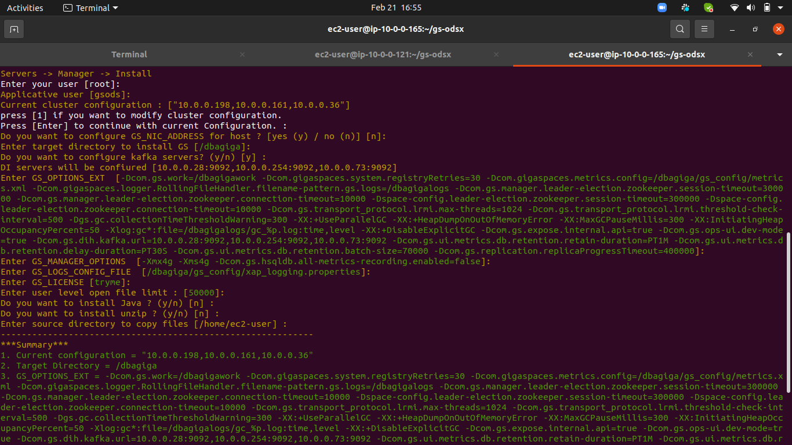
    
    After completion of installation do list
    
    - Menu -> Servers -> Manager -> List
    
    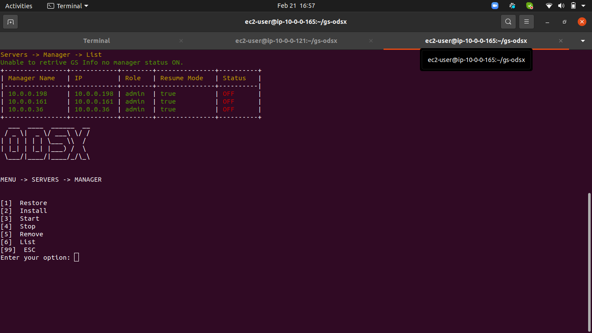
  
- It will add the newly installed manager into cluster.config file.
- If its first manager then we are starting snapshot scheduler.

###### Start

- This option will start the manager which is installed on remote machine.
- After selecting this option it will ask for Host and User of the remote machine for remote connection.

  
  
  Verify manager start with browser. 
  
  
  
###### Stop

- This option will stop the manager which is currently running on remote machine.
- After Selecting this option it will ask for Host and User of the remote machine for remote connection to kill the manager.

  
  
###### List

- It will list out the configured manager from the cluster.config file.
- It will display Name, IP, User and ResumeMode

  

###### Remove

- It will remove installed manager servers from cluster config and optional to remove supported software java / unzip
 
**Space Server (Menu -> Servers -> Space)**

###### Install

- This will install everything required to run gs on vanilla server similar to manager.
- At the end it will add the newly installed space server into cluster.config file.

  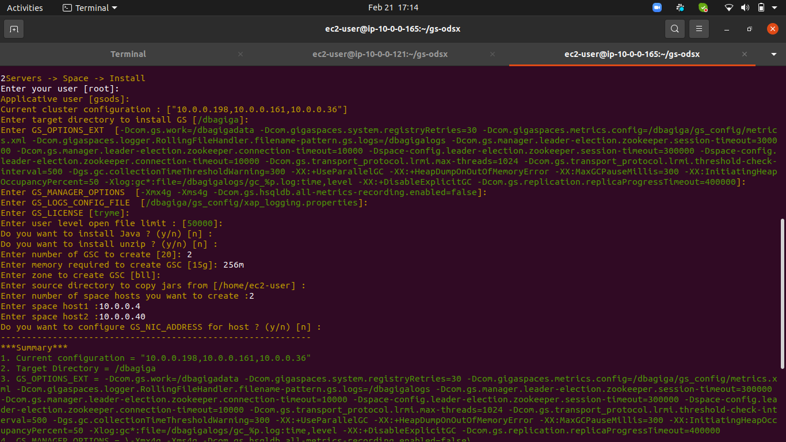
  
###### Start 

- This option will start the stopped space servers with specified GSC / manager / region at the time of installation

  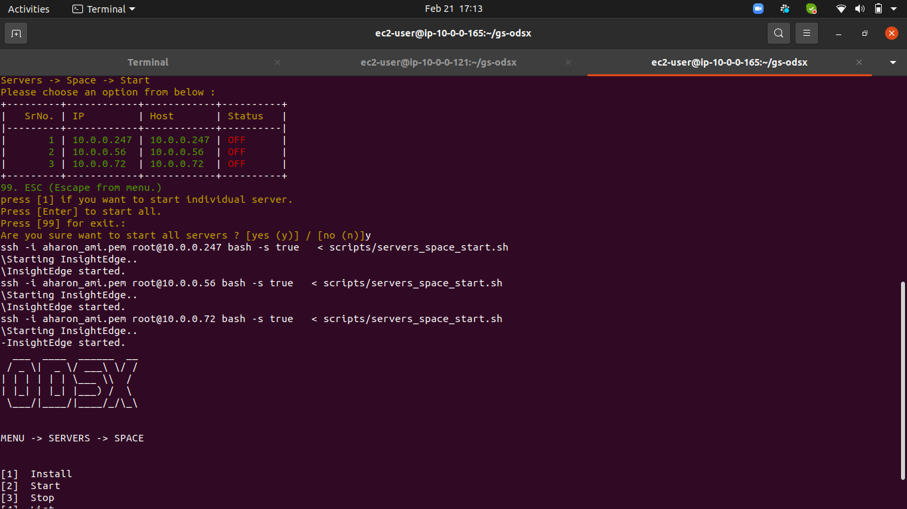

  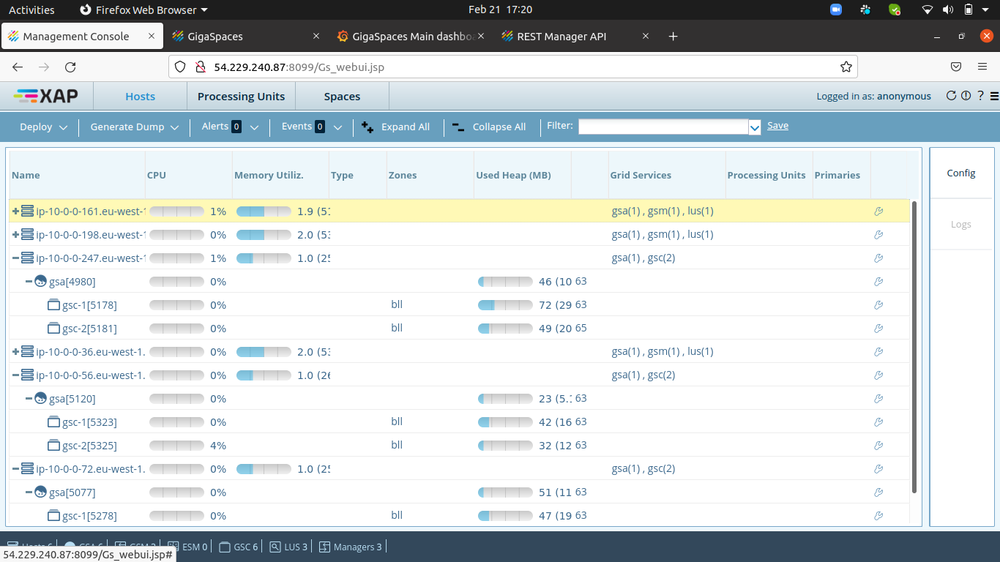
       
###### Stop 

- This option will stop the space server
 
  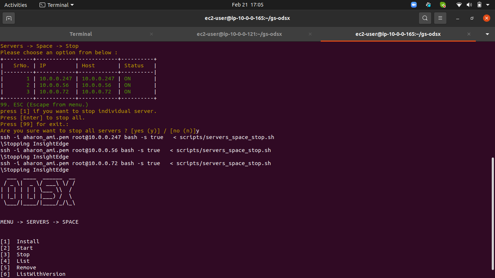

###### Remove

- It will remove installed manager servers from cluster config and optional to remove supported software java / unzip 

**Manager (Menu -> Servers -> Northbound)**

###### Install

- Installation of northbound package under gs-odsx/install/nb/
- Pre-requisite Grafana and Influxdb servers
- It will install northbound on specified server 
- One can chose below option while installing Northbound
  - Northbound servers
  - Northbound management servers
  - Northbound applicative servers
  
  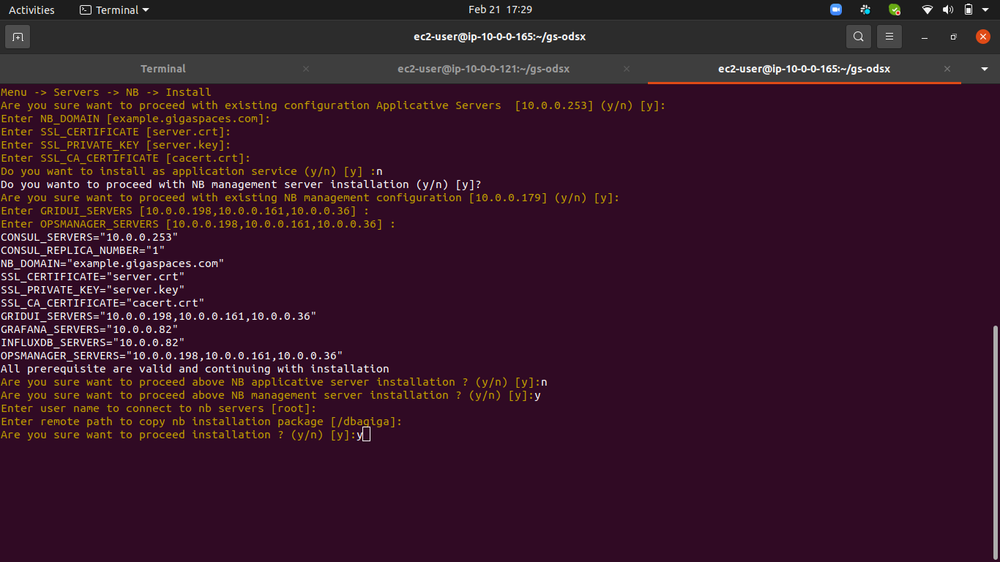
  
###### Start

- It will start northbound service on specified server   
    
###### Stop

- It will stop northbound service on specified server

###### Remove

- It will remove and uninstall northbound service on specified server

**Tiered Storage (Menu -> Tiered Storage)**

###### Deploy

 - You can find it from git repository https://github.com/GigaSpaces-ProfessionalServices/CSM-Magic-Tools.git
 - Build project and copy Bi_Optional_pu.jar file into odsx machine
 - Specify source path of this jar at time of Deploy Step
 - It will provide you an option for to create GSC
 - You can specify zone, number of partitions, space property at time of deployment
 
  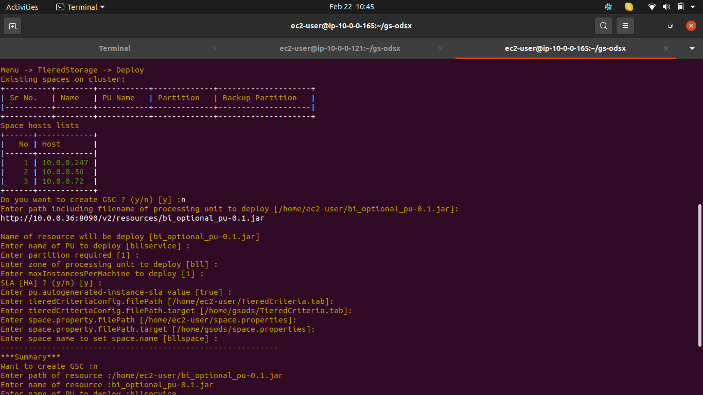
 
 - Run Feeder from manager server
 
  
  
 - By default it will loaded with default criteria file TieredCriteria.tab
 - Verify the deployment on OPS manager  
      
  
   
###### Update Cache Policy

 - Modify your criteria / space property required to update from source file
 - Select space which you want to apply udpdate cache policy
 - One can select individual couple partition or all available partitions
   - It will restart backup from couple
   - You can modify waiting time default is 30 sec 
   - Once backup partition restarted it will wait for space to become healthy
 
 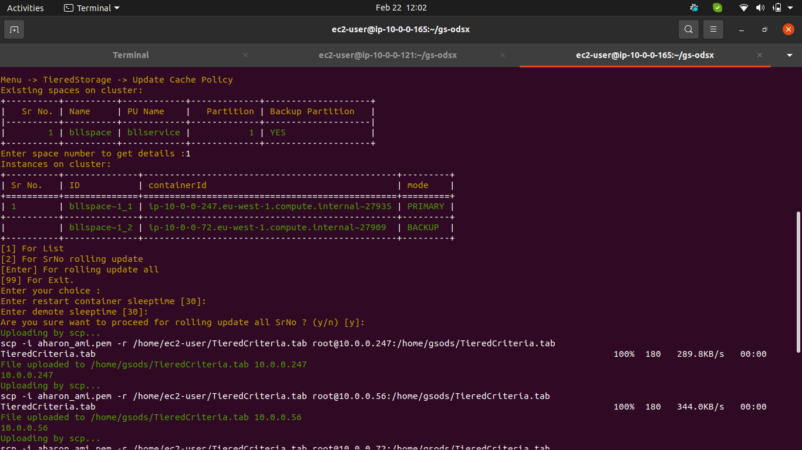
 
 - This step will demote the selected couple partition
 - After completion of update cache policy Go to OPS manager and see the updated criteria on overview
  
  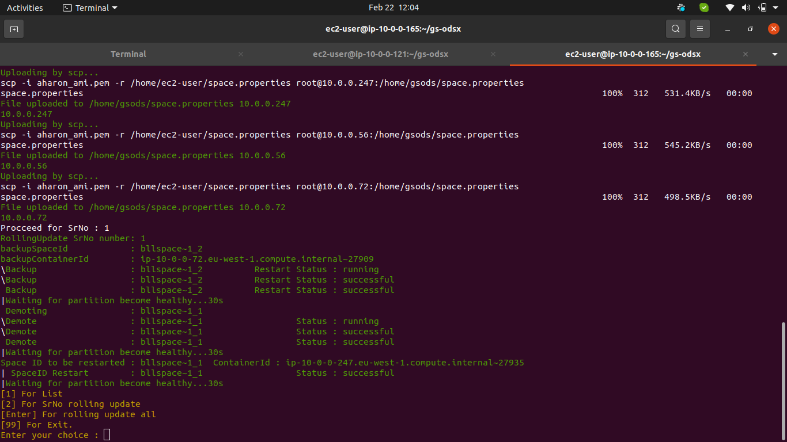
  
  - You can observe after changing the TieredCriteria.tab file based on updated criteria data feeded without downtime of space
  
  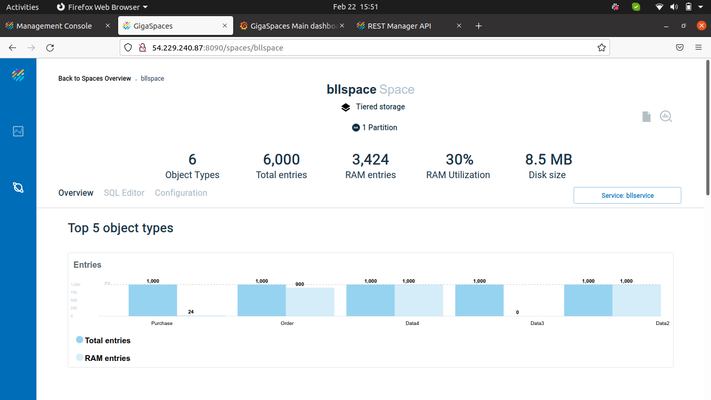
  
###### Undeploy
 
- It will list all available spaces on cluster
- You can remove / undeploy either one or all available spaces from cluster 

    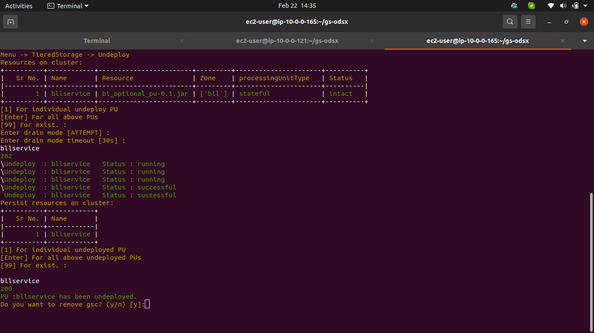
    
