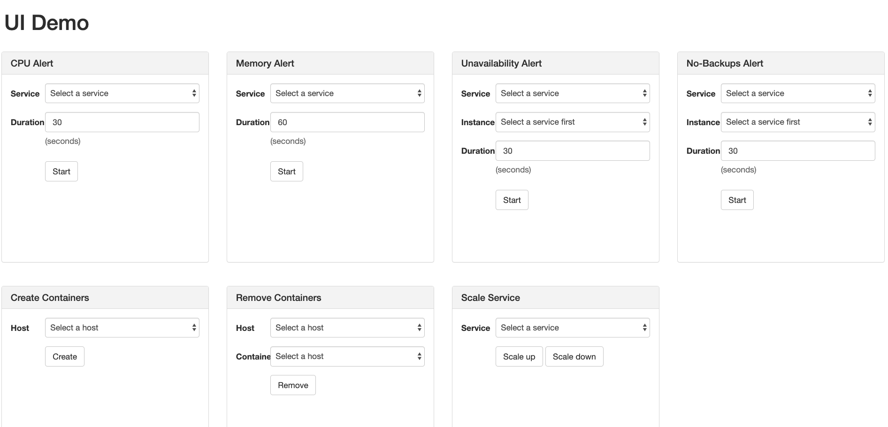
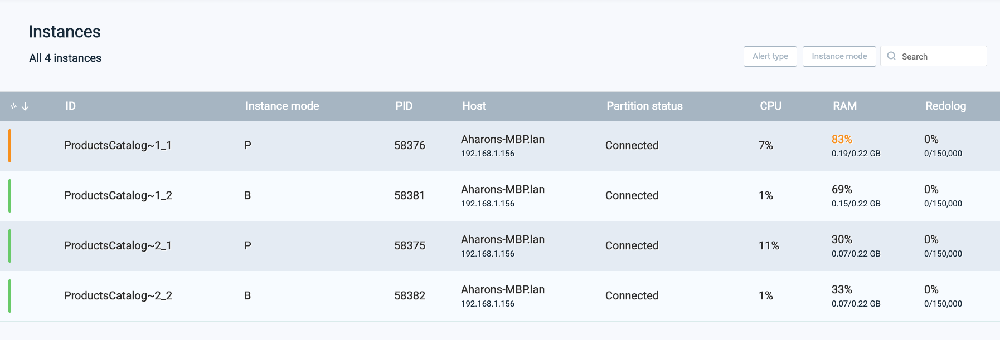
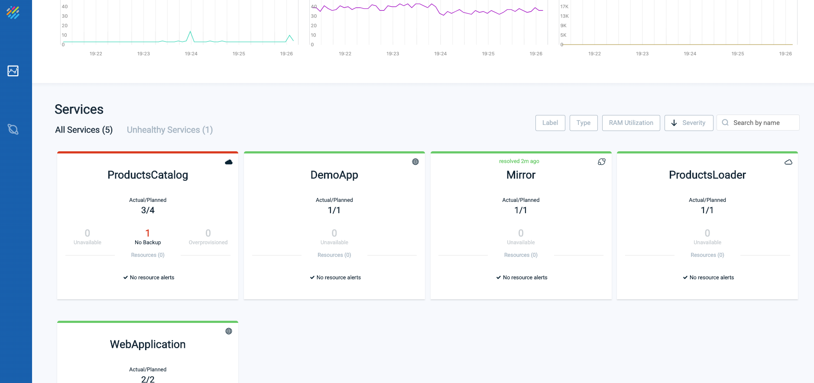
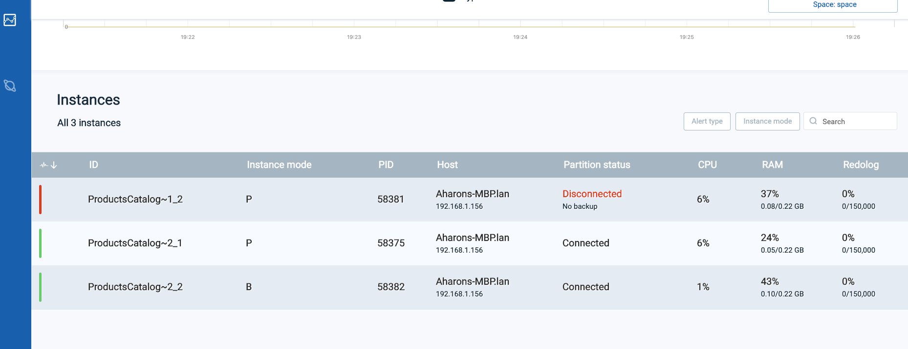
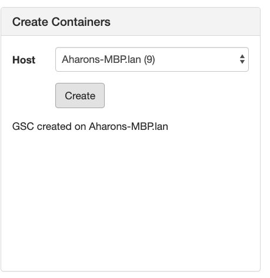
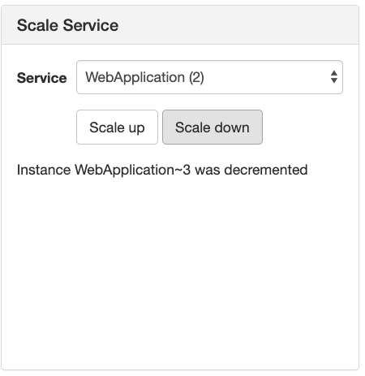
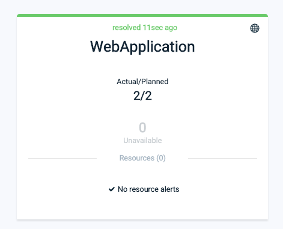
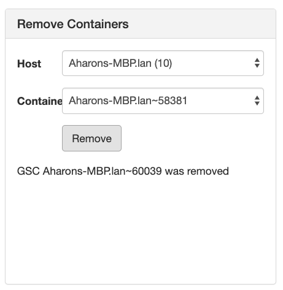

# xap-admin-training - lab6

# GigaSpaces Ops Manager 

## Lab Goals

**1.** Explore from close GS Ops Manager windows  
**2.** Get familiar with GS Ops Manager capabilities 

## Lab Description
In this lab we will focus on GigaSpaces Ops Manager functionalities. 
To better know its capabilities you will use GS Ops manager ui demo tool for your convenience.

#### 1 Download and run GS Ops manager demo tool:

*  git clone https://github.com/GigaSpaces-ProfessionalServices/ui-demo 
*  Open README.MD and follow it's instructions: 
       https://github.com/GigaSpaces-ProfessionalServices/ui-demo/blob/master/README.MD    
* Once done with the above readme continue with the next section **(2 UI DEMO)** 
       
#### 2 UI DEMO

Open the ui demo: 
* http://localhost:8280/

##### 1.1 CPU Alert:
* Choose ProductsCatalog Service and trigger the CPU Alert: 

* Trouble shoot it in the GS Ops Manager: 

##### 1.2 Memory Alert:
* Choose ProductsCatalog Service and trigger the Memory Alert: 

* Trouble shoot it in the GS Ops Manager: 

##### 1.3 Unavailability Alert:
* Choose Mirror Service and trigger the Unavailability Alert: 

* Trouble shoot it in the GS Ops Manager: 

##### 1.4 No-Backups Alert:
* Choose ProductsCatalog Service and trigger the No-Backups Alert: 

* Trouble shoot it in the GS Ops Manager: 

##### 1.5 Create Containers:
* Select your host and click the Create button: 

* Verify that you have a free GSC in the Web Management Console: 

##### 1.6 Scale Up Service:
* Choose WebApplication Service and click the Scale up button: 

* Verify WebAppliaction instance was incremented in the GS Ops Manager Services view: 

##### 1.7 Scale Down Service:
* Choose WebApplication Service and click the Scale down button: 

* Verify WebAppliaction instance was decremented in the GS Ops Manager Services view: 

##### 1.8 Remove Containers:
* Open the Web Management Console and verify which GSC pid is empty with no service deploy on it: 

* Select your host and Container to remove click the Remove button: 

* Verify in the Web Management Console spare GSC was removed: 

#### 3 UI DEMO termination

From ui-demo folder run: 
* ./undeploy_all.sh 

* Shut down XAP run time environment and roll back setenv-overrides.sh (delete or comment GS_GSC_OPTIONS line)

      

    